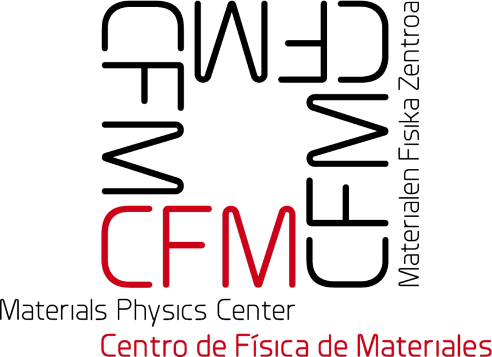
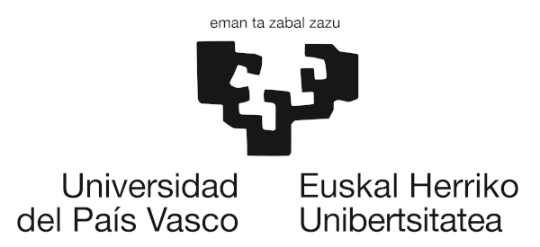

The first *"Summer School on the Calculation of Ionic Quantum and Anharmonic Effects with the Stochastic Self-Consistent Harmonic Approximation"* will be held in Donostia/San Sebastián, Spain, from June 26-30, 2023. It will be a fantastic opportunity to learn the fundamental physics behind the SSCHA code and to get hands-on training sessions on its different utilities with lectures given by the developers of the code.

This will be your school if you want to learn how to calculate thermodynamic, vibrational, transport, spectroscopic, and superconducting properties in strongly anharmonic materials. The lectures and the hands-on sessions will focus first on the basics of the SSCHA and first simple calculations. More advanced lectures on phase transitions, spectroscopic properties, thermal conductivity, and electron-phonon interactions will follow later. In the hands-on sessions the student will learn to calculate the critical temperature of charge-density wave transitions, Raman and Infrared spectra of strongly anharmonic systems, the thermal conductivity at different levels of theory, and the superconducting properties of materials even if the harmonic approximation collapses.   

Students are expected to bring their own laptop for the hands-on sessions. No prior knowledge on the SSCHA is needed for  participating in the school, but it is advised to have some knowledge on the theory of phonons as well as some experience in computer simulations with *ab initio* methods or force fields.   

We wait for you in the beautiful city of San Sebastian this summer.
   
In this website you can find the following information:
- [Lecturers](#Lecturers)
- [Program](#Program)
- [Registration and abstract submission](#Registration)
- [Venue and travel information](#Travel)
- [Organizers and contact](#Organizers)

Institutional sponsors:

# Lecturers

 [**Raffaello Bianco**](http://personale.unimore.it/Rubrica/dettaglio/rbianco) - *University of Modena, Italy*

 [**Matteo Calandra**](https://mcalandra.github.io/) - *University of Trento, Italy*

 [**Ion Errea**](https://cfm.ehu.es/errealab/) - *University of the Basque Country, Spain*

 [**Francesco Mauri**](http://www2.phys.uniroma1.it/doc/mauri/) - *La Sapienza University, Italy*

 [**Lorenzo Monacelli**](https://scholar.google.it/citations?user=J5BKff0AAAAJ&hl=en) - *EPFL, Switzerland*

 [**Đorđe Dangić**](https://cfm.ehu.es/errealab/) - *University of the Basque Country, Spain*

 [**Diego Martínez Gutiérrez**](https://cfm.ehu.es/errealab/) - *Centro de Física de Materiales, Spain*

# Program

To be announced soon

# Registration and abstract submission

To be announced soon

# Venue and travel information

To be announced soon

# Contact us

To be announced soon

