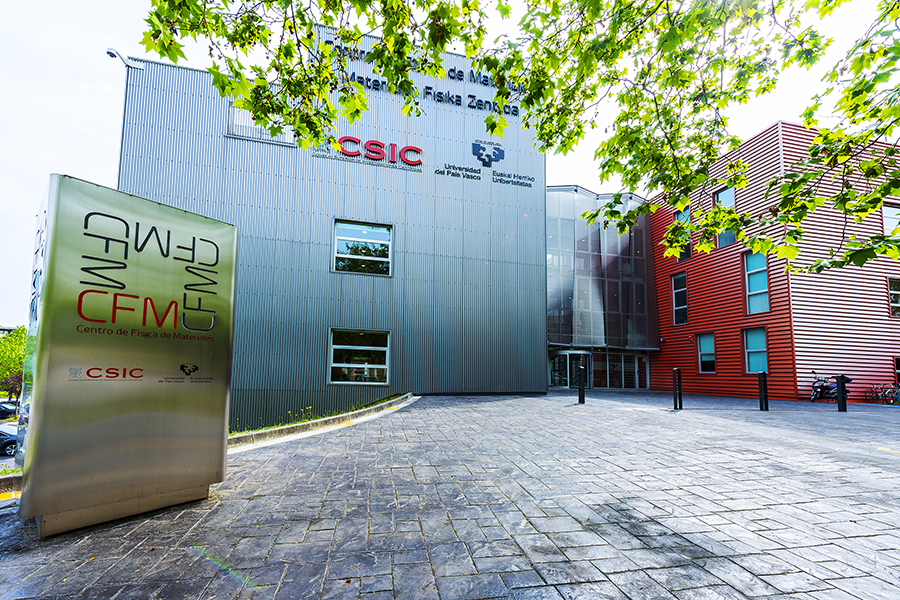

The first *"Summer School on the Calculation of Ionic Quantum and Anharmonic Effects with the Stochastic Self-Consistent Harmonic Approximation"* will be held in Donostia/San Sebastián, Spain, from June 26-30, 2023. It will be a fantastic opportunity to learn the fundamental physics behind the SSCHA code and to get hands-on training sessions on its different utilities with lectures given by the developers of the code.

This will be your school if you want to learn how to calculate thermodynamic, vibrational, transport, spectroscopic, and superconducting properties in strongly anharmonic materials. The lectures and the hands-on sessions will focus first on the basics of the SSCHA and first simple calculations. More advanced lectures on phase transitions, spectroscopic properties, thermal conductivity, and electron-phonon interactions will follow later. In the hands-on sessions the student will learn to calculate the critical temperature of charge-density wave transitions, Raman and Infrared spectra of strongly anharmonic systems, the thermal conductivity at different levels of theory, and the superconducting properties of materials even if the harmonic approximation collapses.   

Students are expected to bring their own laptop for the hands-on sessions. No prior knowledge on the SSCHA is needed for  participating in the school, but it is advised to have some knowledge on the theory of phonons as well as some experience in computer simulations with *ab initio* methods or force fields.   

We wait for you in the beautiful city of San Sebastian this summer.
   
In this website you can find the following information:
- [Lecturers](#Lecturers)
- [Program](#Program)
- [Registration and abstract submission](#Registration)
- [Venue and travel information](#Travel)
- [Organizers and contact](#Organizers)

Institutional sponsors:

# Lecturers

 [**Raffaello Bianco**](http://personale.unimore.it/Rubrica/dettaglio/rbianco) - *University of Modena, Italy*

 [**Matteo Calandra**](https://mcalandra.github.io/) - *University of Trento, Italy*

 [**Ion Errea**](https://cfm.ehu.es/errealab/) - *University of the Basque Country, Spain*

 [**Francesco Mauri**](http://www2.phys.uniroma1.it/doc/mauri/) - *La Sapienza University, Italy*

 [**Lorenzo Monacelli**](https://scholar.google.it/citations?user=J5BKff0AAAAJ&hl=en) - *EPFL, Switzerland*

 [**Đorđe Dangić**](https://cfm.ehu.es/errealab/) - *University of the Basque Country, Spain*

 [**Diego Martínez Gutiérrez**](https://cfm.ehu.es/errealab/) - *Centro de Física de Materiales, Spain*

# Program

|   | Monday,   June 26 | Tuesday,   June 27 | Wednesday,   June 28 | Thursday,   June 29  | Friday,   June 30 |
|---|---|---|---|---|---|
| 9:00-10:30  | Lecture1:   **Francesco Mauri**   *Theory of lattice vibrations and anharmonicity* |  Lecture3:   **Raffaello Bianco**   *Second-order phase transitions in the SSCHA* | Hands-on-session4:   **Raffaello Bianco**   *Calculation of spectral functions with the SSCHA*  | Lecture6:   **Matteo Calandra**   *Theory of the electron-phonon interaction and superconductivity*  | Lecture9:   **Đorđe Dangić**   *Thermal conductivity in strongly anharmonic crystals*  |
| 10:30-11:00 | Coffee Break | Coffee Break  | Coffee Break  | Coffee Break  | Coffee Break  | 
| 11:00-12:30  | Lecture2:   **Ion Errea**   *Non-perturbative anharmonicity and the SSCHA*  | Hands-on-session3:   **Diego Martinez**   *Calculations of second-order phase transitions with the SSCHA*  | Lecture5:   **Francesco Mauri**   *Raman and Infrared spectra of strongly anharmonic materials*  | Hands-on-session7:   **Ion Errea**   *Calculation of the electron-phonon interaction and superconducting properties with the SSCHA*  | Hands-on-session8:   **Đorđe Dangić**   *Thermal conductivity calculations with the SSCHA*  | 
| 12:30-14:30  | Lunch Break | Lunch Break  | Lunch Break  | Lunch Break  | End of School  | 
| 14:30-16:00  | Hands-on-session1:   **Diego Martinez**   *First SSCHA simulations: free energy and structural relaxations*  | Lecture4:   **Raffaello Bianco**   *Spectral functions and spectroscopic properties*  | Hands-on-session5:   **Lorenzo Monacelli**   *Raman and Infrared spectra with the SSCHA*  | Lecture8:   **Lorenzo Monacelli**   *Strengths and limitations of the SSCHA: how does it compare with other approaches?*  |   |
| 16:00-16:30  | Coffee Break | Coffee Break  | Coffee Break  | Coffee Break  |   | 
| 16:30-18:00  | Hands-on-session2:   **Lorenzo Monacelli**   *Setting up automatic SSCHA simulations on clusters*  | **Oral Contributed Talks**  | Hands-on-session6:   **Đorđe Dangić**   *The SSCHA with machine learning potentials*  | **Poster Session**  |   |
| 20:30-23:30  |   |   | Conference Dinner  |   |   |

# Registration and abstract submission

Registration is now open. Deadline is June 18, 2023. **Regular Registration Fee: 150€**

The registration fee includes all the school material, lectures, hands-on sessions, coffee breaks, and conference dinner. There is a limited number of students that can be accepted. Registration will be accepted to on a first come, first served basis. So register as soon as possible. 

Registration to the conference is done through UIK’s platform. If you are already user of such platform, log in with your mail and password. Otherwise, register first to be a user.  Find detailed instructions for registration and access to your personal area on UIK’s platform [HERE](Registration_instructions_SSCHA.pdf). You will find useful information with screenshots to lead you through the registration process. Once registered you will have access to your personal area where you can find your invoice and attendance certificate.

# Venue and travel information

The school will take place at the *Centro de Física de Materiales* located in the campus of the University of the Basque Country in San Sebastian, Spain. The exact [address](https://goo.gl/maps/neif5cyRB4UsD5QFA) is *Manuel de Lardizabal Pasealekua 5, 20018 San Sebastian, Spain*.

 

<ins><b>How to reach San Sebastian</b></ins>:

By plane:
- Bilbao airport, Spain (IATA: BIO, 100 km. from the city center): About 1 hour drive from San Sebastian. An international airport with connections to all major cities in Europe (London, Paris, Frankfurt, Brussels, Rome,...). The most convenient one for overseas travellers in terms of connections and air fares. A direct shuttle bus running every hour connects the airport with San Sebastián for about 17 euros. The bus time table is available at [Lurraldebus](http://www.lurraldebus.eus) (search between "AEROPUERTO BILBAO" and "DONOSTIA/SAN SEBASTIAN").
- San Sebastian airport, Spain (IATA: EAS, 25 km. from the city center). Next to the town of Hondarribia, about 30 minutes drive from San Sebastian. A small airport with domestic connections to Madrid and Barcelona. Iberia flies to this airport. Convenient when a connection through Madrid is possible. A taxi connecting the airport and the city should be around 30 euros. The airport is also connected to the city center with lines E20 and E21 operated by [Lurraldebus](http://www.lurraldebus.eus).
- Biarritz airport, France (IATA: BIQ, 50 km. from the city center). 40 minutes drive from San Sebastian. Air France flies to this airport, and some low-cost airlines such as Ryanair also fly here. Convenient when flying from France or London. Public transportation is complicated between Biarritz and San Sebastian.

By train:
- The Adif train station Estación del Norte is in the center of San Sebastian, close to Urumea river. It offers connections to several Spanish cities, including Madrid and Barcelona.
- There is also Metro Donostialdea, popularly known as Topo, a narrow-gauge train connecting Donostia with cities along the Basque Coast, from Bilbao and Hendaye (France).

By bus:
- The San Sebastian bus station, which is located by the Adif train station, has lines to cities troughout Spain. The main company traveling here is [Alsa](https://www.alsa.es/eu/).

By car:
- The city is connected to the rest of Spain by the N-1 (Madrid-Irun highway), AP-8 (Bilbao-Irun highway), and A-15 (Pamplona-San Sebastián highway).

 <ins><b>Accommodation</b></ins>:

The registration fee does not include accommodation and participants should make their own bookings separately. Please find here a list of recommended hotels.

Student houses near the conference venue:
 - [Olarain](https://www.olarain.com)
 - [Manuel Agid Querol](https://www.resa.es/es/residencias/san-sebastian/residencia-universitaria-manuel-agud-querol/residencia/)

Hotels near the conference venue:
 - [Hotel NH Collection San Sebastian Aranzazu](https://www.nh-hoteles.es/hotel/nh-collection-san-sebastian-aranzazu)
 - [Hotel San Sebastián](https://www.ilunionhotels.co.uk/hotel-ilunion-san-sebastian-in-san-sebastian/)
 - [Codina Sercotel Hotel](https://www.hotelcodina.es/esp/index_esp.html)
 - [Hotel Antik](http://hotelantiksansebastian.com)
 - [Hotel Avenida](https://www.hotelavenida.net)
 - [Barceló Costa Vasca](https://www.barcelo.com/es-es/barcelo-costa-vasca/)

Hostels near the conference venue:
 - [Koisi Hostel](https://koisihostel.com)

Other options:
 - San Sebastian offers a great variety of different kinds of accommodation, ranging from 5-star hotels to hostels and flats. In order to make it easier for you to find the accommodation that better suits you, we suggest to have a look at the following link [San Sebastian Tourist Office](https://www.sansebastianturismoa.eus/en/sleep/where-to-sleep).

# Organizers and contact

The organizers of the school are:
 - Ion Errea - *University of the Basque Country, Spain*
 - Lorenzo Monacelli - *EPFL, Switzerland*
 - Diego Martínez Gutiérrez -  *Centro de Física de Materiales, Spain*
 - Raffaello Bianco - *University of Modena, Italy*

You may contact us at this email address: codesscha@gmail.com

