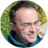

- [Lecturers](#Lecturers)
- [Program](#Program)
- [Registration and abstract submission](#Registration)
- [Venue and travel information](#Travel)
- [Organizers and contact](#Organizers)

Sponsors:

# Lecturers

 [**Raffaello Bianco**](http://personale.unimore.it/Rubrica/dettaglio/rbianco) 

*Assistant Professor at Università degli Studi di Modena e Reggio Emilia, Modena, Italy*

 [**Matteo Calandra**](https://mcalandra.github.io/) 

*Full Professor at the University of Trento, Trento, Italy*

 [**Ion Errea**](https://cfm.ehu.es/errealab/) 

*Associate Professor at the University of the Basque Country, San Sebastian, Spain*

 [**Francesco Mauri**](http://www2.phys.uniroma1.it/doc/mauri/) 

*Full Professor at the Università di Roma La Sapienza, Rome, Italy*

 [**Lorenzo Monacelli**](https://scholar.google.it/citations?user=J5BKff0AAAAJ&hl=en)

*Postdoctoral researcher at EPFL, Lausanne, Switzerland*

 [**&#272or&#273e Dangi&#263**](https://scholar.google.it/citations?user=J5BKff0AAAAJ&hl=en)

*Postdoctoral researcher at the University of the Basque Country, San Sebastian, Spain*

 [**Diego Martínez Gutiérrez**](https://scholar.google.it/citations?user=J5BKff0AAAAJ&hl=en)

*Postdoctoral researcher at the Centro de Física de Materiales, San Sebastian, Spain*

# Program

To be announced soon

# Registration and abstract submission

To be announced soon

# Venue and travel information

To be announced soon

# Contact us

To be announced soon

