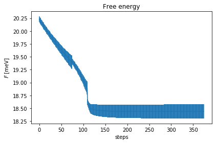
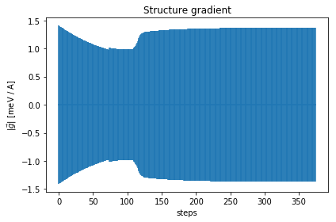
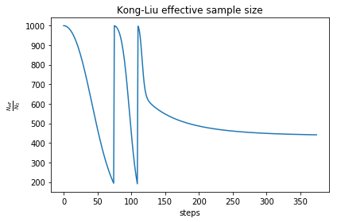

In order to get familiar with the code we strongly suggest that before attempting a real calculation you run the tutorials provided here.

We suggest that you start to run the tutorials in the following order:

1. [**Lead Telluride**](#Lead-Telluride)

    In this tutorial you will learn how you can set up a calculation from scratch starting from a CIF file. 

    It is illustrated how the ASE package can be used to prepare the input files to run the initial Born-Oppenheimer structural relaxation and harmonic phonon calculation. It is also illustrated how the output of these calculations can be used to start the SSCHA free energy minimization by creating first the ensemble and, second, calculating the energies, forces, and stress tensors for them. It is described how the latter calculations can be performed in three different ways: by using ASE to perform the calculations locally, by running the DFT calculations manually locally or in a cluster, and setting up an automatic submission to a cluster.

2. [**Lead Telluride structural instability**](#Lead-Telluride-structural-instability)

    In this tutorial you will understand how to calculate the free energy Hessian used to determine the stability of the system in the free energy landscape, valid to determine second-order phase transitions such as charge-density wave of ferroelectric transitions.

3. [**Lead Telluride spectral properties**](#Lead-Telluride-spectral-properties)

    Here you will learn how to run the SSCHA minimization as an stand-alone program, and also how to calculate the phonon spectral functions, which are in the end what experiments probe. Several approaches to calculate the spectral function are exemplified.   

4. [**Tin Telluride with force fields**](#Tin-Telluride-with-force-fields)

    In this tutorial you will learn how to automatize a calculation with a python script using a force field. Also how to calculate the with a force field the free energy Hessian at different temperatures by scripting all the calculations. 

5. [**Sulfur hydride**](http://sscha.eu/Tutorials/Automatic_Calculations/)

    In this tutorial you can learn how to automatize a SSCHA minimization. The example works with the H$$_3$$S superconducting compound.

6. [**Lanthanum hydride**](http://sscha.eu/Tutorials/VariableCellRelaxation/)

    In this tutorial, which deals with LaH$$_{10}$$, you can learn how to automatize a SSCHA relaxation also considering the lattice degrees of freedom.

<a name="Lead-Telluride"></a>
# 1. Lead Telluride

In this tutorial, we will set up, from scratch, a calculation of lead telluride (PbTe), a thermoelectric material with high thermoelectric efficiency. All the files needed for the calculation are in the directory Tutorials/PbTe of the *python-sscha* package.

Here, for carrying out the calculations, we will use Quantum ESPRESSO, ASE, and the SSCHA for thermodynamic properties. To setup ASE to work with espresso, please refer to the official [guide](https://wiki.fysik.dtu.dk/ase/ase/calculators/espresso.html).

We prepared the tutorial with the experimental structure in CIF format. You can download the starting CIF files from online databases or use ASE to build your structure.
In this case, we downloaded the structure "PbTe.cif"  from the [American Mineralogist Crystal Structure Database](http://rruff.geo.arizona.edu/AMS/amcsd.php).
The pseudopotentials used for the DFT calculations are in the pseudo_espresso folder. A full list of pseudopotentials is available on the [Quantum ESPRESSO website](https://www.quantum-espresso.org/pseudopotentials).

## Preparation
Both ASE and the SSCHA work in python, so we need to import them.
Moreover, since we want to use Quantum ESPRESSO, we also import the Quantum ESPRESSO calculator of ASE.
Indeed, you can replace the Quantum ESPRESSO calculator with any ASE calculator that can compute total energies, forces, and the stress tensors (the latter required only for cell relaxation). 

```python
# Load in the notebook all scientific libraries
# It can be replaced with:
# from numpy import *
# import numpy as np
# from matplotlib.pyplot import *
%pylab
```


```python
from __future__ import print_function
from __future__ import division
import sys,os

import ase
from ase.calculators.espresso import Espresso
from ase.visualize import view

# We import the basis modules for the SSCHA
import cellconstructor as CC
import cellconstructor.Structure
import cellconstructor.Phonons

# Import the SSCHA engine (we will use it later)
import sscha, sscha.Ensemble, sscha.SchaMinimizer, sscha.Relax
```

We will now set up the Quantum ESPRESSO calculator for ASE.  For now on, we will use it to relax the original structure within a simple DFT calculation (this is an experimental structure). Then, we will feed this calculator into the SSCHA code to perform the SSCHA minimization.

```python
# Lets define the pseudopotentials
pseudos = {"Pb": "Pb.upf",
          "Te": "Te.upf"}

# Now we define the parameters for the espresso calculations
input_params = {"ecutwfc" : 60, # The plane-wave wave-function cutoff
               "ecutrho": 240, # The density wave-function cutoff,
               "conv_thr": 1e-6, # The convergence for the DFT self-consistency
               "pseudo_dir" : "pseudo_espresso", # The directory of the pseudo potentials
               "tprnfor" : True, # Print the forces
               "tstress" : True # Print the stress tensor
               }

k_spacing = 0.2 #A^-1 The minimum distance in the Brillouin zone sampling

espresso_calc = Espresso(input_data = input_params, pseudopotentials = pseudos, kspacing = k_spacing)
```

We need to import the structure. 


```python
PbTe_atoms = ase.io.read("PbTe.cif")

# We can view the structure
view(PbTe_atoms)
```

As you may have noticed, this structure is in the conventional cell.
While it is useful for visualization purposes, it makes the SSCHA calculation harder, as more atoms are in the unit cell.
So we redefine the primitive cell with the *CellConstructor* package.
From an easy check on the structure, it is possible to recognize that the primitive vectors $$\vec{v'}$$ 
can be obtained from the conventional vectors $$\vec{v}$$ as follows:

$$
\vec {v'}_1 = \frac 12 \left(\vec v_1 + \vec v_2\right)
$$
$$
\vec {v'}_2 = \frac 12 \left(\vec v_1 - \vec v_2\right)
$$
$$
\vec {v'}_3 = \frac 12 \left(\vec v_1 + \vec v_3\right)
$$


```python
# Initialize a Cellconstructor Structure
struct = CC.Structure.Structure()
struct.generate_from_ase_atoms(PbTe_atoms)

# Define the new unit cell
new_cell = struct.unit_cell.copy()
new_cell[0,:] = .5 * struct.unit_cell[0,:] + .5*struct.unit_cell[1,:]
new_cell[1,:] = .5 * struct.unit_cell[0,:] - .5*struct.unit_cell[1,:]
new_cell[2,:] = .5 * struct.unit_cell[0,:] + .5*struct.unit_cell[2,:]

# Apply the new unit cell to the structure
# And remove duplicated atoms
struct.unit_cell = new_cell
struct.fix_coords_in_unit_cell()
PbTe_primitive = struct.get_ase_atoms()

view(PbTe_primitive)
```

You can see that the new unit cell is much smaller than the previous one, and we have only two atoms per cell, as expected from a rock salt structure.

We can relax the volume at ambient pressure with a variable cell relaxation in Quantum ESPRESSO. For this purpose, we will employ the ASE Espresso calculator to get familiar with it. Indeed the same operation can be performed using a standard espresso input or your favorite DFT program.

```python
# We override (or add) the key for the calculation type
input_params["calculation"] = "vc-relax"
# Generate once again the Espresso calculator
espresso_calc = Espresso(input_data = input_params, pseudopotentials = pseudos, kspacing = k_spacing)

# We attach the calculator to the cell
PbTe_primitive.set_calculator(espresso_calc)

# We run the relaxation
equilibrium_energy = PbTe_primitive.get_total_energy() # It should take few minutes
```


```python
# Ase should have created an input file espresso.pwi that you can check
# And redirect the output through espresso.pwo
# This relaxation should have changed the structure
# So we need to reload the structure from the output espresso file
PbTe_final= ase.io.read("espresso.pwo")

print("Volume before optimization: ", PbTe_primitive.get_volume(), " A^3")
print("Volume after optimization: ", PbTe_final.get_volume(), " A^3")
```

    Volume before optimization:  63.71002599999998  A^3
    Volume after optimization:  67.90591056326011  A^3


Now we have a structure in the primitive unit cell and relaxed.
We remark that the convergence parameters chosen for the minimization are too low to get accurate results, especially for the variable cell relaxation. Here the value of the pressure is overestimated by about 5 GPa; increase the wave-function cutoff to 70 Ry and the density cutoff to 280 Ry to get a more accurate result. We selected under converged parameters just to run very fast on a single processor as a demonstration. 

### Harmonic calculation

Now we need to perform a harmonic calculation to get the spectra.
This can be done with perturbation theory with Quantum ESPRESSO, directly with the ASE library, if we want to use the finite displacement approach, or with phonopy, if you want to correctly exploit the symmetries of the crystal.

In this example, we will show how to do this by exploiting Quantum ESPRESSO perturbation theory on DFT.
We will compute the dynamical matrix on a 2x2x2 q mesh (the equivalent of using a 2x2x2 supercell with the finite displacement approach)
and we will also compute effective charges as the system is an insulator.
We will then save the results in harmonic_dyn filenames.


```python
# We need an input file for phonon calculation in espresso.
ph_input = """
&inputph
    ! the final filename
    fildyn = "harmonic_dyn"
    
    ! the q mesh
    ldisp = .true.
    nq1 = 2 
    nq2 = 2
    nq3 = 2
    
    ! compute also the effective charges and the dielectric tensor
    epsil = .true.
&end
"""

# We write the input script and execute the phonon calculation program
with open("harmonic.phi", "w") as f:
    f.write(ph_input)

# Run the calculation
cmd = "mpirun -np 2 ph.x -npool 2 -i harmonic.phi > harmonic.pho"
res = os.system(cmd) # This command took with 4 i-7 processors about 5 minutes
```

You can see that espresso generated several files:
 * harmonic_dyn0
 * harmonic_dyn1 
 * ...
 
We import them with *CellConstructor*.

We need only to know the number of total q independent points by symmetries, that is,
the total number of dynamical matrix printed by Quantum ESPRESSO (harmonic_dyn0 does not count).
In this case, it should be 3.


```python
# Load the dynamical matrices just computed
harm_dyn = CC.Phonons.Phonons("harmonic_dyn", nqirr =3) # We load harmonic_dynX with X = 1,2,3

# Now we can print all the phonon frequencies
w_s, pols = harm_dyn.DiagonalizeSupercell()
# By default, the dynamical matrix is written in Ry/bohr^2, so the energy is in Ry
# To transform in cm-1 we can use the conversion factor provided by CellConstructor
print ("\n".join(["{:.4f} cm-1".format(w * CC.Units.RY_TO_CM) for w in  w_s]))
```

    -186.1459 cm-1
    -186.1459 cm-1
    -186.1459 cm-1
    -185.9474 cm-1
    -185.9474 cm-1
    -185.9474 cm-1
    -179.9445 cm-1
    -179.9445 cm-1
    -179.9445 cm-1
    -179.9445 cm-1
    -179.9445 cm-1
    -179.9445 cm-1
    -101.7456 cm-1
    -101.7456 cm-1
    -101.7456 cm-1
    -80.2691 cm-1
    -80.2691 cm-1
    -80.2691 cm-1
    -80.2691 cm-1
    -80.2691 cm-1
    -80.2691 cm-1
    48.0931 cm-1
    48.0931 cm-1
    48.0931 cm-1
    52.7799 cm-1
    52.7799 cm-1
    52.7799 cm-1
    52.7799 cm-1
    52.7799 cm-1
    52.7799 cm-1
    52.7799 cm-1
    52.7799 cm-1
    55.6362 cm-1
    55.6362 cm-1
    55.6362 cm-1
    55.6362 cm-1
    55.6362 cm-1
    55.6362 cm-1
    55.6362 cm-1
    55.6362 cm-1
    77.3157 cm-1
    77.3157 cm-1
    77.3157 cm-1
    77.3157 cm-1
    99.2432 cm-1
    99.2432 cm-1
    99.2432 cm-1
    99.2432 cm-1


What a mess?! many frequencies are imaginary (the negative ones).
We do not even have the acoustic frequencies at gamma equal to zero.

This is due to two reasons:

1. We have not converged parameters for the ab-initio simulation, so some of them may be an artifact.
2. PbTe may have a ferroelectric instability, so the system could be unstable.

If the system has a structural phase transition, the high-symmetry structure at $$T=0$$ K wants to distort the cell to break the symmetries, so no matter how well we converge the phonon calculations,
some imaginary frequencies will not be removed. 

In this case, the structure is in a saddle-point of the Born-Oppenheimer (BO) energy landscape. 
Many materials similar to PbTe are ferroelectric and have a structural phase transition (as SnSe, SnTe, etc.). PbTe is an exception, as it exhibits only an incipient ferroelectric transition but the structure is stable at the harmonic level (therefore, all the imaginary frequencies we found are just due to under converged parameters in the calculations).

Luckily, the SSCHA can deal with systems with imaginary frequencies, even if they are physically meaningful (instability).

Note that the presence of imaginary frequencies prevents the application of any harmonic approximation.

## The Self-Consistent Harmonic Approximation

Now we have all the ingredients to start the SSCHA calculation.
The SSCHA finds the optimal gaussian density matrix that minimizes the free energy of the system:
$$
\rho_{\mathcal R, \Upsilon}(\vec R) = \sqrt{\det(\Upsilon / 2\pi)} \exp \left[ -\frac 12 \sum_{\alpha\beta} (R_\alpha - \mathcal{R}_\alpha)\Upsilon_{\alpha\beta}(R_\beta - \mathcal{R}_\beta)\right]
$$
where $$\mathcal{R}$$ and $$\Upsilon$$ are, respectively, the average centroid position and the covariance matrix of the gaussian, while $$\alpha,\beta=1\cdots 3N$$ runs on both the atomic and the cartesian coordinates.

In the specific case, the $$\rho_{\mathcal R, \Upsilon}(\vec R)$$ density matrix can be represented by a positive definite dynamical matrix.
The equilibrium density matrix of any harmonic Hamiltonian is a Gaussian. Our density matrix is related one to one to
an auxiliary harmonic hamiltonian $$\mathcal H_{\mathcal R, \Upsilon}$$.
$$
\rho_{\mathcal R, \Upsilon} \longleftrightarrow \mathcal H_{\mathcal R, \Upsilon}
$$

### Preparation of the data

First, we need to obtain a good starting point for our density matrix $$\rho$$.
We can use the harmonic dynamical matrix we computed on the previous step (harmnic_dyn).

There is a problem: a harmonic hamiltonian must be positive definite to generate a density matrix, and the PbTe harmonic Hamiltonian is not.
The *CellConstructor* can force a dynamical matrix to be positive definite.

```python
# Load the dynamical matrix 
dyn = CC.Phonons.Phonons("harmonic_dyn", nqirr = 3)

# Apply the sum rule and symmetries
dyn.Symmetrize()

# Flip the imaginary frequencies into real ones
dyn.ForcePositiveDefinite()

# We can print the frequencies to show the magic:
w_s, pols = dyn.DiagonalizeSupercell()
print ("\n".join(["{:.4f} cm-1".format(w * CC.Units.RY_TO_CM) for w in  w_s]))
```

    0.0000 cm-1
    0.0000 cm-1
    0.0000 cm-1
    52.7799 cm-1
    52.7799 cm-1
    52.7799 cm-1
    52.7799 cm-1
    52.7799 cm-1
    52.7799 cm-1
    52.7799 cm-1
    52.7799 cm-1
    55.6362 cm-1
    55.6362 cm-1
    55.6362 cm-1
    55.6362 cm-1
    55.6362 cm-1
    55.6362 cm-1
    55.6362 cm-1
    55.6362 cm-1
    77.3157 cm-1
    77.3157 cm-1
    77.3157 cm-1
    77.3157 cm-1
    80.2691 cm-1
    80.2691 cm-1
    80.2691 cm-1
    80.2691 cm-1
    80.2691 cm-1
    80.2691 cm-1
    99.2432 cm-1
    99.2432 cm-1
    99.2432 cm-1
    99.2432 cm-1
    101.7456 cm-1
    101.7456 cm-1
    101.7456 cm-1
    179.9445 cm-1
    179.9445 cm-1
    179.9445 cm-1
    179.9445 cm-1
    179.9445 cm-1
    179.9445 cm-1
    186.1459 cm-1
    186.1459 cm-1
    186.1459 cm-1
    187.8042 cm-1
    187.8042 cm-1
    187.8042 cm-1


As you can see, we eliminated the imaginary frequencies. This is no more the harmonic dynamical matrix, however, it is a good starting point for defining the density matrix $$\rho_{\mathcal R, \Upsilon}(R)$$.

### The stochastic approach

To solve the self-consistent harmonic approximation we use a stochastic approach: we generate random ionic configurations distributed according to $$\rho_{\mathcal R, \Upsilon}$$ so that we can compute the free energy as
$$
F_{\mathcal R, \Upsilon} = F[{\mathcal H}_{\mathcal R, \Upsilon}] + \left<V(R) - \mathcal V(R)\right>_{\rho_{\mathcal R, \Upsilon}}
$$

Here $$F[\mathcal H_{\mathcal R, \Upsilon}]$$ is the free energy of the auxiliary harmonic hamiltonian $$\mathcal H_{\mathcal R, \Upsilon}$$, 
$$V(R)$$ is the BO energy landscape, $$\mathcal V(R)$$ is the harmonic potential of the auxiliary hamiltonian $$\mathcal H_{\mathcal R, \Upsilon}$$ and $$\left<\cdot\right>_{\rho_{\mathcal R, \Upsilon}}$$ is the average over the $$\rho_{\mathcal R, \Upsilon}$$ density matrix.

So we need to generate the ensemble randomly distributed according to $$\rho_{\mathcal R, \Upsilon}$$. This is done as follows:


```python
# We setup an ensemble for the SSCHA at T = 100 K using the density matrix  from the dyn dynamical matrix
ensemble = sscha.Ensemble.Ensemble(dyn, T0 = 100, supercell= dyn.GetSupercell())

# We generate 10 randomly displaced structures in the supercell
ensemble.generate(N = 10) 

# We can look at one configuration to have an idea on how they look like
# Hint: try to raise the temperature to 1000 K or 2000 K if you want to see a bigger distortion on the lattice
view(ensemble.structures[0].get_ase_atoms())
```

To minimize the free energy, we need to compute the quantity $$V(R)$$ (the energy) and its gradient (the atomic forces) for each ionic configuration generated within the ensemble. 

This can be done in many ways. You can do it manually:
You can save the ensemble as text files with the atomic coordinates and cell, copy that on a cluster, run your DFT calculations, parse the output files and tell the SSCHA code the values of energy and forces for each configuration manually. 
This is very general, in this way you can use whatever program to calculate energies and forces, but it requires a lot of interaction between the SSCHA code and the user.

A more interesting option is the possibility to run the calculation automatically with an ASE calculator. This is achieved by passing to the ensemble object the ASE calculator; it will do the calculation automatically. The drawback is that the calculations are executed on the same computer as the SSCHA code is installed. This can be an issue if you prefer running the SSCHA in your laptop, while you want to rely on an external cluster to perform the heavy DFT calculations.

It is also possible to configure a cluster for a remote calculation so that the code will automatically connect to the cluster, submit the calculations, and retrieve the results without any further interaction with the user. This latter option is the recommended one for large production runs. 

In the following subsections, We will follow all the possibilities, you can jump directly to the section you are more interested in.

### The ASE automatic calculation (local)
We start with the easiest possible thing. We already performed the calculation using ASE for the cell relaxation, we will set up it
now for a simple total energy DFT calculation, attach to our ensemble variable and compute the ensemble.

**NOTE**: Sometimes calculators fail randomly, the ensemble class will resubmit a single calculation for 5 times if it fails. If 5 consecutive fails are found, then the code raises an exception, showing the ASE error.


```python
# Lets setup the espresso calculator for ASE
# (You can substitute the following two lines with the calculator you prefer)
input_params["calculation"] = "scf" # Setup the simple DFT calculation

espresso_calc = Espresso(pseudopotentials = pseudos, input_data = input_params, kspacing = k_spacing, koffset = k_offset)

# Now we use the espresso calculator to compute all the configurations
ensemble.compute_ensemble(espresso_calc)
```

    conf 0 / 10
    conf 1 / 10
    conf 2 / 10
    conf 3 / 10
    conf 4 / 10
    conf 5 / 10
    conf 6 / 10
    conf 7 / 10
    conf 8 / 10
    conf 9 / 10


```python
# Now we can save the ensemble, to reload it in any later moment
ensemble.save("data_ensemble_ASE", population = 1)
```

### The manual calculation (local or on a cluster)
To perform a manual calculation we save each ionic configuration in a text file (atomic coordinates and the lattice vectors). 
You will need to parse them with a custom script to prepare appropriate input files for your favorite calculator and eventually send them in a cluster.
In this example, we will use the standard pw.x executable of quantum espresso for the DFT calculation, without relying on ASE. You can adapt it to your needs.


```python
# We save the ensemble as it is, before computing the forces
# The population flag allows us to save several ensembles inside the same directory
# As the SSCHA is an iterative algorithm, we may need more steps to converge,
# in this way we can save all the ensembles of the same SSCHA calculation inside the same directory
ensemble.save("data_ensemble_manual", population = 1)
```

Now let us have a look at the files created by the code in the ensemble directory 'data_ensemble_manual'.
We will notice files made as:

    u_population1_X.dat  
    scf_population1_X.dat   

Both files represent the ionic configurations. The Xs are the IDs (starting from 1) of the configurations. In the u_population1_X.dat file is stored the atomic displacement of each ion with respect to the centroid position. The scf_population1_X.dat is a file that contains the whole ionic displaced structure. In particular, in the first part, we have the atomic coordinates preceded by the atomic type (in Angstrom), while in the last part we have the lattice vectors (in Angstrom). This is the standard format to be used in Quantum ESPRESSO with ibrav=0, however, since it should not have any symmetry (is a randomly displaced configuration) it can be easily converted for input to any calculator.

So, we will use the scf_population1_X.dat to prepare our input scripts for Quantum ESPRESSO.

After we will get total energies, forces, and stresses for any ionic configurations, we must save the results in the following files:

    forces_population1_X.dat   
    pressures_population1_X.dat    
    energies_supercell_population1.dat


forces_population1_X.dat for each row must be filled with the force (in Ry/Bohr) on the corresponding atom of the same configuration, pressure_population1_X.dat must be filled with the 3x3 symmetric stress tensor (in Ry/Bohr^3) of the X configuration, and energies_supercell_population1.dat is a one-column file that contains, for each row, the total energy (in Ry) on the supercell of each configuration (in order of ID).

In the following code we will prepare the Quantum ESPRESSO pw.x input for each configuration.


```python
# Ok now we will use python to to parse the ensemble and generate input files for the ab-initio run

# First of all, we must prepare a generic header for the calculation
typical_espresso_header = """
&control
    calculation = "scf"
    tstress = .true.
    tprnfor = .true.
    disk_io = "none"
    pseudo_dir = "pseudo_espresso"
&end
&system
    nat = {}
    ntyp = 2
    ibrav = 0
    ecutwfc = 40
    ecutrho = 160
&end
&electrons
    conv_thr = 1d-6
    !diagonalization = "cg"
&end

ATOMIC_SPECIES
Pb 207.2 Pb.upf
Te 127.6 Te.upf

K_POINTS automatic
1 1 1 0 0 0
""".format(ensemble.structures[0].N_atoms) 
# We extract the number of atoms form the ensemble and the celldm(1) from the dynamical matrix (it is stored in Angstrom, but espresso wants it in Bohr)
# You can also read it on the fourth value of the first data line on the first dynamical matrix file (dyn_start_popilation1_1); In the latter case, it will be already in Bohr.

# Now we need to read the scf files
all_scf_files = [os.path.join("data_ensemble_manual", f) for f in os.listdir("data_ensemble_manual") if f.startswith("scf_")]

# In the previous line  I am reading all the files inside data_ensemble_manual os.listdir(data_ensemble_manual) and iterating over them (the f variable)
# I iterate only on the filenames that starts with scf_ 
# Then I join the directory name data_ensemble_manual to f. In unix it will be equal to data_ensemble_manual/scf_....
# (using os.path.join to concatenate path assure to have the correct behaviour independently on the operating system

# We will generate the input file in a new directory
if not os.path.exists("run_calculation"):
    os.mkdir("run_calculation")

for file in all_scf_files:
    # Now we are cycling on the scf_ files we found.
    # We must extract the number of the file
    # The file is the string "data_ensemble_manual/scf_population1_X.dat"
    # Therefore the X number is after the last "_" and before the "." character
    # We can split before the string file at each "_", isolate the last part "X.dat"
    # and then split it again on "." (obtaining ["X", "dat"]) and select the first element
    # then we convert the "X" string into an integer
    number = int(file.split("_")[-1].split(".")[0])
    
    # We decide the filename for the espresso input
    # We will call it run_calculation/espresso_run_X.pwi
    filename = os.path.join("run_calculation", "espresso_run_{}.pwi".format(number))
    
    # We start writing the file
    with open(filename, "w") as f:
        # We write the header
        f.write(typical_espresso_header)
        
        # Load the scf_population_X.dat file
        ff = open(file, "r")
        structure_lines = ff.readlines()
        ff.close()
        
        # Write the content on the espresso_run_X.pwi file
        # Note in the files we specify the units for both the cell and the structure [Angstrom]
        f.writelines(structure_lines)
        
```

The previous code will generate the input files inside a directory run_calculation for quantum espresso. Now we just need to run them.

You can copy them to your cluster, submit a job, and copy back the results.
For completeness, the next cell of code will perform the calculation locally, it could require some time.
If you pass them to a supercomputer, remember to copy also the pseudopotentials!


```python
directory = "run_calculation"
# Copy the pseudo
for file in os.listdir(directory):
    # Skip anything that is not an espresso input file
    if not file.endswith(".pwi"):
        continue 
        
    outputname = file.replace(".pwi", ".pwo")
    
    total_inputname = os.path.join(directory, file)
    total_outputname = os.path.join(directory, outputname)
    
    # Run the calculation (on 4 processors)
    cmd = "mpirun -np 4 pw.x -i {} > {}".format(total_inputname, total_outputname)
    print("Running: ", cmd) # On my laptop with 4 processors (i7) it takes about 1 minute for configuration
    os.system(cmd)
```

    Running:  /usr/bin/mpirun -np 4 pw.x -i run_calculation/espresso_run_3.pwi > run_calculation/espresso_run_3.pwo
    Running:  /usr/bin/mpirun -np 4 pw.x -i run_calculation/espresso_run_9.pwi > run_calculation/espresso_run_9.pwo
    Running:  /usr/bin/mpirun -np 4 pw.x -i run_calculation/espresso_run_4.pwi > run_calculation/espresso_run_4.pwo
    Running:  /usr/bin/mpirun -np 4 pw.x -i run_calculation/espresso_run_8.pwi > run_calculation/espresso_run_8.pwo
    Running:  /usr/bin/mpirun -np 4 pw.x -i run_calculation/espresso_run_10.pwi > run_calculation/espresso_run_10.pwo
    Running:  /usr/bin/mpirun -np 4 pw.x -i run_calculation/espresso_run_6.pwi > run_calculation/espresso_run_6.pwo
    Running:  /usr/bin/mpirun -np 4 pw.x -i run_calculation/espresso_run_7.pwi > run_calculation/espresso_run_7.pwo
    Running:  /usr/bin/mpirun -np 4 pw.x -i run_calculation/espresso_run_1.pwi > run_calculation/espresso_run_1.pwo
    Running:  /usr/bin/mpirun -np 4 pw.x -i run_calculation/espresso_run_2.pwi > run_calculation/espresso_run_2.pwo
    Running:  /usr/bin/mpirun -np 4 pw.x -i run_calculation/espresso_run_5.pwi > run_calculation/espresso_run_5.pwo


Either we run the calculation locally or we copied in a cluster and ran there, now we have the output files inside the directory run_calculations, we need to retrieve the energies, forces, and stress tensors (if any).

As written, we must convert the total energy of the supercell in Ry, the forces in Ry/Bohr, and the stress in Ry/Bohr^3.
Luckily quantum espresso already gives these quantities in the correct units, but be careful when using different calculators.
This problem does not arise when using automatic calculators, as the SSCHA and ASE will cooperate to convert the units to the correct one.
Now we will parse the Quantum ESPRESSO output looking for the energy, the forces, and the stress tensor.


```python
directory = "run_calculation"
output_filenames = [f for f in os.listdir(directory) if f.endswith(".pwo")] # We select only the output files
output_files = [os.path.join(directory, f) for f in output_filenames] # We add the directory/outpufilename to load them correctly

# We prepare the array of energies
energies = np.zeros(len(output_files)) 
for file in output_files:
    # Get the number of the configuration.
    id_number = int(file.split("_")[-1].split(".")[0]) # The same as before, we need the to extract the configuration number from the filename
    
    # Load the file
    ff = open(file, "r")
    lines = [l.strip() for l in ff.readlines()] # Read the whole file removing tailoring spaces
    ff.close()
    
    # Lets look for the energy (in espresso the first line that starts with !)
    # next is used to find only the first occurrence
    energy_line = next(l for l in lines if len(l) > 0 if l.split()[0] == "!")
    
    # Lets collect the energy (the actual number is the 5th item on the line, but python indexes start from 0)
    # note, also the id_number are saved starting from 1
    energies[id_number - 1] = float(energy_line.split()[4])
    
    # Now we can collect the force
    # We need the number of atoms
    nat_line = next( l for l in lines if len(l) > 0 if l.split()[0] == "number" and l.split()[2] == "atoms/cell" )
    nat = int(nat_line.split()[4])
    
    # Now allocate the forces and read them
    forces = np.zeros((nat, 3))
    forces_lines = [l for l in lines if len(l) > 0 if l.split()[0] == "atom"] # All the lines that starts with atom will contain a force
    for i in range(nat):
        forces[i, :] = [float(x) for x in forces_lines[i].split()[-3:]] # Get the last three number from the line containing the force
    
    # Now we can take the stress tensor
    stress = np.zeros((3,3))
    # We pick the index of the line that starts with the words total stress
    index_before_stress = next(i for i, l in enumerate(lines) if len(l) > 0 if l.split()[0] == "total" and l.split()[1] == "stress")
    # The stress tensor is located just after it
    for i in range(3):
        index = i + index_before_stress + 1
        stress[i, :] = [float(x) for x in lines[index].split()[:3]]

    # We can save the forces_population1_X.dat and pressures_population1_X.dat files
    force_file = os.path.join("data_ensemble_manual", "forces_population1_{}.dat".format(id_number))
    stress_file = os.path.join("data_ensemble_manual", "pressures_population1_{}.dat".format(id_number))
    np.savetxt(force_file, forces)
    np.savetxt(stress_file, stress)

# Now we read all the configurations, we can save the energy file
energy_file = os.path.join("data_ensemble_manual", "energies_supercell_population1.dat")
np.savetxt(energy_file, energies)
```

Now we have collected back the ensemble, and we can load it into the sscha once again.
This time, when we load the ensemble, we also need to specify the number of configurations.
If we made some mistakes in naming the files or some files have the wrong number of lines, the code would complain and stop.


```python
ensemble.load("data_ensemble_manual", population = 1, N = 10)
```

### The automatic submission to a cluster

The *python-sscha* code implements also the possibility to send the calculation to a remote cluster.
This option is useful, as installing the full sscha package on a cluster may be cumbersome. 

With this option, we will run all the SSCHA locally, and submit to the cluster only the DFT calculations.
At the current moment, the cluster automatic submission is compatible only with the SLURM queue system, and for now, only Quantum ESPRESSO input file generation has been tested.

First, we need to initialize the cluster, specifying all the relevant variables.
Here, we use the example of the MARCONI HPC of the CINECA, but can be edited to run on most clusters (tested in the Spanish MARE NOSTRUM, the French IRENE, and EKHI at the CFM)


```python
# Here we configure the cluster object MARCONI BROADWELL (we provide an example for GPU espresso running on MARCONI 100 on a separate directory)
import sscha.Cluster

my_hpc = sscha.Cluster.Cluster(pwd = None)

# We setup the connection info
my_hpc.hostname = "login.marconi.cineca.it@myuser" # The command to connect via ssh to the cluster
my_hpc.account_name = "IscrB_MYACRONYM" # The name of the project for the computation
my_hpc.workdir = "/marconi_work/IscrB_MYACRONYM/myuser/workdir" # the directory in which the calculations are performed

# Now we need to setup the espresso
# First we must tell the cluster where to find him:
my_hpc.binary = "pw.x -npool NPOOL -i  PREFIX.pwi > PREFIX.pwo"
# Then we need to specify if some modules must be loaded in the submission script
my_hpc.load_modules = """
# Here this is a bash script at the beginning of the submission
# We can load modules

module load espresso
"""

# All these information are independent from the calculation
# Now we need some more specific info, like the number of processors, pools and other stuff
my_hpc.n_cpu = 32 # We will use 32 processors
my_hpc.n_nodes = 1 #In 1 node
my_hpc.n_pool = 4 # This is an espresso specific tool, the parallel CPU are divided in 4 pools

# We can also choose in how many batch of jobs we want to submit simultaneously, and how many configurations for each job
my_hpc.batch_size = 40
my_hpc.job_number = 10
# In this way we submit 40 jobs, each one with 10 configurations

# We can specify the time limit for each job,
my_hpc.time = "00:30:00" # 30 minutes
```


```python
# Now we can compute the ensemble using this cluster configuration, in a similar way we made with ASE:
# We generate the ASE espresso calculator
input_params["calculation"] = "scf" # Setup the simple DFT calculation

espresso_calc = Espresso(pseudopotentials = pseudos, input_data = input_params, kspacing = k_spacing, koffset = k_offset)

# Now we use the espresso calculator with the cluster to send the calculation in the remote cluster.
ensemble.compute_ensemble(espresso_calc, cluster = my_hpc)
```

The last line will do the job. It will establish a connection to the cluster, prepare all the input files, send them, submit them through a SLURM queue system, and collect them back. 
The interesting feature of this procedure is that if some calculation fails, the automatic process will automatically resubmit it up to five times (this number can be changed as it is a property of the cluster, to avoid wasting CPU time if we setup a too low time limit. The variable is my_hpc.max_recalc.

You will need to connect without manually typing your password to use the cluster in this way. This is done by public/private key encryption with ssh, that is the safest way to go. However, some clusters do not allow connection with private/public keys (or the policy to obtain this kind of access requires a painful bureaucratic procedure) and impose the manual typing of the password each time. In this case, you can act in two ways: by setting up an ssh tunnel to connect (this is also refused by some clusters) or by explicitly telling python the password for the connection when you create the cluster object:
```python
my_hcp = sscha.Cluster.Cluster(pwd="mybeautifullpassword")
```

To run the code in this way, you need the ssh-pass package to be installed on your local computer.
This is not the best thing to do, as your password will be stored in clear text, and easily stolen from you. So before using this command check if it is impossible to establish a connection without the password request.


```python
# We can save the ensemble for further processing
ensemble.save("data_ensemble_cluster", population = 1)
```

## The SSCHA minimization
In the previous sections, we initialized the starting density matrix $$\rho_{\mathcal R,\Upsilon}$$, and we generated a randomly distributed ensemble. Then we used Quantum ESPRESSO to compute the energies, forces, and the stress tensors from it.

In this section we will use this ensemble to optimize the density matrix $$\rho_{\mathcal R, \Upsilon}$$ to minimize the free energy.
The minimization will continue until both we converge to a minimum or our ensemble does not describe sufficiently well anymore the updated $$\rho_{\mathcal R, \Upsilon}$$.
The ensemble degradation occurs when our updated parameters $$\mathcal R$$ and $$\Upsilon$$ change a lot with respect to the original value used to generate the ensemble.

This criterion is established by the Kong Liu ratio (see [Monacelli et al, PRB 98 (2), 024106](https://journals.aps.org/prb/abstract/10.1103/PhysRevB.98.024106) for details on the definition).

In this case, $$\mathcal R$$ are fixed by symmetry, so our only degrees of freedom are in the $$\Upsilon$$ matrix. We force the system to ignore $$\mathcal R$$ for the minimization convergence.


```python
# Lets reset other calculation if you run this cell multiple times
ensemble.update_weights(dyn, 100) # Restore the original density matrix at T = 100 K
minimizer = sscha.SchaMinimizer.SSCHA_Minimizer(ensemble)

# Ignore the structure minimization (is fixed by symmetry)
minimizer.minim_struct = False

# Setup the minimization parameter for the covariance matrix
minimizer.min_step_dyn = 0.05 # Values around 1 are good
#minimizer.precond_dyn = False
#minimizer.root_representation = "root2"

# Setup the threshold for the ensemble wasting
minimizer.kong_liu_ratio = 0.3 # Usually 0.5 is a good value

# Lest start the minimization
minimizer.init()
minimizer.run()
```

The previous calculation will print a lot of info on the standard output as the minimization goes.
However, after it finishes, you can plot the minimization features to have a hint of what happened:


```python
minimizer.plot_results()
```

Here you see several plots as a function of the minimization steps. 
The first one is the total Free energy (including anharmonic contributions) 
The second plot is the modulus of the free energy gradient with respect to the covariance $\Upsilon$ matrix. 
The third plot is the modulus of the free energy gradient with respect to the average atomic position $\mathcal R$.
The final plot is a measurement of the ensemble degrading.
You can notice that the gradient of the atomic position is always 0, this reflects the fact that the average position of the atoms must keep the
frequencies. 

You can also explicitly interrogate the code for quantities like Free energy and Stress tensor now that the system is ended.
To print some generic info you can use the finalize() method. Otherwise, you can access specific quantities:


```python
minimizer.finalize()
```

    
     * * * * * * * * 
     *             * 
     *   RESULTS   * 
     *             * 
     * * * * * * * * 
    
    
    Minimization ended after 10 steps
    
    Free energy = -4767586.25400589 +-       1.18792173 meV
    FC gradient modulus =   19709.10738392 +-       0.16384031 bohr^2
    Struct gradient modulus =       0.00000000 +-       0.00000000 meV/A
    Kong-Liu effective sample size =  3.204267119925592
    
    
     ==== STRESS TENSOR [GPa] ==== 
          4.37878027      0.00000000     -0.00000000                0.01248128      0.00000000      0.00000000
          0.00000000      4.37878027     -0.00000000    +-          0.00000000      0.01248128      0.00000000
         -0.00000000      0.00000000      4.37878027                0.00000000      0.00000000      0.01248128
    
     Ab initio average stress [GPa]:
          4.36834543      0.00000000     -0.00000000
          0.00000000      4.36834543     -0.00000000
         -0.00000000     -0.00000000      4.36834543
    


```python
print("The total free energy per unit cell is:", minimizer.get_free_energy(), " Ry")
print("The total stress tensor is [Ry/bohr^3]:")
print(minimizer.get_stress_tensor()[0])
print("And the stochastic error on the stress tensor is:")
print(minimizer.get_stress_tensor()[1])
print("The stocastic error of the free energy instead, was:", minimizer.get_free_energy(return_error = True)[1], " Ry")
```

    The total free energy per unit cell is: -350.4109991915717  Ry
    The total stress tensor is [Ry/bohr^3]:
    [[ 2.97663324e-04  2.71050543e-20 -1.35525272e-19]
     [ 2.71050543e-20  2.97663324e-04 -2.71050543e-20]
     [-2.16840434e-19  2.71050543e-20  2.97663324e-04]]
    And the stochastic error on the stress tensor is:
    [[8.48460188e-07 0.00000000e+00 0.00000000e+00]
     [0.00000000e+00 8.48460188e-07 0.00000000e+00]
     [0.00000000e+00 0.00000000e+00 8.48460188e-07]]
    The stocastic error of the free energy instead, was: 8.731060497873162e-05  Ry


## Saving the results

We completed the minimization, now we can save the final results.
In particular, we can save the density matrix $$\rho_{\mathcal R, \Upsilon}$$ (or rather the dynamical matrix and the centroid positions from which we can obtain the density matrix). 

These two quantities are both stored inside the auxiliary dynamical matrix. We can access it through:
```python
minimizer.dyn
```

We can, for example, show a new average structure (in this case will be equal to the beginning one, as it is fixed by symmetry) and print the frequencies of the effective matrix, to see how they changed.


```python
# Draw the 3D structure of the final average atomic positions
view(minimizer.dyn.structure.get_ase_atoms())

# We can save the dynamical matrix
minimizer.dyn.save_qe("dyn_pop1_")

# Print the frequencies before and after the minimization
w_old, p_old = ensemble.dyn_0.DiagonalizeSupercell() # This is the representation of the density matrix used to generate the ensemble
w_new, p_new = minimizer.dyn.DiagonalizeSupercell()

# We can now print them 
print(" Old frequencies |  New frequencies")
print("\n".join(["{:16.4f} | {:16.4f}  cm-1".format(w_old[i] * CC.Units.RY_TO_CM, w_new[i] * CC.Units.RY_TO_CM) for i in range(len(w_old))]))
```

     Old frequencies |  New frequencies
              0.0000 |          -0.0000  cm-1
              0.0000 |          -0.0000  cm-1
              0.0000 |           0.0000  cm-1
             52.7799 |          51.2496  cm-1
             52.7799 |          51.2496  cm-1
             52.7799 |          51.2496  cm-1
             52.7799 |          51.2496  cm-1
             52.7799 |          51.2496  cm-1
             52.7799 |          51.2496  cm-1
             52.7799 |          51.2496  cm-1
             52.7799 |          51.2496  cm-1
             55.6362 |          56.2187  cm-1
             55.6362 |          56.2187  cm-1
             55.6362 |          56.2187  cm-1
             55.6362 |          56.2187  cm-1
             55.6362 |          56.2187  cm-1
             55.6362 |          56.2187  cm-1
             55.6362 |          56.2187  cm-1
             55.6362 |          56.2187  cm-1
             77.3157 |          60.2082  cm-1
             77.3157 |          60.2082  cm-1
             77.3157 |          60.2082  cm-1
             77.3157 |          60.2082  cm-1
             80.2691 |          60.2082  cm-1
             80.2691 |          60.2082  cm-1
             80.2691 |          64.3616  cm-1
             80.2691 |          64.3616  cm-1
             80.2691 |          64.3616  cm-1
             80.2691 |          76.8430  cm-1
             99.2432 |          76.8430  cm-1
             99.2432 |          76.8430  cm-1
             99.2432 |          76.8430  cm-1
             99.2432 |          99.4508  cm-1
            101.7456 |          99.4508  cm-1
            101.7456 |          99.4508  cm-1
            101.7456 |          99.4508  cm-1
            179.9445 |         101.9649  cm-1
            179.9445 |         101.9649  cm-1
            179.9445 |         101.9649  cm-1
            179.9445 |         101.9649  cm-1
            179.9445 |         101.9649  cm-1
            179.9445 |         101.9649  cm-1
            186.1459 |         136.6898  cm-1
            186.1459 |         136.6898  cm-1
            186.1459 |         136.6898  cm-1
            187.8042 |         143.2382  cm-1
            187.8042 |         143.2382  cm-1
            187.8042 |         143.2382  cm-1


## Congratulations! 
You performed your first SSCHA relaxation! 
However, we still are not done. Most likely, the SSCHA stopped when the original ensemble does no longer describe the current density matrix.
We should repeat the procedure to extract a new ensemble with the last density matrix, compute energies and forces and then minimize again.
This procedure should be iterated until we converge.

There are many ways, you can manually iterate the ensemble generation, simply rerunning this notebook (but loading the new dynamical matrix we saved as dyn_pop1_).
However, the SSCHA code offers a module (Relax) that can automatize these iterations for you.
Indeed, in this case, you need to set up an automatic calculator with ASE, locally, or with the cluster option. 

<a name="Lead-Telluride-structural-instability"></a>
# 2. Lead Telluride structural instability

One of the main features of the SSCHA is that it provides a complete theoretical framework to study second-order phase transitions for structural instabilities. Examples of those are materials undergoing a charge-density wave, ferroelectric, or simply a structural transition. An example application for each one of this case with the SSCHA can be found in these papers:
1. [Bianco et. al. Nano Lett. 2019, 19, 5, 3098-3103](https://pubs.acs.org/doi/abs/10.1021/acs.nanolett.9b00504)
2. [Aseguinolaza et. al. Phys. Rev. Lett. 122, 075901](https://journals.aps.org/prl/abstract/10.1103/PhysRevLett.122.075901)
3. [Bianco et. al. Phys. Rev. B 97, 214101](https://journals.aps.org/prb/abstract/10.1103/PhysRevB.97.214101)

According to Landau's theory of second-order phase transitions, a phase transition occurs when the free energy curvature around the high-symmetry structure on the direction of the order parameter becomes negative:


For structural phase transitions, the order parameter is associated to phonon atomic displacements. So we just need to calculate the Free energy Hessian, as:

$$
\frac{\partial^2 F}{\partial R_a \partial R_b}.
$$

Here, $$a$$ and $$b$$ encode both atomic and Cartesian coordinates.
This quantity is very hard to compute with a finite difference approach, as it would require a SSCHA calculation for all possible atomic displacements (keeping atoms fixed). Also because finite difference approaches are hindered by the stochastic noise in the Free energy. Luckily, the SSCHA provides an analytical equation for the free energy Hessian, derived by Raffaello Bianco in the work [Bianco et. al. Phys. Rev. B 96, 014111](https://journals.aps.org/prb/abstract/10.1103/PhysRevB.96.014111).
The free energy curvature can be written in matrix form as:

$$
\frac{\partial^2 F}{\partial {R_a}\partial {R_b}} = \Phi_{ab} + \sum_{cdefgh} \stackrel{(3)}{\Phi}_{acd}\Lambda_{cdef}[1 - \Lambda\stackrel{(4)}{\Phi}]^{-1}_{efgh} \stackrel{(3)}{\Phi}_{ghb}
$$

Here, $$\Phi$$ is the SCHA auxiliary force constant matrix obtained by the auxiliary harmonic Hamiltonian, $$\stackrel{(3,4)}{\Phi}$$ are the average of the 3rd and 4th derivative of the Born-Oppenheimer energy landscape on the SSCHA density matrix, while the $$\Lambda$$ tensor is a function of the frequencies of the auxiliary harmonic Hamiltonian.
Fortunately, this complex equation can be evaluated from the ensemble with a simple function call.

Lets see a practical example:

```python
%pylab
# Lets import all the sscha modules
import cellconstructor as CC
import cellconstructor.Phonons
import sscha, sscha.Ensemble

# We load the SSCHA dynamical matrix for the PbTe (the one after convergence)
dyn_sscha = CC.Phonons.Phonons("dyn_sscha", nqirr = 3)

# Now we load the ensemble
ensemble = sscha.Ensemble.Ensemble(dyn_sscha, T0 = 1000, supercell=dyn_sscha.GetSupercell())
ensemble.load("data_ensemble_final", N = 100, population = 5)

# If the SSCHA matrix was not the one used to compute the ensemble
# We must update the ensemble weights
# We can also use this function to simulate a different temperature.
ensemble.update_weights(dyn_sscha, T = 1000)

# ----------- COMPUTE THE FREE ENERGY HESSIAN -----------
dyn_hessian = ensemble.get_free_energy_hessian()
# -------------------------------------------------------

# We can save the free energy hessian as a dynamical matrix in quantum espresso format
dyn_hessian.save_qe("free_energy_hessian")
```

This code will do the trick. We can then print the frequencies of the hessian. If an imaginary frequency is present, then the system wants to spontaneously break the high symmetry phase. The frequencies in the free energy hessian are temperature dependent. Tracking the temperature at which an imaginary frequency appears the temperature at which the second-order phase transition occurs can be determined.

It is important to mention that by default the *bubble* approximation is assumed by the SSCHA code, meaning that in the equation above it is assumed that $$\stackrel{(4)}{\Phi}$$. This is an approximation that it is usually good, but needs to be checked. In order to include the $$\stackrel{(4)}{\Phi}$$ term the call to compute the Hessian needs to be modified as

```python
# ----------- COMPUTE THE FREE ENERGY HESSIAN -----------
dyn_hessian = ensemble.get_free_energy_hessian(include_v4 = True)
# -------------------------------------------------------
``` 

Including the $$\stackrel{(4)}{\Phi}$$ term for large supercells is time and memory consuming.

<a name="Lead-Telluride-spectral-properties"></a>
# 3. Lead Telluride spectral properties

In this tutorial we will learn how to perform static (free energy Hessian) and dynamic (spectral function) SSCHA phonon calculations. We will perform the calculations on PbTe in the rock-salt structure ([Ribeiro et al.,Phys. Rev. B 97, 014306](https://journals.aps.org/prb/abstract/10.1103/PhysRevB.97.014306)) and, in order to speed-up the calculation, we will emply a force-field model based on the work of [Ai et al, Phys. Rev. B 90, 014308](https://journals.aps.org/prb/abstract/10.1103/PhysRevB.90.014308). The force-field model can be downloaded and installed from [here](https://github.com/SSCHAcode/F3ToyModel). The material to run the example (dynamical matrices and path file) can be found in the folder python-sscha/Tutorials/Spectral_properties. Unless otherwise specified, the equations and the sections we will refer to are in the paper [Monacelli et al. arXiv:2103.03973](https://arxiv.org/abs/2103.03973) describing the SSCHA program.

We will work with a 4x4x4 supercell. To set up the interatomic force-field, we use the 8 (number of irreducible points in the 4x4x4 grid) matrices PbTe.ff.4x4x4.dyn#q to set up the interaction at harmonic level (obtained from first-principles), and we fix the parameters $$p_3$$, $$p_4$$ and $$p_{4\chi}$$ to set up the 3rd and 4th order anharmonic interaction. 

We perform the minimization of the free energy functional with respect to the auxiliary harmonic matrices (the atomic positions are fixed in the high-symmetry $$Fm\bar{3}m$$ rock-salt configuration) at $$300~\mathrm{K}$$. As we have learnt in previous tutorials, in order to obtain the final SSCHA dynamical matrices we need to perform the minimization in several steps, generating different populations. With this script we generate, from the temporary SSCHA dynamical matrices obtained at the end of a minimization, the next ensamble (a.k.a. population) to continue the minimization and we also compute the energy-forces for elements of this ensamble. The dynamical matrices to be used to generate the first ensamble can be the same dynamical matrices that define the toy-model harmonic force field. The parameters to be inserted in this script are: the population number that is going to be generated ("population", integer), and the number of elements in this ensamble (" n_random", integer).


```python
from __future__ import print_function

# Import the cellconstructor stuff
import cellconstructor as CC
import cellconstructor.Phonons

# Import the modules of the force field
import fforces as ff
import fforces.Calculator

# Import the modules to run the sscha
import sscha, sscha.Ensemble, sscha.SchaMinimizer
import sscha.Relax, sscha.Utilities


# Import Matplotlib to plot
import numpy as np
import matplotlib.pyplot as plt


# ========================= TOY MODEL DEFINITION ===========================
# Dynamical matrices that set up the harmonic part of the force-field
ff_dyn_name="PbTe.ff.4x4x4.dyn"
# Paramters that set up the anharmonic part of the force-field
p3 = -0.0140806002
p4 = -0.01089564958
p4x = 0.00254038964
# ====================================================================

# ======================== TO BE SET ================================
# population to be generated (integer number)
population=  
# dynamical matrices to be used to generate the population
dyn_sscha_name="PbTe.dyn"
# temperature
T=300.
# number of ensamble elements
n_random=
# dir where the population ensamble is stored
ens_savedir="ens_pop"+str(population)
# ====================================================================


INFO = """
We compute the population #{} for PbTe with the force-field defined by 
the harmonic matrices: {} 
and the parameters:
p3=  {}
p4=  {}
p4x= {}

The ensamble will be generated from dyn mat: {}
The temperature is {} K
The number of ensamble elements is {}.
The ensamble with energy/forces will be saved in: {}

""".format(population,ff_dyn_name,p3,p4,p4x,dyn_sscha_name,T,n_random,ens_savedir)


print(INFO)
print()
print(" ======== RUNNING ======== ")
print()


# Setup the harmonic part of the force-field 
ff_dynmat = CC.Phonons.Phonons(ff_dyn_name, 8)
ff_calculator = ff.Calculator.ToyModelCalculator(ff_dynmat)
# Setup the anharmonic part of the force-field
ff_calculator.type_cal = "pbtex"
ff_calculator.p3 = p3
ff_calculator.p4 = p4
ff_calculator.p4x = p4x
# Load matrices
dyn_sscha=CC.Phonons.Phonons( dyn_sscha_name,8)
# Generate the ensemble
supercell=dyn_sscha.GetSupercell()
ens = sscha.Ensemble.Ensemble(dyn_sscha, T, supercell)
ens.generate(n_random)
# Compute energy and forces for the ensemble elements
ens.get_energy_forces(ff_calculator , compute_stress = False)
# save population
ens.save(ens_savedir, population)
```

Once the population ensamble has been generated, the minimization has to be performed. The input file to perform the minimization as stand-alone code, without python scripting, is


```python
cat > input << EOF
&inputscha
    n_random =                                ! number of elements (integer)
    data_dir = "ens_pop#(population-number)"  ! population directory path (character)                     
    population = 1                            ! population number (integer)
    fildyn_prefix = "PbTe.dyn"                ! dyn mat that generated the population (character)
    nqirr = 8
    supercell_size =  4 4 4
    Tg = 300.0 
    T  = 300.0
    preconditioning = .true.
    root_representation = "normal"
    meaningful_factor = 1e-12
    gradi_op = "gc" 
    n_random_eff =                            ! Kong-Liu parameter minimum threshold
    minim_struc  =  .false. 
    print_stress = .false.
    eq_energy = 0.0
    lambda_a = 0.1
    lambda_w = 0.1
    max_ka = 10000
/
&utils
    save_freq_filename = "Frequencies.dat"
&end
EOF
```
and it is launched with:
```
sscha -i input --save-data data_saved > output
```

At the end of the minimizations, performed with several populations, we have:

The dynamical matrices that generated the last population #popnum

PbTe.dyn#q

The last population, stored in the folder

ens_pop#popnum

The SSCHA dynamical matrices obtained with the last minimization

PbTe.SSCHA.dyn#q

We have all the ingredients to perform the next step and calculate the free energy Hessian (including or not the 4th order SSCHA FCs terms).

At the end of the calculation we will have two main results

1. The free energy Hessian dynamical matrices:

   PbTe.Hessian.dyn#q


2. The third order SSCHA FCs (conveniently symmetrized), 
   crucial for the spectral analysis that we will perform:
   
   d3_realspace_sym.npy

This is the script to perform such a calculation, where the parameters to be inserted are: the ensamble data directory ("DATA_DIR",string), and the number of elements in the ensamble ("N_RANDOM",integer), whereas ("INCLUDE_V4", logical) can be left as False (we will use functionalities that use only the third order FCs, i.e. the ''bubble''):


```python
from __future__ import print_function
from __future__ import division

# Import the modules to read the dynamical matrix
import cellconstructor as CC
import cellconstructor.Phonons

# Import the SCHA modules
import sscha, sscha.Ensemble


# Here the input information
DATA_DIR = # path to the directory ens_pop#lastpop where the last population is stored
N_RANDOM = # number elements in the ensamble
DYN_PREFIX =  'PbTe.dyn'  # dyn mat that generated the last population
FINAL_DYN =   'PbTe.SSCHA.dyn'    # SSCHA dyn mat obtained with the last minimization 
SAVE_PREFIX = 'PbTe.Hessian.dyn'  # Free energy Hessian dynamical matrices
NQIRR = 8
Tg = 300
T =  300
POPULATION = # number of last population
INCLUDE_V4 = False # True to include the 4th-order SSCHA FC term to calculate the Hessian 

INFO = """
In this example we compute the free energy hessian.

The ensemble has been generated with the dynamical matrix at:
{}

And to compute the hessian we will use reweighting at:
{}

The original temperature was {} K, we use reweighting to {} K.
The ensemble, population {}, is located at: {}
The number of configuration is {}.
Do we include the v4 in the calculation? {}

The free energy Hessian will be saved in: {}

The (symmetrized) 3rd order FCs in d3_realspace_sym.npy

""".format(DYN_PREFIX, FINAL_DYN, Tg, T, POPULATION, DATA_DIR,
           N_RANDOM, INCLUDE_V4, SAVE_PREFIX)


print(INFO)
print()
print(" ======== RUNNING ======== ")
print()

print("Loading the original dynamical matrix...")
dyn = CC.Phonons.Phonons(DYN_PREFIX, NQIRR)
print("Loading the current dynamical matrix...")
final_dyn = CC.Phonons.Phonons(FINAL_DYN, NQIRR)

print("Loading the ensemble...")
ens = sscha.Ensemble.Ensemble(dyn, Tg, dyn.GetSupercell())
ens.load(DATA_DIR, POPULATION, N_RANDOM)
# If the ensemble was saved in binary format, load it with
# ens.load_bin(DATA_DIR, POPULATION)

print("Updating the importance sampling...")
ens.update_weights(final_dyn, T)

print("Computing the free energy hessian...")
# Set get_full_hessian to false to have only the odd correction
# Usefull if you want to study the convergence with the number of configuration
dyn_hessian = ens.get_free_energy_hessian(include_v4 = INCLUDE_V4,
                                          get_full_hessian = True,
                                          verbose = True)

print("Saving the hessian to {}...".format(SAVE_PREFIX))
dyn_hessian.save_qe(SAVE_PREFIX)
print("Done.")
```

The matrices PbTe.Hessian.dyn#q are a generalization of the standard harmonic dynamical matrices that include quantum and thermal effects on a static level, Eq.(61). As long as only the "bubble" term is included, Eq.(63), the SSCHA code is able to employ the Fourier interpolation technique to obtain the free energy Hessian on a generic __q__ , integrating on a generic **k** grid (Sec. IV-B, Eq. (66)). In order to perform such a calculations, we have to follow several preliminary steps (see Appendix E.2):

1. We "center" the 3rd order FCs (a step necessary to perform the Fourier interpolation)

2. We impose the acoustic sum rule (ASR)

With this script we load the 3rd oder FCs in d3_realspace_sym.npy, we center it and impose the ASR, and finally
we print it in the FC3 file.


```python
import cellconstructor as CC
import cellconstructor.ForceTensor
import cellconstructor.Structure
import cellconstructor.Spectral

import numpy as np


# Initialize the tensor3 object
# We need 2nd FCs of the used grid to configure the supercell.
# For example, we can use PbTe.dyn#q, or PbTe.SSCHA.dyn#q, or PbTe.Hessian.dyn#q
dyn = CC.Phonons.Phonons("PbTe.SSCHA.dyn",3) 
supercell = dyn.GetSupercell()
tensor3 = CC.ForceTensor.Tensor3(dyn.structure,
                                dyn.structure.generate_supercell(supercell),
                                supercell)

# Assign the tensor3 values
d3 = np.load("d3_realspace_sym.npy")*2.0
tensor3.SetupFromTensor(d3)

# Center and apply ASR
tensor3.Center()
tensor3.Apply_ASR()

# Print it
tensor3.WriteOnFile(fname="FC3",file_format='D3Q')

```

With PbTe.SSCHA.dyn#q and FC3 we have all the ingredients to perform the interpolated Hessian calculation.
As first thing, we can do a double check and verify that the centered (with imposed ASR) FC3 gives the same Hessian than the original calculation, for the same __q__ points and the integration **k**-grid commensurate with the supercell. We can use this input file:


```python
import cellconstructor as CC
import cellconstructor.ForceTensor
import cellconstructor.Structure
import cellconstructor.Spectral

dyn = CC.Phonons.Phonons("PbTe.SSCHA.dyn",8)

supercell = dyn.GetSupercell()
tensor3 = CC.ForceTensor.Tensor3(dyn.structure,
                                dyn.structure.generate_supercell(supercell),
                                supercell)

tensor3.SetupFromFile(fname="FC3",file_format='D3Q')


# integration grid
k_grid=[4,4,4]    

# q points in 2pi/Angstrom
list_of_q_points=[ [  0.0000000,  0.0000000,  0.0000000 ],
                   [ -0.0386763,  0.0386763, -0.0386763 ],
                   [  0.0773527, -0.0773527,  0.0773527 ],
                   [  0.0000000,  0.0773527,  0.0000000 ],
                   [  0.1160290, -0.0386763,  0.1160290 ],
                   [  0.0773527,  0.0000000,  0.0773527 ],
                   [  0.0000000, -0.1547054,  0.0000000 ],
                   [ -0.0773527, -0.1547054,  0.0000000 ]   ]


CC.Spectral.get_static_correction_along_path(dyn=dyn, 
                                             tensor3=tensor, 
                                             k_grid=k_grid, 
                                             q_path=list_of_q_points, 
                                             filename_st="v2_v2+d3static_freq.dat",
                                             T =300.0,
                                             print_dyn = False) # set true to print the Hessian dynamical matrices
                                                                # for each q point


```

This calculation (like all the calculations described below) 
can be performed in parallel on NPROC processors, using MPI. Called input.py the input file
we launch it with
```
mpirun -np NPROC python input.py > output
```

In the file *"v2_v2+d3static_freq.dat"* we have 8 rows (one for each q point).
The first column is the length of the path followed along these 8 points in $$2\pi$$/ units.
After we have the SSCHA frequencies and the Hessian frequencies. They must coincide with the
frequencies that we have already calculated in PbTe.SSCHA.dyn#q and PbTe.Hessian.dyn#q. 

Up to now, we have not really used the Fourier interpolation ( the **q** and the __k__ grid points are commensurate with the supercell calculation) and, as a matter of fact, the centering+ASR imposition was not necessary. However, we can now compute the Hessian dynamical matrices and frequencies along a generic path, integrating on an arbitrary finer grid. We consider the path $$X-\Gamma-X$$ in the *"XGX_path.dat"* file
and we integrate on a $$20\times 20\times 20$$ grid (the path in *"XGX_path.dat"* is made of 1000 points. To speed up the calculations a path with less points can be used).


```python
import cellconstructor as CC
import cellconstructor.ForceTensor
import cellconstructor.Structure
import cellconstructor.Spectral

dyn = CC.Phonons.Phonons("PbTe.SSCHA.dyn",8)

supercell = dyn.GetSupercell()
tensor3 = CC.ForceTensor.Tensor3(dyn.structure,
                                dyn.structure.generate_supercell(supercell),
                                supercell)

tensor3.SetupFromFile(fname="FC3",file_format='D3Q')


# integration grid
k_grid=[20,20,20]    


CC.Spectral.get_static_correction_along_path(dyn=dyn, 
                                             tensor3=tensor, 
                                             k_grid=k_grid, 
                                             q_path_file="XGX_path.dat",
                                             filename_st="v2_v2+d3static_freq.dat",
                                             T =300.0,
                                             print_dyn = False) # set true to print the Hessian dynamical matrices
                                                                # for each q point
```

The result can be plotted to display the Hessian frequency dispersion along the path.


Notice in this plot the LO-TO splitting, which is calculated by the SSHCA code using the effective charges and the electronic permittivity tensor printed in the center zone dynamical matrix file (see Appendix E.3).

The static calculation is essentially devoted to identify the presence of structural instabilities (in this case, as we can see, we do not have instabilities along $$\Gamma-X$$).
To properly compute the phonon spectrum a dynamical calculation has to be performed. As a first thing, let us do a double-check calculation. Let us compute the spectral function $$\sigma(\Omega)$$ in $$X$$ and $$\Gamma$$ obtained in the static approximation Eqs.(72)-(74). The resulting spectral function must be composed of peaks around the Hessian frequencies.


```python
import cellconstructor as CC
import cellconstructor.ForceTensor
import cellconstructor.Structure
import cellconstructor.Spectral

dyn = CC.Phonons.Phonons("PbTe.SSCHA.dyn",8)

supercell = dyn.GetSupercell()
tensor3 = CC.ForceTensor.Tensor3(dyn.structure,
                                dyn.structure.generate_supercell(supercell),
                                supercell)

tensor3.SetupFromFile(fname="FC3",file_format='D3Q')


# integration grid
k_grid=[20,20,20]    

# X and G in 2pi/Angstrom
points=[[-0.1525326,  0.0,  0.0],
        [0.0       ,  0.0,  0.0]      ]

CC.Spectral.get_full_dynamic_correction_along_path(dyn=dyn, 
                                                   tensor3=tensor3, 
                                                   k_grid=k_grid,  
                                                   e1=100, de=0.1, e0=0,     # energy grid
                                                   sm1=1.0, sm0=1.0,  nsm=1, # smearing values
                                                   T=300,
                                                   q_path=points,                                                                                     
                                                   static_limit = True, #static approximation
                                                   notransl = True,  # projects out the acoustic zone center modes
                                                   filename_sp='static_spectral_func')
```

The input values e1, e0, de define the energy grid where the spectral function will be computed: initial, final and spacing value of the energy grid in cm$${}^{-1}$$, respectively. The input values sm0, sm1, nsm define the values used for $$\delta_{\text{se}}$$ of Eq. (75), the smearing used to compute the self-energy: initial, final and number of intermediate values between them, in cm$${}^{-1}$$ (however, as long as we consider the static approximation, the value of $$\delta_{\text{se}}$$ is immaterial). 

We decided to project out the part of the spectral function due to the pure translation modes (since they convey
a trivial information). The result is in the *"static_spectral_func_1.0.dat"* file. 
The first column is the distance of the followed reciprocal space path in $$2\pi$$/ (an information that we are not going to use now). For each point we have the values $$\Omega$$ of the used energy grid (second column) and the spectral function $$\sigma(\Omega)$$ ( third column).

Here we plot $$\sigma(\Omega)$$ for the two points with black line. The colored vertical lines are the Hessian frequency values previously calculated in $$X$$ and $$\Gamma$$. Note that the higher peaks correspond to double degenerate frequencies.


Now we perform a full spectral calculation in $$\Gamma$$, Eq. (76), with the input


```python
import cellconstructor as CC
import cellconstructor.ForceTensor
import cellconstructor.Structure
import cellconstructor.Spectral

dyn = CC.Phonons.Phonons("PbTe.SSCHA.dyn",8)

supercell = dyn.GetSupercell()
tensor3 = CC.ForceTensor.Tensor3(dyn.structure,
                                dyn.structure.generate_supercell(supercell),
                                supercell)

tensor3.SetupFromFile(fname="FC3",file_format='D3Q')


# integration grid
k_grid=[20,20,20]    

# q point
G=[0.0,0.0,0.0]


CC.Spectral.get_full_dynamic_correction_along_path(dyn=dyn, 
                                           tensor3=tensor3, 
                                           k_grid=k_grid,  
                                           e1=145, de=0.1, e0=0,
                                           sm1=1, sm0=1,nsm=1,
                                           T=300,
                                           q_path=G,                                           
                                           notransl = True,
                                           filename_sp='full_spectral_func')
```

and plot the result (second and third column of the *"full_spectral_func_1.0.dat"* file). 


In this calculation we have calculated the full self-energy. We can also employ the no-mode-mixing approximation, 
Eqs. (78)-(80), discarding the off-diagonal elements of the  self-energy in the SSCHA mode basis set with the input 


```python
from __future__ import print_function
import cellconstructor as CC
import cellconstructor.ForceTensor
import cellconstructor.Structure
import cellconstructor.Spectral

dyn = CC.Phonons.Phonons("PbTe.SSCHA.dyn",8)

supercell = dyn.GetSupercell()
tensor3 = CC.ForceTensor.Tensor3(dyn.structure,
                                dyn.structure.generate_supercell(supercell),
                                supercell)

tensor3.SetupFromFile(fname="FC3",file_format='D3Q')


# integration grid
k_grid=[20,20,20]    

# 
G=[0.0,0.0,0.0]

CC.Spectral.get_diag_dynamic_correction_along_path(dyn=dyn, 
                                                   tensor3=tensor3,  
                                                   k_grid=k_grid, 
                                                   q_path=G,
                                                   T = 300.0, 
                                                   e1=145, de=0.1, e0=0,
                                                   sm1=1.0, nsm=1, sm0=1.0,
                                                   filename_sp = 'nomm_spectral_func')

```

The result is printed in the *"nomm_spectral_func_1.0.dat"* file. As before, the first column gives the distance along the path in reciprocal space (here inessential, we are doing a single point calculation), the second column the energy grid values, the third column the spectral function, and subsequently a column for each single mode contribution to the spectral function. Here we are interested in the modes 4, 5, 6 (the first three modes are the acoustic ones).

If we consider the sum of the spectral function of these three modes we essentially obtain the same result obtined with the full self-energy calculation. Therefore, we can safely use the no-mode-mixing approximation.
We can perform a spectral analysis mode by mode: 


The modes 4 and 5 are degenerate (their sum gives the corresponding part of the spectral function showed in the previous figure).  As it is evident, while the mode 6 seems to have a Lorentzian character (with precise
center and linewidth), for the modes 4 and 5 there is a clear no-Lorentzian character. This is evident if we plot the Lorentzian spectral functions for these modes, using for example the "one-shot" approach, Eqs. (81), (84), (85), that we find in the file *"nomm_spectral_func_lorentz_one_shot_1.0.dat"*.
As we can see, the spectral function for the mode 6 is well described in the Lorentzian approximation, whereas modes 4 and 5 have a strong non-Lorentzian character.


To have a more complete picture we can compute the spectral function (in no-mode-mixing approximation)
along the $$X-\Gamma-X$$ path.


```python
from __future__ import print_function
import cellconstructor as CC
import cellconstructor.ForceTensor
import cellconstructor.Structure
import cellconstructor.Spectral

dyn = CC.Phonons.Phonons("PbTe.SSCHA.dyn",8)

supercell = dyn.GetSupercell()
tensor3 = CC.ForceTensor.Tensor3(dyn.structure,
                                dyn.structure.generate_supercell(supercell),
                                supercell)

tensor3.SetupFromFile(fname="FC3",file_format='D3Q')


# integration grid
k_grid=[20,20,20]    

CC.Spectral.get_diag_dynamic_correction_along_path(dyn=dyn, 
                                                   tensor3=tensor3,  
                                                   k_grid=k_grid, 
                                                   q_path_file="XGX_path.dat"
                                                   T = 300.0, 
                                                   e1=145, de=0.1, e0=0,
                                                   sm1=1.0, nsm=1, sm0=1.0,
                                                   filename_sp = 'nomm_spectral_func')
```

We plot the first three columns of *"nomm_spectral_func_1.0.dat"* with a colormap plot (the spectral function plotted as a color function)


We clearly see a satellite in $$\Gamma$$, which well reproduces what is seen in experiments ([Ribeiro et al.,Phys. Rev. B 97, 014306](https://journals.aps.org/prb/abstract/10.1103/PhysRevB.97.014306)).

<a name="Tin-Telluride-with-force-fields"></a>
# 4. Tin Telluride with force fields

In this tutorial we are going to study the thermoelectric transition in SnTe.
To speedup the calculations, we will use a force-field that can mimic the physics of ferroelectric transitions in FCC lattices.

We will replicate the calculations performed in the paper by [Bianco et. al. Phys. Rev. B 96, 014111](https://journals.aps.org/prb/abstract/10.1103/PhysRevB.96.014111).

The force field can be downloaded and installed from [here](https://github.com/SSCHAcode/F3ToyModel). 

## Initialization

As always, we need to initialize the working space.
This time we will initialize first the force field.
This force field needs the harmonic dynamical matrix to be initialized, and the higher order parameters.
We will initialize it in order to reproduce the results in [Bianco et. al. Phys. Rev. B 96, 014111](https://journals.aps.org/prb/abstract/10.1103/PhysRevB.96.014111). The dynamical matrices needed for the harmonic part of the force field can be found in python-sscha/Tutorials/SnTe_ToyModel.

```python
# Import the cellconstructor stuff
import cellconstructor as CC
import cellconstructor.Phonons

# Import the modules of the force field
import fforces as ff
import fforces.Calculator

# Import the modules to run the sscha
import sscha, sscha.Ensemble, sscha.SchaMinimizer
import sscha.Relax, sscha.Utilities

# Load the dynamical matrix for the force field
ff_dyn = CC.Phonons.Phonons("ffield_dynq", 3)

# Setup the forcefield with the correct parameters
ff_calculator = ff.Calculator.ToyModelCalculator(ff_dyn)
ff_calculator.type_cal = "pbtex"
ff_calculator.p3 = 0.036475
ff_calculator.p4 = -0.022
ff_calculator.p4x = -0.014
```

We initialized a force field. For a detailed explanations of the parameters, refer to the [Bianco et. al. Phys. Rev. B 96, 014111](https://journals.aps.org/prb/abstract/10.1103/PhysRevB.96.014111) paper.
Now ff_calculator behaves like any [ASE](https://wiki.fysik.dtu.dk/ase/) calculator, and can be used to compute forces and energies for our SSCHA minimization. Note: this force field is not able to compute stress, as it is defined only at fixed volume, so we cannot use it for a variable cell relaxation.

Now it is the time to initialize the SSCHA. 
We can start from the harmonic dynamical matrix we got for the force field. Remember, SSCHA dynamical matrices must be positive definite.
Since we are studying a system that has a spontaneous symmetry breaking at low temperature, the harmonic dynamical matrices will have imaginary phonons.
We must enforce phonons to be positive definite to start a SSCHA minimization.


```python
# Initialization of the SSCHA matrix
dyn_sscha = ff_dyn.Copy()
dyn_sscha.ForcePositiveDefinite()

# Apply also the ASR and the symmetry group
dyn_sscha.Symmetrize()
```

We must now prepare the sscha ensemble for the minimization. 
We will start with a $$T= 0K$$ simulation.


```python
ensemble = sscha.Ensemble.Ensemble(dyn_sscha, T0 = 0, supercell = dyn_sscha.GetSupercell())
```

We can now proceed with the sscha minimization.
Since we start from auxiliary dynamical matrices that are very far from the correct result, it is convenient to use a safer minimization scheme.
We will use the fourth root minimization, in which, instead of optimizing the auxiliary dynamical matrices themself, we will optimize their fourth root.
Then the dynamical matrix $$\Phi$$ will be obtained as:

$$
\Phi = \left(\sqrt[4]{\Phi}\right)^4.
$$

This constrains $$\Phi$$ to be positive definite during the minimization. Moreover, this minimization is more stable than the standard one. If you want further details, please look at [Monacelli et. al. Phys. Rev. B 98, 024106](https://journals.aps.org/prb/abstract/10.1103/PhysRevB.98.024106).

We also change the Kong-Liu effective sample size threshold. This is a value that decrease during the minimization, as the parameters gets far away from the starting point. It estimates how the original ensemble is good to describe the new parameters. If this value goes below a given threshold, the minimization is stopped, and a new ensemble is extracted.


```python
minim = sscha.SchaMinimizer.SSCHA_Minimizer(ensemble)

# Lets setup the minimization on the fourth root
minim.root_representation = "root4" # Other possibilities are 'normal' and 'sqrt'

# To work correctly with the root4, we must deactivate the preconditioning on the dynamical matrix 
minim.precond_dyn = False

# Now we setup the minimization parameters
# Since we are quite far from the correct solution, we will use a small optimization step
minim.min_step_dyn = 1 # If the minimization ends with few steps (less than 10), decrease it, if it takes too much, increase it

# We decrease the Kong-Liu effective sample size below which the population is stopped
minim.kong_liu_ratio = 0.2 # Default 0.5 
```

We can setup the automatic relaxation, to avoid the need to restart the frequencies at each iteration.
We will also setup a custom function to save the frequencies at each iteration, to see how they evolves.
This is very usefull to understand if the algorithm is converged or not.

We will use ensembles of 1000 configurations for each population, and a maximum of 20 populations.


```python
relax = sscha.Relax.SSCHA(minim, 
                          ase_calculator = ff_calculator,
                          N_configs = 1000, 
                          max_pop = 20)

# Setup the custom function to print the frequencies at each step of the minimization
io_func = sscha.Utilities.IOInfo()
io_func.SetupSaving("frequencies.dat") # The file that will contain the frequencies is frequencies.dat

# Now tell relax to call the function to save the frequencies after each iteration
# CFP stands for Custom Function Post (Post = after the minimization step)
relax.setup_custom_functions(custom_function_post = io_func.CFP_SaveFrequencies)
```

We are ready to start the SSCHA minimization. This may take few minutes, depending on how powerfull is your PC. 
If you do not want to run this on your machine, skip it and pass to the following .


```python
relax.relax()

# Save the final dynamical matrix
relax.minim.dyn.save_qe("final_sscha_T0_")
```

## Plotting the results

We can plot the evolution of the frequencies, as well as the free energy and the gradient to see if the minimization ended correctly.


```python
# Import Matplotlib to plot
import numpy as np
import matplotlib.pyplot as plt

# Setup the interactive plotting mode
plt.ion()

# Lets plot the Free energy, gradient and the Kong-Liu effective sample size
relax.minim.plot_results()
```











As you can see, the free energy always decreases, and reaches a plateau. The gradient at the beginning increases, then it goes to zero very fast close to convergence.
To have an idea on how good is the ensemble, check the Kong-Liu effective sample size (the last plot). We can see that we went two times below the convergence threshold of 0.2 (200 out of 1000 configuration), this means that the we required three populations.
We have at the end 500 good configurations out of the original 1000. This means that the ensemble is still at its 50 % of efficiency.

Let's have a look on how the frequencies evolve now, by loading the frequencies.dat file that we created.


```python
frequencies = np.loadtxt("frequencies.dat")
N_steps, N_modes = frequencies.shape

#For each frequency, we plot it [we convert from Ry to cm-1]
plt.figure(dpi = 120)
for i_mode in range(N_modes):
    plt.plot(frequencies[:, i_mode] * CC.Units.RY_TO_CM)
plt.xlabel("Steps")
plt.ylabel("Frequencies [cm-1]")
plt.title("Evolution of the frequencies")
plt.tight_layout()
```


While at the beginning the frequencies were changing a lot, in the last population they changed more smoothly. 
This is a good sign of convergence. One frequency has a very small value. 
The cusps in the frequencies is the point in which we changed the ensemble. In the minimization we provided, this happened once slightly above step 100, in correspondence with the change of the ensemble into the last one.
We reached the final results with only 3 ensembles (3000 configurations energy/forces calculations).

# The instability

From the frequencies, we can see that we have one SSCHA frequency that is very low, below 10 cm$$^{-1}$$.
This is probably a sign of instability.
We remark: the sscha auxiliary frequencies are not the real frequencies observed in experiments, but rather are linked to the average displacements of atoms along that mode. In particular the average displacements of atoms can be computed from the SSCHA auxiliary frequencies as (includes both thermal and quantum fluctuations):

$$
\sigma_\mu = \sqrt{ \frac{1 + 2n_\mu}{2\omega_\mu}}
$$

where $$n_\mu$$ is the boson occupation number and $$\omega_\mu$$ is the SSCHA auxiliary frequency.

It is clear, that $$\omega_\mu$$ will always be positive, even if we have an instability. Since we have a very small mode in the SSCHA frequencies, it means that associated to that mode we have huge fluctuations. This can indicate an instability.
However, to test this we need to compute the free energy curvature along this mode. This can be obtained in one shot thanks to the theory developed in [Bianco et. al. Phys. Rev. B 96, 014111](https://journals.aps.org/prb/abstract/10.1103/PhysRevB.96.014111). 

First of all, we generate a new ensemble with more configurations. To compute the hessian we will use an ensemble of 10000 configurations.


```python
# We reload the final result (no need to rerun the sscha minimization)
dyn_sscha_final = CC.Phonons.Phonons("final_sscha_T0_", 3)

# We reset the ensemble
ensemble = sscha.Ensemble.Ensemble(dyn_sscha_final, T0 = 0, supercell = dyn_sscha_final.GetSupercell())

# We need a bigger ensemble to properly compute the hessian
# Here we will use 10000 configurations
ensemble.generate(10000)

# We now compute forces and energies using the force field calculator
ensemble.get_energy_forces(ff_calculator, compute_stress = False)
```

Now we can compute the free energy hessian. 
We can choose if we neglect or not in the calculation the four phonon scattering process. Four phonon scattering processes require a huge memory allocation for big systems, that scales as $$(3 \cdot N)^4$$ with $$N$$ the number of atoms in the supercell. Moreover, it may require also more configurations to converge.

In almost all the systems we studied up to now, we found this four phonon scattering at high order to be negligible.
We remark, that the SSCHA minimization already includes four phonon scattering at the lowest order perturbation theory, thus neglecting this term only affects combinations of one or more four phonon scattering with two three phonon scatterings (high order diagrams).
For more details, see [Bianco et. al. Phys. Rev. B 96, 014111](https://journals.aps.org/prb/abstract/10.1103/PhysRevB.96.014111). 


```python
dyn_hessian = ensemble.get_free_energy_hessian(include_v4 = False) # We neglect high-order four phonon scattering

# We can save it
dyn_hessian.save_qe("hessian")
```

We can print the eigenmodes of the free energy hessian to check if there is an instability:


```python
w_hessian, pols_hessian = dyn_hessian.DiagonalizeSupercell()

# Print all the frequency converting them into cm-1 (They are in Ry)
print("\n".join(["{:16.4f} cm-1".format(w * CC.Units.RY_TO_CM) for w in w_hessian]))
```

            -18.4862 cm-1
            -18.4862 cm-1
            -18.4862 cm-1
              0.0000 cm-1
              0.0000 cm-1
              0.0000 cm-1
             23.3091 cm-1
             23.3091 cm-1
             23.3091 cm-1
             23.3091 cm-1
             23.3091 cm-1
             23.3091 cm-1
             25.7898 cm-1
             25.7898 cm-1
             25.7898 cm-1
             48.9018 cm-1
             48.9018 cm-1
             48.9018 cm-1
             48.9018 cm-1
             48.9018 cm-1
             48.9018 cm-1
             48.9018 cm-1
             48.9018 cm-1
             52.5769 cm-1
             52.5769 cm-1
             52.5769 cm-1
             52.5769 cm-1
             52.5769 cm-1
             52.5769 cm-1
             64.6604 cm-1
             64.6604 cm-1
             64.6604 cm-1
             67.9293 cm-1
             67.9293 cm-1
             67.9293 cm-1
             67.9293 cm-1
             67.9293 cm-1
             67.9293 cm-1
             67.9293 cm-1
             67.9293 cm-1
             80.5268 cm-1
             80.5268 cm-1
             80.5268 cm-1
             80.5268 cm-1
            102.3613 cm-1
            102.3613 cm-1
            102.3613 cm-1
            102.3613 cm-1


Yes we have  imaginary phonons! We found an instability! You can check what happens if you include the fourth order.

# The phase transition

Up to now we studied the system at $$T = 0K$$ and we found that there is an instability. However, we can repeat the minimization at many temperatures, and track the phonon frequency to see which is the temperature at which the system becomes stable.

We can exploit the fact that our *python-sscha* package is a python library, and write a small script to automatize the calculation.

We will simulate the temperatures up to room temperature (300 K) with steps of 50 K.
Note, this will perform all the steps above 6 times, so it may take some minutes, depending on the PC (on a i3 from 2015, with one core, it took 2 hours).


```python
# Define the temperatures, from 50 to 300 K, 6 temperatures
temperatures = np.linspace(50, 300, 6)

lowest_hessian_mode = []
lowest_sscha_mode = []

# Perform a simulation at each temperature
t_old = 0
for T in temperatures:
    # Load the starting dynamical matrix
    dyn = CC.Phonons.Phonons("final_sscha_T{}_".format(int(t_old)), 3)
    
    # Prepare the ensemble
    ensemble = sscha.Ensemble.Ensemble(dyn, T0 = T, supercell = dyn.GetSupercell())
    
    # Prepare the minimizer 
    minim = sscha.SchaMinimizer.SSCHA_Minimizer(ensemble)
    minim.min_step_dyn = 0.002
    minim.kong_liu_ratio = 0.5
    #minim.root_representation = "root4"
    #minim.precond_dyn = False
    
    # Prepare the relaxer (through many population)
    relax = sscha.Relax.SSCHA(minim, ase_calculator = ff_calculator, N_configs=1000, max_pop=5)
    
    # Relax
    relax.relax()
    
    # Save the dynamical matrix
    relax.minim.dyn.save_qe("final_sscha_T{}_".format(int(T)))
    
    # Recompute the ensemble for the hessian calculation
    ensemble = sscha.Ensemble.Ensemble(relax.minim.dyn, T0 = T, supercell = dyn.GetSupercell())
    ensemble.generate(5000)
    ensemble.get_energy_forces(ff_calculator, compute_stress = False)
    
    # Get the free energy hessian
    dyn_hessian = ensemble.get_free_energy_hessian(include_v4 = False)
    dyn_hessian.save_qe("hessian_T{}_".format(int(T)))

    # Get the lowest frequencies for the sscha and the free energy hessian
    w_sscha, pols_sscha = relax.minim.dyn.DiagonalizeSupercell()
    # Get the structure in the supercell
    superstructure = relax.minim.dyn.structure.generate_supercell(relax.minim.dyn.GetSupercell()) #
    
    # Discard the acoustic modes
    acoustic_modes = CC.Methods.get_translations(pols_sscha, superstructure.get_masses_array())
    w_sscha = w_sscha[~acoustic_modes]
    
    lowest_sscha_mode.append(np.min(w_sscha) * CC.Units.RY_TO_CM) # Convert from Ry to cm-1
    
    w_hessian, pols_hessian = dyn_hessian.DiagonalizeSupercell()
    # Discard the acoustic modes
    acoustic_modes = CC.Methods.get_translations(pols_hessian, superstructure.get_masses_array())
    w_hessian = w_hessian[~acoustic_modes]
    lowest_hessian_mode.append(np.min(w_hessian) * CC.Units.RY_TO_CM) # Convert from Ry to cm-1
    
    t_old = T

# We prepare now the file to save the results
freq_data = np.zeros( (len(temperatures), 3))
freq_data[:, 0] = temperatures
freq_data[:, 1] = lowest_sscha_mode
freq_data[:, 2] = lowest_hessian_mode

# Save results on file
np.savetxt("hessian_vs_temperature.dat", freq_data, header = "T [K]; SSCHA mode [cm-1]; Free energy hessian [cm-1]")
```

We can now load and plot the results.


```python
hessian_data = np.loadtxt("hessian_vs_temperature.dat")
plt.figure(dpi = 120)
plt.plot(hessian_data[:,0], hessian_data[:,1], label = "Min SCHA freq", marker = ">")
plt.plot(hessian_data[:,0], hessian_data[:,2], label = "Free energy curvature", marker = "o")
plt.axhline(0, 0, 1, color = "k", ls = "dotted") # Draw the zero
plt.xlabel("Temperature [K]")
plt.ylabel("Frequency [cm-1]")
plt.legend()
plt.tight_layout()
```


From the previous plot we can easily see that the phase transition occurs at about 170 K.
It is worth noting, as pointed out, that the SSCHA frequency is always positive definite, and no divergency is present in correspondance of the transition.
Moreover, the Free energy curvature is more noisy than the SSCHA one. Mainly because the error is bigger on small frequencies for the fact that
$$
\omega \sim \sqrt{\Phi}.
$$
But this is also due to the computation of the free energy curvature itself, which requires the third order force constant tensor that requires more configurations to converge.

Be aware, if you study phase transition in charge density waves, like [NbS2](https://pubs.acs.org/doi/abs/10.1021/acs.nanolett.9b00504) or [TiSe2](https://arxiv.org/abs/1910.12709),
or thermoelectric materials like [SnSe](https://journals.aps.org/prl/abstract/10.1103/PhysRevLett.122.075901) or [SnS](https://journals.aps.org/prb/abstract/10.1103/PhysRevB.100.214307) usually the transition temperature depends strongly on the supercell size.

For the Landau theory of phase transition, since the SSCHA is a mean-field approach, we expect that around the transition the critical exponent of the temperature goes as
$$
\omega \sim T^\frac 1 2.
$$

Thus it is usually better to plot the temperature versus the square of the frequency:


```python
hessian_data = np.loadtxt("hessian_vs_temperature.dat")
plt.figure(dpi = 120)
plt.plot(hessian_data[:,0], np.sign(hessian_data[:,2]) * hessian_data[:,2]**2, label = "Free energy curvature", marker = "o")
plt.axhline(0, 0, 1, color = "k", ls = "dotted") # Draw the zero
plt.xlabel("Temperature [K]")
plt.ylabel("$\omega^2$ [cm-2]")
plt.legend()
plt.tight_layout()
```


As seen, the linear interpolation between 100 and 250 K is much better in this plot, allowing for a more precise determination of the transition temperature.

