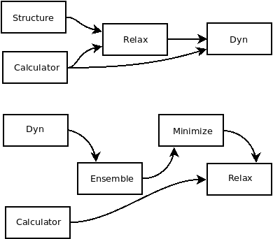
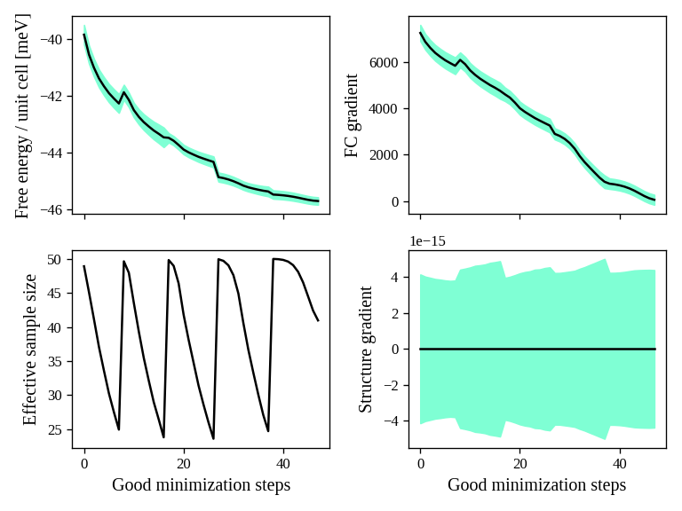
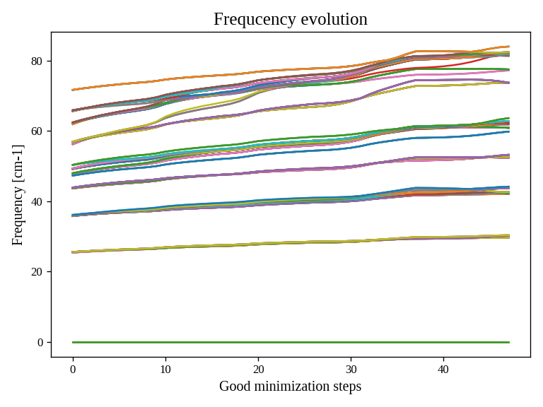
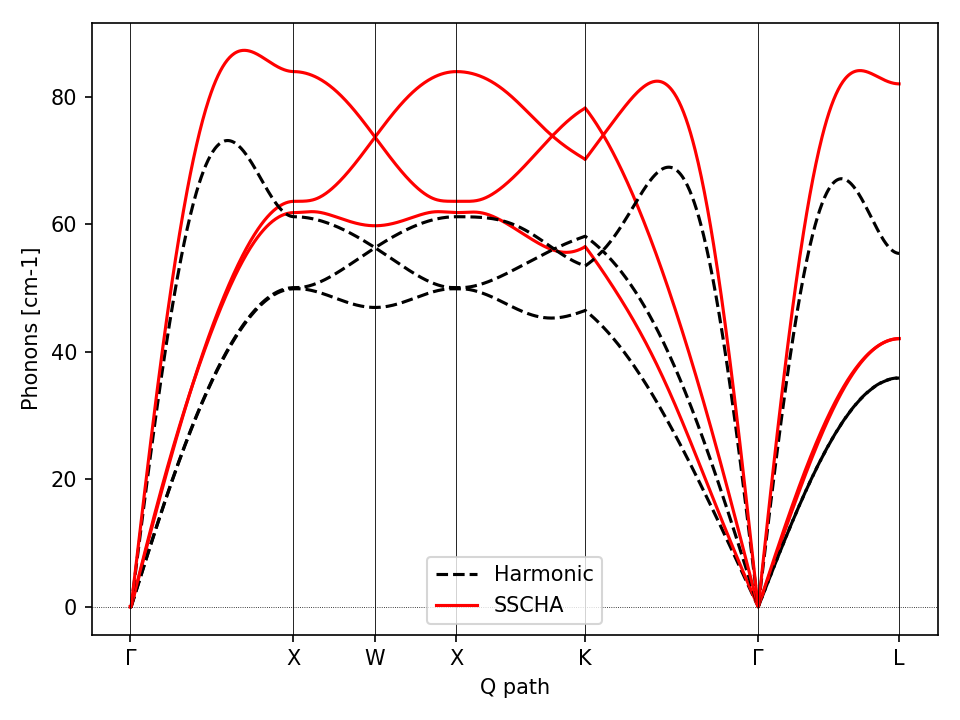
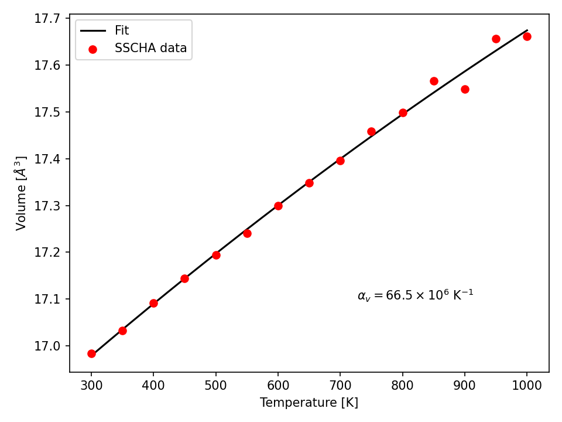

In this hands-on tutorial we provide ready to use examples to setup your first
SSCHA calculation. Here we show how the SSCHA can be used to calculate free energies and relax a structure.  

This tutorial was prepared for the [2023 SSCHA School](http://sscha.eu/Schools/2023/home/) by Diego Martinez Gutierrez. You can see here the video os the hands-on session:

<iframe width="560" height="315" src="https://www.youtube.com/embed/3cE6Sw_7hSk" title="YouTube video player" frameborder="0" allow="accelerometer; autoplay; clipboard-write; encrypted-media; gyroscope; picture-in-picture; web-share" allowfullscreen></iframe>

<section id="the-free-energy-of-gold-a-simulation-in-the-nvt-ensemble">
<h2>The free energy of gold: a simulation in the NVT ensemble</h2>

This simple tutorial explains how to setup a SSCHA calculation starting just from the structure, in this case a cif file we downloaded from the [Materials Project](<a class="reference external" href="https://materialsproject.org/materials/mp-81/">https://materialsproject.org/materials/mp-81/</a>) database that we can find in the <em>01_First_SSCHA_simulations</em> directory.

<dl class="simple">
<dt>Starting from the Gold structure in the primitive cell, to run the SSCHA we need:</dt><dd><ul class="simple">
<li>
Compute the harmonic phonons (dynamical matrix)
</li>
<li>
Remove imaginary frequencies (if any)
</li>
<li>
Run the SSCHA
</li>
</ul>
</dd>
</dl>

At the very beginning, we simply import the sscha libraries, cellconstructor, the math libraries and the force field. This is done in python with the <cite>import</cite> statemets.

<pre># Import the sscha code
import sscha, sscha.Ensemble, sscha.SchaMinimizer
import sscha.Relax, sscha.Utilities

# Import the cellconstructor library to manage phonons
import cellconstructor as CC, cellconstructor.Phonons
import cellconstructor.Structure, cellconstructor.calculators

# Import the force field of Gold
import ase, ase.calculators
from ase.calculators.emt import EMT

# Import numerical and general pourpouse libraries
import numpy as np, matplotlib.pyplot as plt
import sys, os
</pre>

The first thing we do is to initialize a cellconstructor structure from the cif file downloaded from the material database (<em>Au.cif</em>). We initialize the EMT calculator from ASE, and relax the structure:

<pre>gold_structure = CC.Structure.Structure()
gold_structure.read_generic_file(&quot;Au.cif&quot;)

# Get the force field for gold
calculator = EMT()

# Relax the gold structure
relax = CC.calculators.Relax(gold_structure, calculator)
gold_structure_relaxed = relax.static_relax()
</pre>

In the case of Gold the relaxation is useless, as it is a FCC structure with Fm-3m symmetry group and 1 atom per primitive cell. This means the atomic positions have no degrees of freedom, thus the relaxation will end before even start.

Next, we perform the harmonic phonon calculation using cellconstructor and a finite displacement approach:

<pre>gold_harmonic_dyn = CC.Phonons.compute_phonons_finite_displacements(gold_structure_relaxed, calculator, supercell = (4,4,4))

# Impose the symmetries and
# save the dynamical matrix in the quantum espresso format
gold_harmonic_dyn.Symmetrize()
gold_harmonic_dyn.save_qe(&quot;gold_harmonic_dyn&quot;)
</pre>

The method <cite>compute_phonons_finite_displacements</cite> is documented in the CellConstructor guide. It requires the structure (in this case <cite>gold_structure_relaxed</cite>), the force-field (<cite>calculator</cite>) and the supercell for the calculation. In this case we use a 4x4x4 (equivalent to 64 atoms). This may not be sufficient to converge all the properties, especially at very high temperature, but it is just a start.

Note that  <cite>compute_phonons_finite_displacements</cite>  works in parallel with MPI, therefore, if the script is executed with <cite>mpirun -np 16 python myscript.py</cite> it will split the calculations of the finite displacements across 16 processors. You need to have mpi4py installed.
However, in this case, due to the high symmetries, only one calculation is reqired to get the harmonic dynamical matrix, therefore the parallelization is useless.

After computing the harmonic phonons in gold_harmonic_dyn, we impose the correct symmetrization and the acousitic sum rule with the <cite>Symmetrize</cite> method, and save the result in the quantum ESPRESSO format with <cite>save_qe</cite>.

We are ready to submit the SSCHA calculation in the NVT ensemble.

<dl class="simple">
<dt>The important parameters are:</dt><dd><ul class="simple">
<li>
The temperature
</li>
<li>
The number of random configurations in the ensemble
</li>
<li>
The maximum number of iterations
</li>
</ul>
</dd>
</dl>

These parameters are almost self-explaining.
In contrast with Molecular Dynamics (MD) or Metropolis-Monte Carlo (MC) calculations, where the equilibrium probability distribution is sampled from a dynamical evolution of a structure, the SSCHA encodes the whole probability distribution as an analytical function. Therefore, to compute properties, we can generate on the fly the configurations that sample the equilibrium distribution.

<figure class="align-default" id="id1">

<figcaption>

Fig. 1 Workflow of the SSCHA objects for a free energy minimization.

</figcaption>
</figure>

The code that sets up and perform the SSCHA is the following:

<pre>TEMPERATURE = 300
N_CONFIGS = 50
MAX_ITERATIONS = 20

# Initialize the random ionic ensemble
ensemble = sscha.Ensemble.Ensemble(gold_harmonic_dyn, TEMPERATURE)

# Initialize the free energy minimizer
minim = sscha.SchaMinimizer.SSCHA_Minimizer(ensemble)
minim.set_minimization_step(0.01)

# Initialize the NVT simulation
relax = sscha.Relax.SSCHA(minim, calculator, N_configs = N_CONFIGS,
max_pop = MAX_ITERATIONS)

# Define the I/O operations
# To save info about the free energy minimization after each step
ioinfo = sscha.Utilities.IOInfo()
ioinfo.SetupSaving(&quot;minim_info&quot;)
relax.setup_custom_functions(custom_function_post = ioinfo.CFP_SaveAll)

# Run the NVT simulation
relax.relax(get_stress = True)

# Save the final dynamical matrix
relax.minim.dyn.save_qe(&quot;sscha_T300_dyn&quot;)
</pre>

In the previous code we defined the main object to run the simulation:

<blockquote>

<ul class="simple">
<li>
<cite>ensemble</cite> (<cite>sscha.Ensemble.Ensemble</cite>), represents the ensemble of ionic configurations. We initialize it with the dynamical matrix (which represent how much atoms fluctuate around the centroids) and the temperature.
</li>
<li>
<cite>minim</cite> (<cite>sscha.SchaMinimizer.SSCHA_Minimizer</cite>) performs the free energy minimization. It contains all the info regarding the minimization algorithm, as the initial timestep (that here we set to 0.01). You can avoid setting the time-step, as the code will automatically guess the best value.
</li>
<li>
<cite>relax</cite> (<cite>sscha.Relax.SSCHA</cite>) automatizes the generation of ensembles, calculation of energies and forces and the free energy minimization to perform a NVT or NPT calculation. To initialize it, we pass the <cite>minim</cite> (which contains the ensemble with the temperature), the force-field (<cite>calculator</cite>), the number of configurations <cite>N_configs</cite> and the maximum number of iterations.
</li>
</ul>

</blockquote>

In this example, most of the time is spent in the minimization, however, if we replace the force-field with ab-initio DFT, the time to run the minimization is negligible with respect to the time to compute energies and forces on the ensemble configurations.
The total (maximum) number of energy/forces calculations is equal to the number of configurations times the number of iterations (passed through the <cite>max_pop</cite> argument).

The calculation is submitted with <cite>relax.relax()</cite>. However, before running the calculation we introduce another object, the <cite>IOInfo</cite>.
This tells the <cite>relax</cite> to save information of the free energy, its gradient and the anharmonic phonon frequencies during the minimization in the files <em>minim_info.dat</em> and <em>minim_info.freqs</em>. It is not mandatory to introduce them, but it is very usefull as it allows to visualize the minimization while it is running.

The full input file is:

<pre># Import the sscha code
import sscha, sscha.Ensemble, sscha.SchaMinimizer, sscha.Relax, sscha.Utilities

# Import the cellconstructor library to manage phonons
import cellconstructor as CC, cellconstructor.Phonons
import cellconstructor.Structure, cellconstructor.calculators

# Import the force field of Gold
import ase, ase.calculators
from ase.calculators.emt import EMT

# Import numerical and general pourpouse libraries
import numpy as np, matplotlib.pyplot as plt
import sys, os

&quot;&quot;&quot;
Here we load the primitive cell of Gold from a cif file.
And we use CellConstructor to compute phonons from finite differences.
The phonons are computed on a q-mesh 4x4x4
&quot;&quot;&quot;

gold_structure = CC.Structure.Structure()
gold_structure.read_generic_file(&quot;Au.cif&quot;)

# Get the force field for gold
calculator = EMT()

# Relax the gold structure (useless since for symmetries it is already relaxed)
relax = CC.calculators.Relax(gold_structure, calculator)
gold_structure_relaxed = relax.static_relax()

# Compute the harmonic phonons
# NOTE: if the code is run with mpirun, the calculation goes in parallel
gold_harmonic_dyn = CC.Phonons.compute_phonons_finite_displacements(gold_structure_relaxed, calculator, supercell = (4,4,4))

# Impose the symmetries and
# save the dynamical matrix in the quantum espresso format
gold_harmonic_dyn.Symmetrize()
gold_harmonic_dyn.save_qe(&quot;harmonic_dyn&quot;)

# If the dynamical matrix has imaginary frequencies, remove them
gold_harmonic_dyn.ForcePositiveDefinite()

&quot;&quot;&quot;
gold_harmonic_dyn is ready to start the SSCHA calculation.

Now let us initialize the ensemble, and the calculation at 300 K.
We will run a NVT calculation, using 100 configurations at each step
&quot;&quot;&quot;

TEMPERATURE = 300
N_CONFIGS = 50
MAX_ITERATIONS = 20

# Initialize the random ionic ensemble
ensemble = sscha.Ensemble.Ensemble(gold_harmonic_dyn, TEMPERATURE)

# Initialize the free energy minimizer
minim = sscha.SchaMinimizer.SSCHA_Minimizer(ensemble)
minim.set_minimization_step(0.01)

# Initialize the NVT simulation
relax = sscha.Relax.SSCHA(minim, calculator, N_configs = N_CONFIGS,
max_pop = MAX_ITERATIONS)

# Define the I/O operations
# To save info about the free energy minimization after each step
ioinfo = sscha.Utilities.IOInfo()
ioinfo.SetupSaving(&quot;minim_info&quot;)
relax.setup_custom_functions(custom_function_post = ioinfo.CFP_SaveAll)

# Run the NVT simulation (save the stress to compute the pressure)
relax.relax(get_stress = True)

# Save the final dynamical matrix
# And print in stdout the info about the minimization
relax.minim.finalize()
relax.minim.dyn.save_qe(&quot;sscha_T{}_dyn&quot;.format(TEMPERATURE))
</pre>

Now save the file as <cite>sscha_gold.py</cite> and execute it with:

<pre>$ python sscha_gold.py &gt; output.log
</pre>

And that’s it. The code will probably take few minutes on a standard laptop computer.
<strong>Congratulations!</strong> You run your first SSCHA simulation!

If you open a new terminal in the same directory of the SSCHA submission, you can plot the info during the minimization.
Starting from version 1.2, we provide a visualization utilities installed together with the SSCHA.
Simply type

<pre>$ sscha-plot-data.py minim_info
</pre>

You will see two windows.

<figure class="align-default" id="id2">

<figcaption>

Fig. 2 Minimization data of Gold.

</figcaption>
</figure>

In <a class="reference internal" href="#fig-goldminim">Fig. 2</a> we have all the minimization data. On the top-left panel, we see the free energy. As expected, it decreases (since the SSCHA is minimizing it).
You can see that at certain values of the steps there are discontinuities.
These occurs when the code realizes that the ensemble on which it is computing is no more good and a new one is generated. The goodness of an ensemble is determined by the Kong-Liu effective sample size (bottom-left).
When it reaches 0.5 of its initial value (equal to the number of configurations), the ensemble is extracted again and a new iteration starts. You see that in the last iteration, the code stops before getting to 25 (\(0.5\cdot 50\)). This means that the code converged properly: the gradient reached zero when the ensemble was still good.

On the right-side you see the free energy gradients, which must go to zero to converge. The top-right is the gradient of the SSCHA dynamical matrix, while on bottom-right there is the gradient of the average atomic positions.

Indeed, since the gold atomic positions are all fixed by symmetries, it is always zero (but it will be different from zero in more complex system).

<figure class="align-default" id="id3">

<figcaption>

Fig. 3 All the SSCHA phonon frequencies as a function of the step in the NVT simulation.

</figcaption>
</figure>

Instead, <a class="reference internal" href="#fig-goldfreqs">Fig. 3</a> represents the evolution of the SSCHA phonon frequencies.
Here, all the frequencies in the supercell (at each q point commensurate with the calculation) are shown.

NOTE

The sscha auxiliary frequencies in <a class="reference internal" href="#fig-goldfreqs">Fig. 3</a> are not the real frequencies observed in experiments, but rather are linked to the average displacements of atoms along that mode.

By looking at how they change you can have an idea on which phonon mode are more affected by anharmonicity. In this case, it is evident that Gold is strongly anharmonic and that the temperature makes all the phonon frequencies harder.

At the end of the simulation, the code writes the final dynamical matrix in the quantum espresso file format: <em>sscha_T300_dynX</em> where X goes over the number of irreducible q points.

In the next section, we analyze in details each section of the script to provide a bit more insight on the simulation, and a guide to modify it to fit your needs and submit your own system.

<section id="plot-the-phonon-dispersion">
<h3>Plot the phonon dispersion</h3>

Now that the SSCHA minimization ended, we can compare the harmonic and anharmonic phonon dispersion of Gold.

To this purpouse, we can simply run a script like the following. You find a copy of this script already in Examples/ThermodynamicsOfGold/plot_dispersion.py.

You can use it even in your simulation, simply edit the value of the uppercase keyword at the beginning of the script to match your needs.

<pre># Import the CellConstructor library to plot the dispersion
import cellconstructor as CC, cellconstructor.Phonons
import cellconstructor.ForceTensor

# Import the numerical libraries and those for plotting
import numpy as np
import matplotlib.pyplot as plt

import sys, os

# Let us define the PATH in the brilluin zone and the total number of points
PATH = &quot;GXWXKGL&quot;
N_POINTS = 1000

# Here we define the position of the special points
SPECIAL_POINTS = {&quot;G&quot;: [0,0,0],
             &quot;X&quot;: [0, .5, .5],
             &quot;L&quot;: [.5, .5, .5],
             &quot;W&quot;: [.25, .75, .5],
             &quot;K&quot;: [3/8., 3/4., 3/8.]}

# The two dynamical matrix to be compared
HARM_DYN = &#39;harmonic_dyn&#39;
SSCHA_DYN = &#39;sscha_T300_dyn&#39;

# The number of irreducible q points
# i.e., the number of files in which the phonons are stored
NQIRR = 13

# --------------------- THE SCRIPT FOLLOWS ---------------------

# Load the harmonic and sscha phonons
harmonic_dyn = CC.Phonons.Phonons(HARM_DYN, NQIRR)
sscha_dyn = CC.Phonons.Phonons(SSCHA_DYN, NQIRR)

# Get the band path
qpath, data = CC.Methods.get_bandpath(harmonic_dyn.structure.unit_cell,
             PATH,
             SPECIAL_POINTS,
             N_POINTS)
xaxis, xticks, xlabels = data # Info to plot correclty the x axis

# Get the phonon dispersion along the path
harmonic_dispersion = CC.ForceTensor.get_phonons_in_qpath(harmonic_dyn, qpath)
sscha_dispersion = CC.ForceTensor.get_phonons_in_qpath(sscha_dyn, qpath)

nmodes = harmonic_dyn.structure.N_atoms * 3

# Plot the two dispersions
plt.figure(dpi = 150)
ax = plt.gca()

for i in range(nmodes):
    lbl=None
    lblsscha = None
    if i == 0:
        lbl = &#39;Harmonic&#39;
        lblsscha = &#39;SSCHA&#39;

    ax.plot(xaxis, harmonic_dispersion[:,i], color=&#39;k&#39;,
            ls=&#39;dashed&#39;, label=lbl)
    ax.plot(xaxis, sscha_dispersion[:,i],
            color=&#39;r&#39;, label=lblsscha)

# Plot vertical lines for each high symmetry points
for x in xticks:
   ax.axvline(x, 0, 1, color = &quot;k&quot;, lw = 0.4)
ax.axhline(0, 0, 1, color = &#39;k&#39;, ls = &#39;:&#39;, lw = 0.4)

# Set the x labels to the high symmetry points
ax.set_xticks(xticks)
ax.set_xticklabels(xlabels)

ax.set_xlabel(&quot;Q path&quot;)
ax.set_ylabel(&quot;Phonons [cm-1]&quot;)

ax.legend()

plt.tight_layout()
plt.savefig(&quot;dispersion.png&quot;)
plt.show()
</pre>

If we save the script as <cite>plot_dispersion.py</cite> in the same directory of the calculation, we can run it with

<pre>$ python plot_dispersion.py
</pre>

<figure class="align-default" id="id4">

<figcaption>

Fig. 4 Comparison between the SSCHA and the harmonic phonon dispersion of Gold.

</figcaption>
</figure>

The script will plot the figure of the phonon dispersion <a class="reference internal" href="#fig-dispersion">Fig. 4</a>.
It is quite different from the experimental one because of the poor accuracy of the force field, however, the SSCHA results is much closer to the experimental value.

Exercise

Try to perform the simulation of Gold but at a different temperature, plot then the SSCHA phonon dispersion as a function of temperature.

How does the phonon bands behave if the temperature is increased? Do they become more rigid (energy increases) or softer?

</section>
</section>
<section id="running-in-the-npt-ensemble-simulating-thermal-expansion">
<h2>Running in the NPT ensemble: simulating thermal expansion</h2>

Now that you have some experience with the NVT simulation we are ready for the next step: NPT,
or relaxing the lattice.

With python-sscha it is very easy to run NPT simulation, you simply have to replace the line of the NVT script with the target pressure for the simulation:

<pre># Replace the line
# relax.relax(get_stress = True)
# with
relax.vc_relax(target_press = 0)
</pre>

And that is all! The target pressure is expressed in GPa, in this case 0 is ambient conditions (1 atm = 0.0001 GPa)

You can also perform NVT simulation with variable lattice parameters: In this case the system will constrain the total volume to remain constant, but the lattice parameter will be optimized (if the system is not cubic and has some degrees of freedom, which is not the case for Gold).

The NVT ensemble with variable lattice parameters (cell shape) is

<pre># Replace the line
#    relax.vc_relax(target_press = 0)
# with
relax.vc_relax(fix_volume = True)
</pre>

Indeed, this is a NVT simulation, therefore there is no need to specify the target pressure.

The following script, we run the NPT ensemble at various temperatures, each time starting from the previous ensemble, to follow the volume thermal expansion of gold.

This script assume you already performed the NVT calculation, so that we can start from that results, and avoid the harmonic calculation (It is always a good practice to start with NVT simulation and then run NPT from the final result).

<pre># Import the sscha code
import sscha, sscha.Ensemble, sscha.SchaMinimizer, sscha.Relax
import sscha.Utilities

# Import the cellconstructor library to manage phonons
import cellconstructor as CC, cellconstructor.Phonons
import cellconstructor.Structure, cellconstructor.calculators

# Import the force field of Gold
import ase, ase.calculators
from ase.calculators.emt import EMT

# Import numerical and general pourpouse libraries
import numpy as np, matplotlib.pyplot as plt
import sys, os

# Define the temperature range (in K)
T_START = 300
T_END = 1000
DT = 50

N_CONFIGS = 50
MAX_ITERATIONS = 10

# Import the gold force field
calculator = EMT()

# Import the starting dynamical matrix (final result of get_gold_free_energy.py)
dyn = CC.Phonons.Phonons(&quot;sscha_T300_dyn&quot;, nqirr = 13)

# Create the directory on which to store the output
DIRECTORY = &quot;thermal_expansion&quot;
if not os.path.exists(DIRECTORY):
    os.makedirs(&quot;thermal_expansion&quot;)

# We cycle over several temperatures
t = T_START

volumes = []
temperatures = []
while t &lt;= T_END:
    # Change the temperature
    ensemble = sscha.Ensemble.Ensemble(dyn, t)
    minim = sscha.SchaMinimizer.SSCHA_Minimizer(ensemble)
    minim.set_minimization_step(0.1)

    relax = sscha.Relax.SSCHA(minim, calculator, N_configs = N_CONFIGS,
                              max_pop = MAX_ITERATIONS)

    # Setup the I/O
    ioinfo = sscha.Utilities.IOInfo()
    ioinfo.SetupSaving( os.path.join(DIRECTORY, &quot;minim_t{}&quot;.format(t)))
    relax.setup_custom_functions( custom_function_post = ioinfo.CFP_SaveAll)

    # Run the NPT simulation
    relax.vc_relax(target_press = 0)

    # Save the volume and temperature
    volumes.append(relax.minim.dyn.structure.get_volume())
    temperatures.append(t)

    # Start the next simulation from the converged value at this temperature
    relax.minim.dyn.save_qe(os.path.join(DIRECTORY,
                            &quot;sscha_T{}_dyn&quot;.format(t)))
    dyn = relax.minim.dyn

    # Print in standard output
    relax.minim.finalize()

    # Update the temperature
    t += DT

    # Save the thermal expansion
    np.savetxt(os.path.join(DIRECTORY, &quot;thermal_expansion.dat&quot;),
               np.transpose([temperatures, volumes]),
               header = &quot;Temperature [K]; Volume [A^3]&quot;)
</pre>

You can run the script as always with:

<pre>$ python thermal_expansion.py
</pre>

And … done!

This calculation is going to require a bit more time, as we run multiple SSCHA at several temperatures.
After it finishes, you can plot the results written in the file thermal_expansion/thermal_expansion.dat.

A simple script to plot the thermal expansion (and fit the volumetric thermal expansion value) is the following

<pre>import numpy as np
import matplotlib.pyplot as plt

import scipy, scipy.optimize

# Load all the dynamical matrices and compute volume
DIRECTORY = &quot;thermal_expansion&quot;
FILE = os.path.join(DIRECTORY, &quot;thermal_expansion.dat&quot;)

# Load the data from the final data file
temperatures, volumes = np.loadtxt(FILE, unpack = True)

# Prepare the figure and plot the V(T) from the sscha data
plt.figure(dpi = 150)
plt.scatter(temperatures, volumes, label = &quot;SSCHA data&quot;)

# Fit the data to estimate the volumetric thermal expansion coefficient
def parabola(x, a, b, c):
    return a + b*x + c*x**2
def diff_parab(x, a, b, c):
    return b + 2*c*x

popt, pcov = scipy.optimize.curve_fit(parabola, temperatures, volumes,
                                      p0 = [0,0,0])

# Evaluate the volume thermal expansion
vol_thermal_expansion = diff_parab(300, *popt) / parabola(300, *popt)
plt.text(0.6, 0.2, r&quot;$\alpha_v = &quot;+&quot;{:.1f}&quot;.format(vol_thermal_expansion*1e6)+r&quot;\times 10^6 $ K$^{-1}$&quot;,
         transform = plt.gca().transAxes)

# Plot the fit
_t_ = np.linspace(np.min(temperatures), np.max(temperatures), 1000)
plt.plot(_t_, parabola(_t_, *popt), label = &quot;Fit&quot;)

# Adjust the plot adding labels, legend, and saving in eps
plt.xlabel(&quot;Temperature [K]&quot;)
plt.ylabel(r&quot;Volume [$\AA^3$]&quot;)
plt.legend()
plt.tight_layout()
plt.savefig(&quot;thermal_expansion.png&quot;)
plt.show()
</pre>

<figure class="align-default" id="id5">

<figcaption>

Fig. 5 Thermal expansion of Gold. From the fit of the data we can compute the volumetric
thermal expansion coefficient (at 300 K).

</figcaption>
</figure>

We report the final thermal expansion in <a class="reference internal" href="#fig-goldexpansion">Fig. 5</a>.
The volumetric expansion coefficient \(\alpha_v\) is obtained from the fit
thanks to the thermodynamic relation:

\[\alpha_v = \frac{1}{V} \left(\frac{dV}{dT}\right)_P\]

Also in this case, the result is quite off with experiments, due to the not completely realistic force-field employed. To get a more realistic approach, you should use <em>ab-initio</em> calculations or a more refined force-field.

</section>
<section id="ab-initio-calculation-with-the-sscha-code">
<h2>Ab initio calculation with the SSCHA code</h2>

The SSCHA code is compatible with the Atomic Simulation Environment (ASE), which we employed in the previous tutorial to get a fast force-field for Gold.

However, ASE already provides an interface with most codes to run ab initio simulations.
The simplest way of interfacing the SSCHA to an other ab initio code is to directly use ASE.

The only difference is in the definition of the calculator, in the first example of this chapter, the Gold force field was defined as:

<pre>import ase
from ase.calculators.emt import EMT
calculator = EMT()
</pre>

We simply need to replace these lines to our favourite DFT code. In this example we are going to use quantum espresso, but the procedure for VASP, CASTEP, CRYSTAL, ABINIT, SIESTA, or your favourite one are exatly the same (Refer to the official documentatio of ASE to the instruction on how to initialize these calculators).

In the case of DFT, unfortunately, we cannot simply create the calculator in one line, like we did for EMT force-field, as we need also to provide a lot of parameters, as pseudopotentials, the choice of exchange correlation, the cutoff of the basis set, and the k mesh grid for Brilluin zone sampling.

In the following example, we initialize the quantum espresso calculator for Gold.

<pre>import cellconstructor.calculators
from ase.calculators.espresso import Espresso

# Initialize the DFT (Quantum Espresso) calculator for gold
# The input data is a dictionary that encodes the pw.x input file namelist
input_data = {
    &#39;control&#39; : {
        # Avoid writing wavefunctions on the disk
        &#39;disk_io&#39; : &#39;None&#39;,
        # Where to find the pseudopotential
        &#39;pseudo_dir&#39; : &#39;.&#39;
    },
    &#39;system&#39; : {
        # Specify the basis set cutoffs
        &#39;ecutwfc&#39; : 45,   # Cutoff for wavefunction
        &#39;ecutrho&#39; : 45*4, # Cutoff for the density
        # Information about smearing (it is a metal)
        &#39;occupations&#39; : &#39;smearing&#39;,
        &#39;smearing&#39; : &#39;mv&#39;,
        &#39;degauss&#39; : 0.03
    },
    &#39;electrons&#39; : {
        &#39;conv_thr&#39; : 1e-8
    }
}

# the pseudopotential for each chemical element
# In this case just Gold
pseudopotentials = {&#39;Au&#39; : &#39;Au_ONCV_PBE-1.0.oncvpsp.upf&#39;}

# the kpoints mesh and the offset
kpts = (1,1,1)
koffset = (1,1,1)

# Prepare the quantum espresso calculator
#calculator = CC.calculators.Espresso(input_data,
             #                       pseudopotentials,
             #                       kpts = kpts,
             #                       koffset = koffset)
calculator = Espresso(input_data = input_data, pseudopotentials = pseudopotentials,
                                                     kpts = kpts, koffset = koffset)
</pre>

If you are familiar with the quantum espresso input files, you should recognize all the options inside the input_data dictionary. For more options and more information, refer to the <a class="reference external" href="https://www.quantum-espresso.org/Doc/INPUT_PW.html">quantum ESPRESSO pw.x input guide</a>.

Remember, the parameters setted here are just for fun, remember to run appropriate convergence check of the kmesh, smearing and basis set cutoffs before running the SSCHA code.
Keep also in mind that this input file refers to the supercell, and the kpts variable can be properly rescaled if the supercell is increased.

All the rest of the code remains the same (but here we do not compute harmonic phonons, which can be done more efficiently within the Quantum ESPRESSO).
Instead, we take the result obtained with EMT in the previous sections, and try to relax the free energy with a fully ab-initio approach.

The complete code is inside Examples/sscha_and_dft/nvt_local.py

<pre># Import the sscha code
import sscha, sscha.Ensemble, sscha.SchaMinimizer, sscha.Relax, sscha.Utilities

# Import the cellconstructor library to manage phonons
import cellconstructor as CC, cellconstructor.Phonons
import cellconstructor.Structure, cellconstructor.calculators

# Import the DFT calculator
import cellconstructor.calculators
from ase.calculators.espresso import Espresso

# Import numerical and general pourpouse libraries
import numpy as np, matplotlib.pyplot as plt
import sys, os

# Initialize the DFT (Quantum Espresso) calculator for gold
# The input data is a dictionary that encodes the pw.x input file namelist
input_data = {
    &#39;control&#39; : {
        # Avoid writing wavefunctions on the disk
        &#39;disk_io&#39; : &#39;None&#39;,
        # Where to find the pseudopotential
        &#39;pseudo_dir&#39; : &#39;.&#39;
    },
    &#39;system&#39; : {
        # Specify the basis set cutoffs
        &#39;ecutwfc&#39; : 45,   # Cutoff for wavefunction
        &#39;ecutrho&#39; : 45*4, # Cutoff for the density
        # Information about smearing (it is a metal)
        &#39;occupations&#39; : &#39;smearing&#39;,
        &#39;smearing&#39; : &#39;mv&#39;,
        &#39;degauss&#39; : 0.03
    },
    &#39;electrons&#39; : {
        &#39;conv_thr&#39; : 1e-8
    }
}

# the pseudopotential for each chemical element
# In this case just Gold
pseudopotentials = {&#39;Au&#39; : &#39;Au_ONCV_PBE-1.0.oncvpsp.upf&#39;}

# the kpoints mesh and the offset
kpts = (1,1,1)
koffset = (1,1,1)

# Specify the command to call quantum espresso
command = &#39;pw.x -i PREFIX.pwi &gt; PREFIX.pwo&#39;

# Prepare the quantum espresso calculator
#calculator = CC.calculators.Espresso(input_data,
             #                       pseudopotentials,
             #                       command = command,
             #                       kpts = kpts,
             #                       koffset = koffset)
 calculator = Espresso(input_data =  imput_data,
                                     pseudopotentials = pseudopotentials,
                                     command = command,
                                     kpts = kpts,
                                     koffset = koffset)

TEMPERATURE = 300
N_CONFIGS = 50
MAX_ITERATIONS = 20
START_DYN = &#39;harmonic_dyn&#39;
NQIRR = 13

# Let us load the starting dynamical matrix
gold_dyn = CC.Phonons.Phonons(START_DYN, NQIRR)

# Initialize the random ionic ensemble
ensemble = sscha.Ensemble.Ensemble(gold_dyn, TEMPERATURE)

# Initialize the free energy minimizer
minim = sscha.SchaMinimizer.SSCHA_Minimizer(ensemble)
minim.set_minimization_step(0.01)

# Initialize the NVT simulation
relax = sscha.Relax.SSCHA(minim, calculator, N_configs = N_CONFIGS,
                          max_pop = MAX_ITERATIONS)

# Define the I/O operations
# To save info about the free energy minimization after each step
ioinfo = sscha.Utilities.IOInfo()
ioinfo.SetupSaving(&quot;minim_info&quot;)
relax.setup_custom_functions(custom_function_post = ioinfo.CFP_SaveAll)

# Run the NVT simulation (save the stress to compute the pressure)
relax.relax(get_stress = True)

# If instead you want to run a NPT simulation, use
# The target pressure is given in GPa.
#relax.vc_relax(target_press = 0)

# You can also run a mixed simulation (NVT) but with variable lattice parameters
#relax.vc_relax(fix_volume = True)

# Now we can save the final dynamical matrix
# And print in stdout the info about the minimization
relax.minim.finalize()
relax.minim.dyn.save_qe(&quot;sscha_T{}_dyn&quot;.format(TEMPERATURE))
</pre>

Now you can run the SSCHA with an ab-initio code!
However, your calculation will probably take forever.
To speedup things, lets discuss parallelization and how to exploit modern HPC infrastructures.

<section id="parallelization">
<h3>Parallelization</h3>

If you actually tried to run the code of the previous section on a laptop, it will take forever.
The reason is that DFT calculations are much more expensive than the SSCHA minimization. While SSCHA minimizes the number of ab initio calculations (especially when compared with MD or PIMD), still they are the bottleneck of the computational time.

For this reason, we need an opportune parallelization strategy to reduce the total time to run a SSCHA.

The simplest way is to call the previous python script with MPI:

<pre>$ mpirun -np 50 python nvt_local.py &gt; output.log
</pre>

The code will split the configurations in each ensemble on a different MPI process. In this case we have 50 configurations per ensemble, by splitting them into 50 processors, we run the full ensemble in parallel.

However, still the single DFT calculation on 1 processor is going to take hours, and in some cases it may even take days.
Luckily, also quantum ESPRESSO (and many other software) have an internal parallelization to work with.
For example, we can tell quantum espresso to run itself in parallel on 8 processors.
To this purpouse, we simply need to modify the command used to run quantum espresso in the previous script.

<pre># Lets replace
# command = &#39;pw.x -i PREFIX.pwi &gt; PREFIX.pwo&#39;
# with
command = &#39;mpirun -np 8 pw.x -npool 1 -i PREFIX.pwi &gt; PREFIX.pwo&#39;

# The command string is passed to the espresso calculator
calculator = CC.calculators.Espresso(input_data,
                                     pseudopotentials,
                                     command = command,
                                     kpts = kpts,
                                     koffset = koffset)
</pre>

In this way, our calculations will run on 400 processors (50 processors splits the ensemble times 8 processors per each calculation).
This is achieved by nesting mpi calls. However, only the cellconstructor calculators can nest mpi calls without raising errors. This is the reason why we imported the Espresso class from cellconstructor and not from ASE.
If you want to use ASE for your calculator, you can only use the inner parallelization of the calculator modifying the command, as ASE itself implements a MPI parallelization on I/O operations that conflicts with the python-sscha parallelization. This limitation only applies to FileIOCalculators from ASE (thus the EMT force-field is not affected and can be safely employed with python-sscha parallelization).

With this setup, the full code is parallelized over 400 processors. However the SSCHA minimization algorithm is a serial one, and all the time spent in the actual SSCHA minimization is wasting the great number of resources allocated.
Moreover, the SSCHA code needs to be configured and correctly installed on the cluster, which may be a difficult operation due to the hybrid Fortran/pyhton structure.

</section>
</section>
</section>

          

        

      

      

        

<h3>Related Topics</h3>
<ul>
  <li><a href="index.html">Documentation overview</a><ul>
      <li>Previous: <a href="installation.html" title="previous chapter">Software Installation</a></li>
      <li>Next: <a href="tutorial_02_advanced_submission.html" title="next chapter">Hands-on-session 2 - Advanced free energy minimization</a></li>
  </ul></li>
</ul>

  <h3 id="searchlabel">Quick search</h3>
    

    <form class="search" action="search.html" method="get">
      <input type="text" name="q" aria-labelledby="searchlabel" autocomplete="off" autocorrect="off" autocapitalize="off" spellcheck="false"/>
      <input type="submit" value="Go" />
    </form>
    

        

      

      

    

    

      &copy;2023, Lorenzo Monacelli.

      |
      Powered by <a href="http://sphinx-doc.org/">Sphinx 4.2.0</a>
      &amp; <a href="https://github.com/bitprophet/alabaster">Alabaster 0.7.12</a>

      |
      <a href="_sources/tutorial_01_first_simulations.rst.txt"
          rel="nofollow">Page source</a>
    

## The free energy of gold: a simulation in the NVT ensemble

This simple tutorial explains how to setup a SSCHA calculation starting
just from the structure, in this case a cif file we downloaded from the
\[Materials Project\](<https://materialsproject.org/materials/mp-81/>)
database that we can find in the *01_First_SSCHA_simulations* directory.

Starting from the Gold structure in the primitive cell, to run the SSCHA we need:

:   -   Compute the harmonic phonons (dynamical matrix)

    -   Remove imaginary frequencies (if any)

    -   Run the SSCHA

At the very beginning, we simply import the sscha libraries,
cellconstructor, the math libraries and the force field. This is done in
python with the import statemets.

::: {.highlight-python .notranslate}
::: {.highlight}
    # Import the sscha code
    import sscha, sscha.Ensemble, sscha.SchaMinimizer
    import sscha.Relax, sscha.Utilities

    # Import the cellconstructor library to manage phonons
    import cellconstructor as CC, cellconstructor.Phonons
    import cellconstructor.Structure, cellconstructor.calculators

    # Import the force field of Gold
    import ase, ase.calculators
    from ase.calculators.emt import EMT

    # Import numerical and general pourpouse libraries
    import numpy as np, matplotlib.pyplot as plt
    import sys, os
:::
:::

The first thing we do is to initialize a cellconstructor structure from
the cif file downloaded from the material database (*Au.cif*). We
initialize the EMT calculator from ASE, and relax the structure:

::: {.highlight-python .notranslate}
::: {.highlight}
    gold_structure = CC.Structure.Structure()
    gold_structure.read_generic_file("Au.cif")

    # Get the force field for gold
    calculator = EMT()

    # Relax the gold structure
    relax = CC.calculators.Relax(gold_structure, calculator)
    gold_structure_relaxed = relax.static_relax()
:::
:::

In the case of Gold the relaxation is useless, as it is a FCC structure
with Fm-3m symmetry group and 1 atom per primitive cell. This means the
atomic positions have no degrees of freedom, thus the relaxation will
end before even start.

Next, we perform the harmonic phonon calculation using cellconstructor
and a finite displacement approach:

::: {.highlight-python .notranslate}
::: {.highlight}
    gold_harmonic_dyn = CC.Phonons.compute_phonons_finite_displacements(gold_structure_relaxed, calculator, supercell = (4,4,4))

    # Impose the symmetries and
    # save the dynamical matrix in the quantum espresso format
    gold_harmonic_dyn.Symmetrize()
    gold_harmonic_dyn.save_qe("gold_harmonic_dyn")
:::
:::

The method compute_phonons_finite_displacements is documented in the
CellConstructor guide. It requires the structure (in this case
gold_structure_relaxed), the force-field (calculator) and the supercell
for the calculation. In this case we use a 4x4x4 (equivalent to 64
atoms). This may not be sufficient to converge all the properties,
especially at very high temperature, but it is just a start.

Note that compute_phonons_finite_displacements works in parallel with
MPI, therefore, if the script is executed with mpirun -np 16 python
myscript.py it will split the calculations of the finite displacements
across 16 processors. You need to have mpi4py installed. However, in
this case, due to the high symmetries, only one calculation is reqired
to get the harmonic dynamical matrix, therefore the parallelization is
useless.

After computing the harmonic phonons in gold_harmonic_dyn, we impose the
correct symmetrization and the acousitic sum rule with the Symmetrize
method, and save the result in the quantum ESPRESSO format with save_qe.

We are ready to submit the SSCHA calculation in the NVT ensemble.

The important parameters are:

:   -   The temperature

    -   The number of random configurations in the ensemble

    -   The maximum number of iterations

These parameters are almost self-explaining. In contrast with Molecular
Dynamics (MD) or Metropolis-Monte Carlo (MC) calculations, where the
equilibrium probability distribution is sampled from a dynamical
evolution of a structure, the SSCHA encodes the whole probability
distribution as an analytical function. Therefore, to compute
properties, we can generate on the fly the configurations that sample
the equilibrium distribution.

![[Fig. 1 ]{.caption-number}[Workflow of the SSCHA objects for a free
energy
minimization.]{.caption-text}{.headerlink}](figures_01/Diagram1.png)

The code that sets up and perform the SSCHA is the following:

::: {.highlight-python .notranslate}
::: {.highlight}
    TEMPERATURE = 300
    N_CONFIGS = 50
    MAX_ITERATIONS = 20

    # Initialize the random ionic ensemble
    ensemble = sscha.Ensemble.Ensemble(gold_harmonic_dyn, TEMPERATURE)

    # Initialize the free energy minimizer
    minim = sscha.SchaMinimizer.SSCHA_Minimizer(ensemble)
    minim.set_minimization_step(0.01)

    # Initialize the NVT simulation
    relax = sscha.Relax.SSCHA(minim, calculator, N_configs = N_CONFIGS,
    max_pop = MAX_ITERATIONS)

    # Define the I/O operations
    # To save info about the free energy minimization after each step
    ioinfo = sscha.Utilities.IOInfo()
    ioinfo.SetupSaving("minim_info")
    relax.setup_custom_functions(custom_function_post = ioinfo.CFP_SaveAll)

    # Run the NVT simulation
    relax.relax(get_stress = True)

    # Save the final dynamical matrix
    relax.minim.dyn.save_qe("sscha_T300_dyn")
:::
:::

In the previous code we defined the main object to run the simulation:

> 

>
> -   ensemble (sscha.Ensemble.Ensemble), represents the ensemble of
>     ionic configurations. We initialize it with the dynamical matrix
>     (which represent how much atoms fluctuate around the centroids)
>     and the temperature.
>
> -   minim (sscha.SchaMinimizer.SSCHA_Minimizer) performs the free
>     energy minimization. It contains all the info regarding the
>     minimization algorithm, as the initial timestep (that here we set
>     to 0.01). You can avoid setting the time-step, as the code will
>     automatically guess the best value.
>
> -   relax (sscha.Relax.SSCHA) automatizes the generation of ensembles,
>     calculation of energies and forces and the free energy
>     minimization to perform a NVT or NPT calculation. To initialize
>     it, we pass the minim (which contains the ensemble with the
>     temperature), the force-field (calculator), the number of
>     configurations N_configs and the maximum number of iterations.
>
> 

In this example, most of the time is spent in the minimization, however,
if we replace the force-field with ab-initio DFT, the time to run the
minimization is negligible with respect to the time to compute energies
and forces on the ensemble configurations. The total (maximum) number of
energy/forces calculations is equal to the number of configurations
times the number of iterations (passed through the max_pop argument).

The calculation is submitted with relax.relax(). However, before running
the calculation we introduce another object, the IOInfo. This tells the
relax to save information of the free energy, its gradient and the
anharmonic phonon frequencies during the minimization in the files
*minim_info.dat* and *minim_info.freqs*. It is not mandatory to
introduce them, but it is very usefull as it allows to visualize the
minimization while it is running.

The full input file is:

::: {.highlight-python .notranslate}
::: {.highlight}
    # Import the sscha code
    import sscha, sscha.Ensemble, sscha.SchaMinimizer, sscha.Relax, sscha.Utilities

    # Import the cellconstructor library to manage phonons
    import cellconstructor as CC, cellconstructor.Phonons
    import cellconstructor.Structure, cellconstructor.calculators

    # Import the force field of Gold
    import ase, ase.calculators
    from ase.calculators.emt import EMT

    # Import numerical and general pourpouse libraries
    import numpy as np, matplotlib.pyplot as plt
    import sys, os

    """
    Here we load the primitive cell of Gold from a cif file.
    And we use CellConstructor to compute phonons from finite differences.
    The phonons are computed on a q-mesh 4x4x4
    """

    gold_structure = CC.Structure.Structure()
    gold_structure.read_generic_file("Au.cif")

    # Get the force field for gold
    calculator = EMT()

    # Relax the gold structure (useless since for symmetries it is already relaxed)
    relax = CC.calculators.Relax(gold_structure, calculator)
    gold_structure_relaxed = relax.static_relax()

    # Compute the harmonic phonons
    # NOTE: if the code is run with mpirun, the calculation goes in parallel
    gold_harmonic_dyn = CC.Phonons.compute_phonons_finite_displacements(gold_structure_relaxed, calculator, supercell = (4,4,4))

    # Impose the symmetries and
    # save the dynamical matrix in the quantum espresso format
    gold_harmonic_dyn.Symmetrize()
    gold_harmonic_dyn.save_qe("harmonic_dyn")

    # If the dynamical matrix has imaginary frequencies, remove them
    gold_harmonic_dyn.ForcePositiveDefinite()

    """
    gold_harmonic_dyn is ready to start the SSCHA calculation.

    Now let us initialize the ensemble, and the calculation at 300 K.
    We will run a NVT calculation, using 100 configurations at each step
    """

    TEMPERATURE = 300
    N_CONFIGS = 50
    MAX_ITERATIONS = 20

    # Initialize the random ionic ensemble
    ensemble = sscha.Ensemble.Ensemble(gold_harmonic_dyn, TEMPERATURE)

    # Initialize the free energy minimizer
    minim = sscha.SchaMinimizer.SSCHA_Minimizer(ensemble)
    minim.set_minimization_step(0.01)

    # Initialize the NVT simulation
    relax = sscha.Relax.SSCHA(minim, calculator, N_configs = N_CONFIGS,
    max_pop = MAX_ITERATIONS)

    # Define the I/O operations
    # To save info about the free energy minimization after each step
    ioinfo = sscha.Utilities.IOInfo()
    ioinfo.SetupSaving("minim_info")
    relax.setup_custom_functions(custom_function_post = ioinfo.CFP_SaveAll)

    # Run the NVT simulation (save the stress to compute the pressure)
    relax.relax(get_stress = True)

    # Save the final dynamical matrix
    # And print in stdout the info about the minimization
    relax.minim.finalize()
    relax.minim.dyn.save_qe("sscha_T{}_dyn".format(TEMPERATURE))
:::
:::

Now save the file as sscha_gold.py and execute it with:

::: {.highlight-bash .notranslate}
::: {.highlight}
    $ python sscha_gold.py > output.log
:::
:::

And that's it. The code will probably take few minutes on a standard
laptop computer. **Congratulations!** You run your first SSCHA
simulation!

If you open a new terminal in the same directory of the SSCHA
submission, you can plot the info during the minimization. Starting from
version 1.2, we provide a visualization utilities installed together
with the SSCHA. Simply type

::: {.highlight-bash .notranslate}
::: {.highlight}
    $ sscha-plot-data.py minim_info
:::
:::

You will see two windows.

![[Fig. 2 ]{.caption-number}[Minimization data of
Gold.]{.caption-text}{.headerlink}](figures_01/gold_minim.png)

In [[Fig. 2]{.std .std-numref}](#fig-goldminim){.reference .internal} we
have all the minimization data. On the top-left panel, we see the free
energy. As expected, it decreases (since the SSCHA is minimizing it).
You can see that at certain values of the steps there are
discontinuities. These occurs when the code realizes that the ensemble
on which it is computing is no more good and a new one is generated. The
goodness of an ensemble is determined by the Kong-Liu effective sample
size (bottom-left). When it reaches 0.5 of its initial value (equal to
the number of configurations), the ensemble is extracted again and a new
iteration starts. You see that in the last iteration, the code stops
before getting to 25 ([\\(0.5\\cdot 50\\)]{.math .notranslate
.nohighlight}). This means that the code converged properly: the
gradient reached zero when the ensemble was still good.

On the right-side you see the free energy gradients, which must go to
zero to converge. The top-right is the gradient of the SSCHA dynamical
matrix, while on bottom-right there is the gradient of the average
atomic positions.

Indeed, since the gold atomic positions are all fixed by symmetries, it
is always zero (but it will be different from zero in more complex
system).

![[Fig. 3 ]{.caption-number}[All the SSCHA phonon frequencies as a
function of the step in the NVT
simulation.]{.caption-text}{.headerlink}](figures_01/frequency_minim.png)

Instead, [[Fig. 3]{.std .std-numref}](#fig-goldfreqs){.reference
.internal} represents the evolution of the SSCHA phonon frequencies.
Here, all the frequencies in the supercell (at each q point commensurate
with the calculation) are shown.

::: {.topic}
NOTE

The sscha auxiliary frequencies in [[Fig. 3]{.std
.std-numref}](#fig-goldfreqs){.reference .internal} are not the real
frequencies observed in experiments, but rather are linked to the
average displacements of atoms along that mode.
:::

By looking at how they change you can have an idea on which phonon mode
are more affected by anharmonicity. In this case, it is evident that
Gold is strongly anharmonic and that the temperature makes all the
phonon frequencies harder.

At the end of the simulation, the code writes the final dynamical matrix
in the quantum espresso file format: *sscha_T300_dynX* where X goes over
the number of irreducible q points.

In the next section, we analyze in details each section of the script to
provide a bit more insight on the simulation, and a guide to modify it
to fit your needs and submit your own system.

::: {#plot-the-phonon-dispersion .section}
### Plot the phonon dispersion{.headerlink}

Now that the SSCHA minimization ended, we can compare the harmonic and
anharmonic phonon dispersion of Gold.

To this purpouse, we can simply run a script like the following. You
find a copy of this script already in
Examples/ThermodynamicsOfGold/plot_dispersion.py.

You can use it even in your simulation, simply edit the value of the
uppercase keyword at the beginning of the script to match your needs.

::: {.highlight-python .notranslate}
::: {.highlight}
    # Import the CellConstructor library to plot the dispersion
    import cellconstructor as CC, cellconstructor.Phonons
    import cellconstructor.ForceTensor

    # Import the numerical libraries and those for plotting
    import numpy as np
    import matplotlib.pyplot as plt

    import sys, os

    # Let us define the PATH in the brilluin zone and the total number of points
    PATH = "GXWXKGL"
    N_POINTS = 1000

    # Here we define the position of the special points
    SPECIAL_POINTS = {"G": [0,0,0],
                 "X": [0, .5, .5],
                 "L": [.5, .5, .5],
                 "W": [.25, .75, .5],
                 "K": [3/8., 3/4., 3/8.]}

    # The two dynamical matrix to be compared
    HARM_DYN = 'harmonic_dyn'
    SSCHA_DYN = 'sscha_T300_dyn'

    # The number of irreducible q points
    # i.e., the number of files in which the phonons are stored
    NQIRR = 13

    # --------------------- THE SCRIPT FOLLOWS ---------------------

    # Load the harmonic and sscha phonons
    harmonic_dyn = CC.Phonons.Phonons(HARM_DYN, NQIRR)
    sscha_dyn = CC.Phonons.Phonons(SSCHA_DYN, NQIRR)

    # Get the band path
    qpath, data = CC.Methods.get_bandpath(harmonic_dyn.structure.unit_cell,
                 PATH,
                 SPECIAL_POINTS,
                 N_POINTS)
    xaxis, xticks, xlabels = data # Info to plot correclty the x axis

    # Get the phonon dispersion along the path
    harmonic_dispersion = CC.ForceTensor.get_phonons_in_qpath(harmonic_dyn, qpath)
    sscha_dispersion = CC.ForceTensor.get_phonons_in_qpath(sscha_dyn, qpath)

    nmodes = harmonic_dyn.structure.N_atoms * 3

    # Plot the two dispersions
    plt.figure(dpi = 150)
    ax = plt.gca()

    for i in range(nmodes):
        lbl=None
        lblsscha = None
        if i == 0:
            lbl = 'Harmonic'
            lblsscha = 'SSCHA'

        ax.plot(xaxis, harmonic_dispersion[:,i], color='k',
                ls='dashed', label=lbl)
        ax.plot(xaxis, sscha_dispersion[:,i],
                color='r', label=lblsscha)

    # Plot vertical lines for each high symmetry points
    for x in xticks:
       ax.axvline(x, 0, 1, color = "k", lw = 0.4)
    ax.axhline(0, 0, 1, color = 'k', ls = ':', lw = 0.4)

    # Set the x labels to the high symmetry points
    ax.set_xticks(xticks)
    ax.set_xticklabels(xlabels)

    ax.set_xlabel("Q path")
    ax.set_ylabel("Phonons [cm-1]")

    ax.legend()

    plt.tight_layout()
    plt.savefig("dispersion.png")
    plt.show()
:::
:::

If we save the script as plot_dispersion.py in the same directory of the
calculation, we can run it with

::: {.highlight-bash .notranslate}
::: {.highlight}
    $ python plot_dispersion.py
:::
:::

![[Fig. 4 ]{.caption-number}[Comparison between the SSCHA and the
harmonic phonon dispersion of
Gold.]{.caption-text}{.headerlink}](figures_01/gold_dispersion.png)

The script will plot the figure of the phonon dispersion [[Fig. 4]{.std
.std-numref}](#fig-dispersion){.reference .internal}. It is quite
different from the experimental one because of the poor accuracy of the
force field, however, the SSCHA results is much closer to the
experimental value.

::: {.topic}
Exercise

Try to perform the simulation of Gold but at a different temperature,
plot then the SSCHA phonon dispersion as a function of temperature.

How does the phonon bands behave if the temperature is increased? Do
they become more rigid (energy increases) or softer?
:::
:::
:::

::: {#running-in-the-npt-ensemble-simulating-thermal-expansion .section}
Running in the NPT ensemble: simulating thermal expansion{.headerlink}
-----------------------------------------------------------------------------------------------------------------------------------------------------------------

Now that you have some experience with the NVT simulation we are ready
for the next step: NPT, or relaxing the lattice.

With python-sscha it is very easy to run NPT simulation, you simply have
to replace the line of the NVT script with the target pressure for the
simulation:

::: {.highlight-python .notranslate}
::: {.highlight}
    # Replace the line
    # relax.relax(get_stress = True)
    # with
    relax.vc_relax(target_press = 0)
:::
:::

And that is all! The target pressure is expressed in GPa, in this case 0
is ambient conditions (1 atm = 0.0001 GPa)

You can also perform NVT simulation with variable lattice parameters: In
this case the system will constrain the total volume to remain constant,
but the lattice parameter will be optimized (if the system is not cubic
and has some degrees of freedom, which is not the case for Gold).

The NVT ensemble with variable lattice parameters (cell shape) is

::: {.highlight-python .notranslate}
::: {.highlight}
    # Replace the line
    #    relax.vc_relax(target_press = 0)
    # with
    relax.vc_relax(fix_volume = True)
:::
:::

Indeed, this is a NVT simulation, therefore there is no need to specify
the target pressure.

The following script, we run the NPT ensemble at various temperatures,
each time starting from the previous ensemble, to follow the volume
thermal expansion of gold.

This script assume you already performed the NVT calculation, so that we
can start from that results, and avoid the harmonic calculation (It is
always a good practice to start with NVT simulation and then run NPT
from the final result).

::: {.highlight-python .notranslate}
::: {.highlight}
    # Import the sscha code
    import sscha, sscha.Ensemble, sscha.SchaMinimizer, sscha.Relax
    import sscha.Utilities

    # Import the cellconstructor library to manage phonons
    import cellconstructor as CC, cellconstructor.Phonons
    import cellconstructor.Structure, cellconstructor.calculators

    # Import the force field of Gold
    import ase, ase.calculators
    from ase.calculators.emt import EMT

    # Import numerical and general pourpouse libraries
    import numpy as np, matplotlib.pyplot as plt
    import sys, os

    # Define the temperature range (in K)
    T_START = 300
    T_END = 1000
    DT = 50

    N_CONFIGS = 50
    MAX_ITERATIONS = 10

    # Import the gold force field
    calculator = EMT()

    # Import the starting dynamical matrix (final result of get_gold_free_energy.py)
    dyn = CC.Phonons.Phonons("sscha_T300_dyn", nqirr = 13)

    # Create the directory on which to store the output
    DIRECTORY = "thermal_expansion"
    if not os.path.exists(DIRECTORY):
        os.makedirs("thermal_expansion")

    # We cycle over several temperatures
    t = T_START

    volumes = []
    temperatures = []
    while t <= T_END:
        # Change the temperature
        ensemble = sscha.Ensemble.Ensemble(dyn, t)
        minim = sscha.SchaMinimizer.SSCHA_Minimizer(ensemble)
        minim.set_minimization_step(0.1)

        relax = sscha.Relax.SSCHA(minim, calculator, N_configs = N_CONFIGS,
                                  max_pop = MAX_ITERATIONS)

        # Setup the I/O
        ioinfo = sscha.Utilities.IOInfo()
        ioinfo.SetupSaving( os.path.join(DIRECTORY, "minim_t{}".format(t)))
        relax.setup_custom_functions( custom_function_post = ioinfo.CFP_SaveAll)

        # Run the NPT simulation
        relax.vc_relax(target_press = 0)

        # Save the volume and temperature
        volumes.append(relax.minim.dyn.structure.get_volume())
        temperatures.append(t)

        # Start the next simulation from the converged value at this temperature
        relax.minim.dyn.save_qe(os.path.join(DIRECTORY,
                                "sscha_T{}_dyn".format(t)))
        dyn = relax.minim.dyn

        # Print in standard output
        relax.minim.finalize()

        # Update the temperature
        t += DT

        # Save the thermal expansion
        np.savetxt(os.path.join(DIRECTORY, "thermal_expansion.dat"),
                   np.transpose([temperatures, volumes]),
                   header = "Temperature [K]; Volume [A^3]")
:::
:::

You can run the script as always with:

::: {.highlight-bash .notranslate}
::: {.highlight}
    $ python thermal_expansion.py
:::
:::

And ... done!

This calculation is going to require a bit more time, as we run multiple
SSCHA at several temperatures. After it finishes, you can plot the
results written in the file thermal_expansion/thermal_expansion.dat.

A simple script to plot the thermal expansion (and fit the volumetric
thermal expansion value) is the following

::: {.highlight-python .notranslate}
::: {.highlight}
    import numpy as np
    import matplotlib.pyplot as plt

    import scipy, scipy.optimize

    # Load all the dynamical matrices and compute volume
    DIRECTORY = "thermal_expansion"
    FILE = os.path.join(DIRECTORY, "thermal_expansion.dat")

    # Load the data from the final data file
    temperatures, volumes = np.loadtxt(FILE, unpack = True)

    # Prepare the figure and plot the V(T) from the sscha data
    plt.figure(dpi = 150)
    plt.scatter(temperatures, volumes, label = "SSCHA data")

    # Fit the data to estimate the volumetric thermal expansion coefficient
    def parabola(x, a, b, c):
        return a + b*x + c*x**2
    def diff_parab(x, a, b, c):
        return b + 2*c*x

    popt, pcov = scipy.optimize.curve_fit(parabola, temperatures, volumes,
                                          p0 = [0,0,0])

    # Evaluate the volume thermal expansion
    vol_thermal_expansion = diff_parab(300, *popt) / parabola(300, *popt)
    plt.text(0.6, 0.2, r"$\alpha_v = "+"{:.1f}".format(vol_thermal_expansion*1e6)+r"\times 10^6 $ K$^{-1}$",
             transform = plt.gca().transAxes)

    # Plot the fit
    _t_ = np.linspace(np.min(temperatures), np.max(temperatures), 1000)
    plt.plot(_t_, parabola(_t_, *popt), label = "Fit")

    # Adjust the plot adding labels, legend, and saving in eps
    plt.xlabel("Temperature [K]")
    plt.ylabel(r"Volume [$\AA^3$]")
    plt.legend()
    plt.tight_layout()
    plt.savefig("thermal_expansion.png")
    plt.show()
:::
:::

![[Fig. 5 ]{.caption-number}[Thermal expansion of Gold. From the fit of
the data we can compute the volumetric thermal expansion coefficient (at
300
K).]{.caption-text}{.headerlink}](figures_01/thermal_expansion.png)

We report the final thermal expansion in [[Fig. 5]{.std
.std-numref}](#fig-goldexpansion){.reference .internal}. The volumetric
expansion coefficient [\\(\\alpha_v\\)]{.math .notranslate .nohighlight}
is obtained from the fit thanks to the thermodynamic relation:

::: {.math .notranslate .nohighlight}
\\\[\\alpha_v = \\frac{1}{V} \\left(\\frac{dV}{dT}\\right)\_P\\\]
:::

Also in this case, the result is quite off with experiments, due to the
not completely realistic force-field employed. To get a more realistic
approach, you should use *ab-initio* calculations or a more refined
force-field.
:::

::: {#ab-initio-calculation-with-the-sscha-code .section}
Ab initio calculation with the SSCHA code{.headerlink}
----------------------------------------------------------------------------------------------------------------------------------

The SSCHA code is compatible with the Atomic Simulation Environment
(ASE), which we employed in the previous tutorial to get a fast
force-field for Gold.

However, ASE already provides an interface with most codes to run ab
initio simulations. The simplest way of interfacing the SSCHA to an
other ab initio code is to directly use ASE.

The only difference is in the definition of the calculator, in the first
example of this chapter, the Gold force field was defined as:

::: {.highlight-python .notranslate}
::: {.highlight}
    import ase
    from ase.calculators.emt import EMT
    calculator = EMT()
:::
:::

We simply need to replace these lines to our favourite DFT code. In this
example we are going to use quantum espresso, but the procedure for
VASP, CASTEP, CRYSTAL, ABINIT, SIESTA, or your favourite one are exatly
the same (Refer to the official documentatio of ASE to the instruction
on how to initialize these calculators).

In the case of DFT, unfortunately, we cannot simply create the
calculator in one line, like we did for EMT force-field, as we need also
to provide a lot of parameters, as pseudopotentials, the choice of
exchange correlation, the cutoff of the basis set, and the k mesh grid
for Brilluin zone sampling.

In the following example, we initialize the quantum espresso calculator
for Gold.

::: {.highlight-python .notranslate}
::: {.highlight}
    import cellconstructor.calculators
    from ase.calculators.espresso import Espresso

    # Initialize the DFT (Quantum Espresso) calculator for gold
    # The input data is a dictionary that encodes the pw.x input file namelist
    input_data = {
        'control' : {
            # Avoid writing wavefunctions on the disk
            'disk_io' : 'None',
            # Where to find the pseudopotential
            'pseudo_dir' : '.'
        },
        'system' : {
            # Specify the basis set cutoffs
            'ecutwfc' : 45,   # Cutoff for wavefunction
            'ecutrho' : 45*4, # Cutoff for the density
            # Information about smearing (it is a metal)
            'occupations' : 'smearing',
            'smearing' : 'mv',
            'degauss' : 0.03
        },
        'electrons' : {
            'conv_thr' : 1e-8
        }
    }

    # the pseudopotential for each chemical element
    # In this case just Gold
    pseudopotentials = {'Au' : 'Au_ONCV_PBE-1.0.oncvpsp.upf'}

    # the kpoints mesh and the offset
    kpts = (1,1,1)
    koffset = (1,1,1)

    # Prepare the quantum espresso calculator
    #calculator = CC.calculators.Espresso(input_data,
                 #                       pseudopotentials,
                 #                       kpts = kpts,
                 #                       koffset = koffset)
    calculator = Espresso(input_data = input_data, pseudopotentials = pseudopotentials,
                                                         kpts = kpts, koffset = koffset)
:::
:::

If you are familiar with the quantum espresso input files, you should
recognize all the options inside the input_data dictionary. For more
options and more information, refer to the [quantum ESPRESSO pw.x input
guide](https://www.quantum-espresso.org/Doc/INPUT_PW.html){.reference
.external}.

Remember, the parameters setted here are just for fun, remember to run
appropriate convergence check of the kmesh, smearing and basis set
cutoffs before running the SSCHA code. Keep also in mind that this input
file refers to the supercell, and the kpts variable can be properly
rescaled if the supercell is increased.

All the rest of the code remains the same (but here we do not compute
harmonic phonons, which can be done more efficiently within the Quantum
ESPRESSO). Instead, we take the result obtained with EMT in the previous
sections, and try to relax the free energy with a fully ab-initio
approach.

The complete code is inside Examples/sscha_and_dft/nvt_local.py

::: {.highlight-python .notranslate}
::: {.highlight}
    # Import the sscha code
    import sscha, sscha.Ensemble, sscha.SchaMinimizer, sscha.Relax, sscha.Utilities

    # Import the cellconstructor library to manage phonons
    import cellconstructor as CC, cellconstructor.Phonons
    import cellconstructor.Structure, cellconstructor.calculators

    # Import the DFT calculator
    import cellconstructor.calculators
    from ase.calculators.espresso import Espresso

    # Import numerical and general pourpouse libraries
    import numpy as np, matplotlib.pyplot as plt
    import sys, os

    # Initialize the DFT (Quantum Espresso) calculator for gold
    # The input data is a dictionary that encodes the pw.x input file namelist
    input_data = {
        'control' : {
            # Avoid writing wavefunctions on the disk
            'disk_io' : 'None',
            # Where to find the pseudopotential
            'pseudo_dir' : '.'
        },
        'system' : {
            # Specify the basis set cutoffs
            'ecutwfc' : 45,   # Cutoff for wavefunction
            'ecutrho' : 45*4, # Cutoff for the density
            # Information about smearing (it is a metal)
            'occupations' : 'smearing',
            'smearing' : 'mv',
            'degauss' : 0.03
        },
        'electrons' : {
            'conv_thr' : 1e-8
        }
    }

    # the pseudopotential for each chemical element
    # In this case just Gold
    pseudopotentials = {'Au' : 'Au_ONCV_PBE-1.0.oncvpsp.upf'}

    # the kpoints mesh and the offset
    kpts = (1,1,1)
    koffset = (1,1,1)

    # Specify the command to call quantum espresso
    command = 'pw.x -i PREFIX.pwi > PREFIX.pwo'

    # Prepare the quantum espresso calculator
    #calculator = CC.calculators.Espresso(input_data,
                 #                       pseudopotentials,
                 #                       command = command,
                 #                       kpts = kpts,
                 #                       koffset = koffset)
     calculator = Espresso(input_data =  imput_data,
                                         pseudopotentials = pseudopotentials,
                                         command = command,
                                         kpts = kpts,
                                         koffset = koffset)

    TEMPERATURE = 300
    N_CONFIGS = 50
    MAX_ITERATIONS = 20
    START_DYN = 'harmonic_dyn'
    NQIRR = 13

    # Let us load the starting dynamical matrix
    gold_dyn = CC.Phonons.Phonons(START_DYN, NQIRR)

    # Initialize the random ionic ensemble
    ensemble = sscha.Ensemble.Ensemble(gold_dyn, TEMPERATURE)

    # Initialize the free energy minimizer
    minim = sscha.SchaMinimizer.SSCHA_Minimizer(ensemble)
    minim.set_minimization_step(0.01)

    # Initialize the NVT simulation
    relax = sscha.Relax.SSCHA(minim, calculator, N_configs = N_CONFIGS,
                              max_pop = MAX_ITERATIONS)

    # Define the I/O operations
    # To save info about the free energy minimization after each step
    ioinfo = sscha.Utilities.IOInfo()
    ioinfo.SetupSaving("minim_info")
    relax.setup_custom_functions(custom_function_post = ioinfo.CFP_SaveAll)

    # Run the NVT simulation (save the stress to compute the pressure)
    relax.relax(get_stress = True)

    # If instead you want to run a NPT simulation, use
    # The target pressure is given in GPa.
    #relax.vc_relax(target_press = 0)

    # You can also run a mixed simulation (NVT) but with variable lattice parameters
    #relax.vc_relax(fix_volume = True)

    # Now we can save the final dynamical matrix
    # And print in stdout the info about the minimization
    relax.minim.finalize()
    relax.minim.dyn.save_qe("sscha_T{}_dyn".format(TEMPERATURE))
:::
:::

Now you can run the SSCHA with an ab-initio code! However, your
calculation will probably take forever. To speedup things, lets discuss
parallelization and how to exploit modern HPC infrastructures.

::: {#parallelization .section}
### Parallelization{.headerlink}

If you actually tried to run the code of the previous section on a
laptop, it will take forever. The reason is that DFT calculations are
much more expensive than the SSCHA minimization. While SSCHA minimizes
the number of ab initio calculations (especially when compared with MD
or PIMD), still they are the bottleneck of the computational time.

For this reason, we need an opportune parallelization strategy to reduce
the total time to run a SSCHA.

The simplest way is to call the previous python script with MPI:

::: {.highlight-bash .notranslate}
::: {.highlight}
    $ mpirun -np 50 python nvt_local.py > output.log
:::
:::

The code will split the configurations in each ensemble on a different
MPI process. In this case we have 50 configurations per ensemble, by
splitting them into 50 processors, we run the full ensemble in parallel.

However, still the single DFT calculation on 1 processor is going to
take hours, and in some cases it may even take days. Luckily, also
quantum ESPRESSO (and many other software) have an internal
parallelization to work with. For example, we can tell quantum espresso
to run itself in parallel on 8 processors. To this purpouse, we simply
need to modify the command used to run quantum espresso in the previous
script.

::: {.highlight-python .notranslate}
::: {.highlight}
    # Lets replace
    # command = 'pw.x -i PREFIX.pwi > PREFIX.pwo'
    # with
    command = 'mpirun -np 8 pw.x -npool 1 -i PREFIX.pwi > PREFIX.pwo'

    # The command string is passed to the espresso calculator
    calculator = CC.calculators.Espresso(input_data,
                                         pseudopotentials,
                                         command = command,
                                         kpts = kpts,
                                         koffset = koffset)
:::
:::

In this way, our calculations will run on 400 processors (50 processors
splits the ensemble times 8 processors per each calculation). This is
achieved by nesting mpi calls. However, only the cellconstructor
calculators can nest mpi calls without raising errors. This is the
reason why we imported the Espresso class from cellconstructor and not
from ASE. If you want to use ASE for your calculator, you can only use
the inner parallelization of the calculator modifying the command, as
ASE itself implements a MPI parallelization on I/O operations that
conflicts with the python-sscha parallelization. This limitation only
applies to FileIOCalculators from ASE (thus the EMT force-field is not
affected and can be safely employed with python-sscha parallelization).

With this setup, the full code is parallelized over 400 processors.
However the SSCHA minimization algorithm is a serial one, and all the
time spent in the actual SSCHA minimization is wasting the great number
of resources allocated. Moreover, the SSCHA code needs to be configured
and correctly installed on the cluster, which may be a difficult
operation due to the hybrid Fortran/pyhton structure.
:::
:::
:::
:::
:::
:::

::: {.sphinxsidebar role="navigation" aria-label="main navigation"}
::: {.sphinxsidebarwrapper}
::: {.relations}
### Related Topics

-   [Documentation overview](index.html)
    -   Previous: [Software
        Installation](installation.html "previous chapter")
    -   Next: [Hands-on-session 2 - Advanced free energy
        minimization](tutorial_02_advanced_submission.html "next chapter")
:::

::: {#searchbox style="display: none" role="search"}
### Quick search {#searchlabel}

::: {.searchformwrapper}
:::
:::
:::
:::

::: {.clearer}
:::
:::

::: {.footer}
©2023, Lorenzo Monacelli. \| Powered by [Sphinx
4.2.0](http://sphinx-doc.org/) & [Alabaster
0.7.12](https://github.com/bitprophet/alabaster) \| [Page
source](_sources/tutorial_01_first_simulations.rst.txt)
:::
