# Theoretical introduction

The SCHA phonons are non-interacting quasiparticles that already include
anharmonic effects (i.e. interaction between standard harmonic phonons)
at some level. However, anharmoncity causes interaction between the SCHA
phonons too. The interactions between phonons causes a change of their
energy spectrum: from the overlap of simple Dirac-delta functions
centered around the SSCHA phonon frequencies, to the overlap of
Lorentzians with finite width (i.e. the quasiparticles have finite
lifetime) and centered around shifted energies, or structures even more
complex (when the anharmoncity is so strong that the quasiparticle
picture has to be abandoned). For each $\boldsymbol{q}$ of the Brillouin
zone, the SCHA phonons energy spectrum $\sigma(\boldsymbol{q},\Omega)$
is given by Eq.(70)

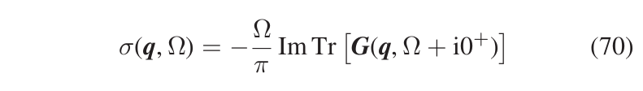{width="400px"}

where $\boldsymbol{G}$ is the SCHA phonons Green function, given by
$\boldsymbol{G}=\boldsymbol{G}^{(0)}+\boldsymbol{G}^{(0)}\boldsymbol{\Pi}\,\,\boldsymbol{G}$,
with $\boldsymbol{G}^{(0)}$ the Green function of the noninteracting
SCHA phonons, and $\boldsymbol{\Pi}$ their selfenergy taking into
account the interaction (in order to make easier the comparison with the
literature, here and in the subsequent equations, the equation numbers
refer to the paper here <https://arxiv.org/abs/2103.03973>). The SSCHA
code allows to compute these quantities, even if in the current
implementation the selfenergy can be computed only in the bubble
approximation (Eq. (75))

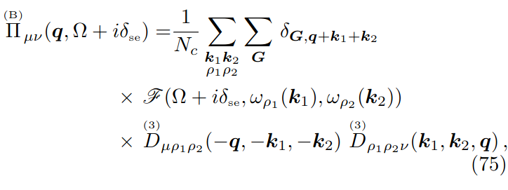{width="400px"}

i.e. the self-energy terms including the 4th order FCs are discarded. In
this equation $\delta_{\scriptscriptstyle{\text{se}}}$ is an infinitely
small positive number (a smearing parameter), that in actual
calculations has to be chosen, toegher with the integration
$\boldsymbol{k}$-grid, in order to find converged results.

The code, in addition to providing the ability to compute the spectral
function through the full formula Eq. (70), allows for various
approximations to be used in order to both compute the spectral function
with reduced computational cost and conduct an analysis of the different
contributions to the spectral function provided by each mode. The main
approximation is to negeclet the off-diagonal terms in the self-energy
written in the SCHA-modes basis set. In other words, we can negelct the
possibility that the interaction mixes different SCHA phonons. In that
case, the total spectrum is given by the the sum of the spectrum of each
mode, $\sigma_{\mu}(\boldsymbol{q},\Omega)$, as shown in Eq.(78),

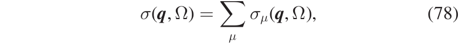{width="400px"}

with $\sigma_{\mu}(\boldsymbol{q},\Omega)$ having a generalized
Lorentzian-like expression shown in Eq.(79)

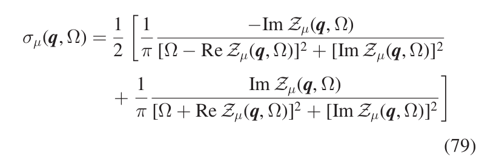{width="400px"}

with $\mathcal{Z}_{\mu}(\boldsymbol{q},\Omega)$ defined in Eq.(80)

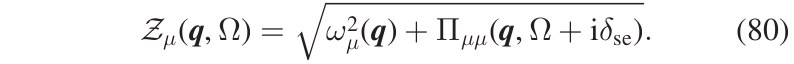{width="400px"}

where $\omega_{\mu}(\boldsymbol{q})$ is the frequency (energy) of the
SCHA phonon $(\boldsymbol{q},\mu)$, and
$\boldsymbol{\Pi}_{\mu\mu}(\boldsymbol{q},\Omega)$ is the corresponding
diagonal element of the self-energy. This is the spectrum in the so
called no mode-mixing approximation. At this level, the single-mode
spectral functions resemble Lorentzian functions, but they are not true
Lorentzians as they have kind of frequency-dependent center and width.
As a matter of fact, in general, the spectrum of a mode can be very
different from a true Lorentzian function, meaning that the
quasiparticle picture for that mode is not appropriate. However, there
are cases where the interaction between the SCHA phonons does not affect
the quasiparticle picture but causes only a shift in the quasiparticle
energy and the appearance of a finite linediwth (i.e. finite lifetime)
with respect to the non-interacting case. In that case, we can write the
spectral function of the mode as a true Lorentzian, Eq.(81),

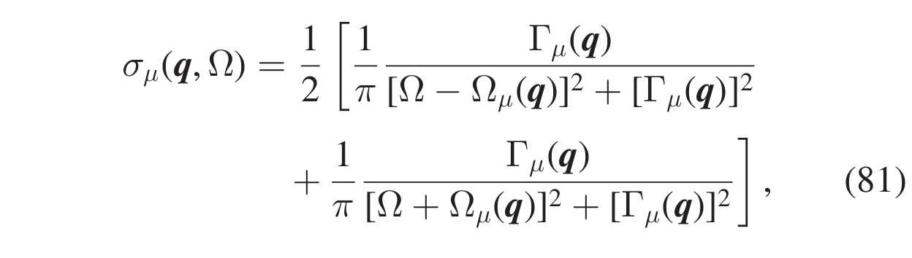{width="400px"}

i.e., the SCHA phonon $(\boldsymbol{q},\mu)$ is a quasiparticle with
definite energy $\Omega_{\mu}(\boldsymbol{q})$ (
$\Delta_{\mu}(\boldsymbol{q})=\Omega_{\mu}(\boldsymbol{q})-\omega_{\mu}(\boldsymbol{q})$
is called the energy shift) and lifetime
$\tau_{\mu}(\boldsymbol{q})=1/2\Gamma_{\mu}(\boldsymbol{q})$, where
$\Gamma_{\mu}(\boldsymbol{q})$ is the Lorentzian half width at half
maximum (HWHM). The quantities $\Omega_{\mu}(\boldsymbol{q})$ and
$\Gamma_{\mu}(\boldsymbol{q})$ satisfy the relations given in
Eqs.(82),(83)

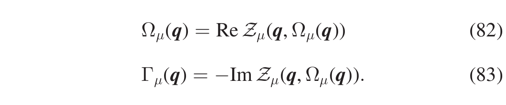{width="400px"}

Notice that the first one is a self-consistent equation. Instead of
solving the self-consistent equation to evaluate
$\Omega_{\mu}(\boldsymbol{q})$ two approximated approaches can be
adpoted, both implemented in the SSCHA. One, that we call \"one-shot\",
evaluates the r.h.s of Eq.(82) at the SCHA frequency (Eqs.(84))

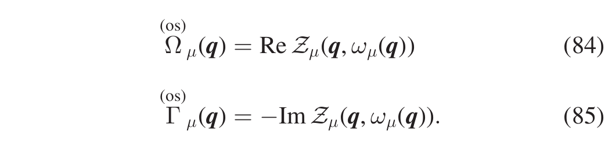{width="400px"}

This approximation is reasonable as long as the energy shift
$\Delta_{\mu}(\boldsymbol{q})=\Omega_{\mu}(\boldsymbol{q})-\omega_{\mu}(\boldsymbol{q})$
is small. In particular, this is true if the SCHA self-energy is a
(small) perturbation of the SCHA free propagator (not meaning that we
are in a perturbative regime with respect to the harmonic
approximation). In thas case, perturbation theory can be employed to
evaluate the spectral function. If in Eq.(80) we keep only the
first-order term in the self-energy, we get Eqs.(86),(87):

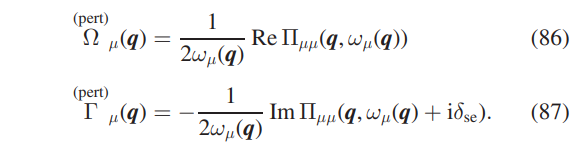{width="400px"}

This concludes the overview on the quantities that we are going to
compute for PbTe.

# Calculations on PbTe

We will perform calculations on PbTe in the rock-salt structure and, in
order to speed-up the calculation, we will employ the force-field model
already used in previous tutorials (the force-field model can be
downloaded and installed from here
<https://github.com/SSCHAcode/F3ToyModel>). The calculations that we are
going to perform are heavily underconverged and have to be consiered
just as a guide to use of the SSCHA code. We will use a 2x2x2 supercell
for PbTe. In order to define the force-field model on this superell we
need three FCs, *PbTe.ff.2x2x2.dyn1*, *PbTe.ff.2x2x2.dyn2*, and
*PbTe.ff.2x2x2.dyn3*

First, we need to do the SSCHA minimization. Create a directory *minim*,
and go into it. We take the force-field FCs as starting point of the
SSCHA mnimization too, with this input file *min.py*

``` python
import cellconstructor as CC
import cellconstructor.Phonons
import fforces as ff
import fforces.Calculator
import sscha, sscha.Ensemble, sscha.SchaMinimizer
import sscha.Relax, sscha.Utilities

# ========================= TOY MODEL DEFINITION ===========================
# Dynamical matrices that set up the harmonic part of the force-field
ff_dyn_name="../04_spectral_calculations/toy_matrices_2x2x2/PbTe.ff.2x2x2.dyn"
# Paramters that set up the anharmonic part of the force-field
p3 = -0.01408
p4 = -0.01090
p4x = 0.00254
# ====================================================================

# ==========================================================
# dynamical matrices to be used as starting guess
dyn_sscha_name="../04_spectral_calculations/toy_matrices_2x2x2/PbTe.ff.2x2x2.dyn"
# temperature
T=300
# minimization parameters
N_CONFIGS = 50
MAX_ITERATIONS = 10
# ====================================================================
# Setup the harmonic part of the force-field
ff_dynmat = CC.Phonons.Phonons(ff_dyn_name, 3)
ff_calculator = ff.Calculator.ToyModelCalculator(ff_dynmat)
# Setup the anharmonic part of the force-field
ff_calculator.type_cal = "pbtex"
ff_calculator.p3 = p3
ff_calculator.p4 = p4
ff_calculator.p4x = p4x
# Load matrices
dyn_sscha=CC.Phonons.Phonons( dyn_sscha_name,3)
dyn_sscha.Symmetrize()
# Generate the ensemble
supercell=dyn_sscha.GetSupercell()
ens = sscha.Ensemble.Ensemble(dyn_sscha, T, supercell)
ens.generate(N_CONFIGS)
# Compute energy and forces for the ensemble elements
ens.get_energy_forces(ff_calculator , compute_stress = False)
# Set up minimizer
minimizer = sscha.SchaMinimizer.SSCHA_Minimizer(ens)
# Ignore the structure minimization (is fixed by symmetry)
minimizer.minim_struct = False
# max number steps (negative infinite)
minimizer.max_ka=-1
# Setup the minimization parameter for the covariance matrix
minimizer.set_minimization_step(1.0)
# Setup the threshold for the ensemble wasting
minimizer.kong_liu_ratio =0.8     # Usually 0.5 is a good value
minimizer.meaningful_factor=1e-5  # meaningul factor
# Initialize the simulation
relax = sscha.Relax.SSCHA(minimizer,
                          ff_calculator,
                          N_configs = N_CONFIGS,
                          max_pop = MAX_ITERATIONS)
# Define the I/O operations
# To save info about the free energy minimization after each step
ioinfo = sscha.Utilities.IOInfo()
ioinfo.SetupSaving("minim_info")
relax.setup_custom_functions(custom_function_post = ioinfo.CFP_SaveAll)
# Start the minimization
relax.relax()
# Print in stdout the info about the minimization
# and save the final dynamical matrix
relax.minim.finalize()
relax.minim.ensemble.save_bin("./data_pop", population_id=1)
relax.minim.dyn.save_qe("SSCHA.T{}.dyn".format(T))
```

launching

``` bash
$ python min.py > min.out
```

after a few second the minimization has concluded. The three SSCHA FCs
matrices have been saved as *SSCHA.T300.dyn#q*. Now we need to compute
the third order FCs (FC3s) (and the Hessian FCs). At the end of the
SSCHA minimization, we saved the last population and the dynamical
matrices that generated it too. Using them, we compute the Hessian
matrices and the FC3s. Exit from *minim*, create a directory *hessian*,
go into it, and use this input file [hessian.py]{.title-ref}

``` python
import cellconstructor as CC
import sscha.Ensemble
#
NQIRR = 3
Tg = 300
T = 300
#
pop_dyn = CC.Phonons.Phonons('../minim/data_pop/dyn_gen_pop1_', 3)
sscha_dyn = CC.Phonons.Phonons('../minim/SSCHA/SSCHA.T300.dyn', 3)
#
ens = sscha.Ensemble.Ensemble(pop_dyn, Tg)
ens.load_bin('../minim/data_pop', population_id = 1)
ens.update_weights(sscha_dyn, T)
#
hessian_dyn, d3 = ens.get_free_energy_hessian(include_v4 = False,
                                              return_d3 = True)

hessian_dyn.save_qe('Hessian.dyn')

############################### FC3 part #############################################

tensor3 = CC.ForceTensor.Tensor3(dyn=sscha_dyn)          # initialize 3rd order tensor
tensor3.SetupFromTensor(d3)                              # assign values
tensor3.Center()                                         # center it
tensor3.Apply_ASR()                                      # apply ASR
tensor3.WriteOnFile(fname="FC3",file_format='D3Q')       # write on file
```

giving

``` bash
$ python hessian.py > hessian.out
```

We already did an Hessian calculation in a previous tutorial. The new
part is the creation of the 3rd order FCs (FC3s), which we wrote in the
file *FC3*. Some comments about the input file. In
`get_free_energy_hessian` we set `return_d3 = True` because we need
these informations to set up the FC3s. Moreover, since we are not going
to use forth order FCs (we will work within the \"bubble
approximation\"), we set `include_v4 = False`, which in general saves a
lot of computation time. Before writing the FC3s on file, we center it
(a step necessary to perform Fourier interpolation), and apply the
acoustic sum rule (ASR), since the centering spoils it.s

The format chosen here to write the FC3 file is the same used in the
d3q.x code <https://anharmonic.github.io/d3q/>. To be precise:
exploiting the lattice translation symmetry, the third order FCs can be
written as
$\Phi^{\alpha_1,\alpha_2,\alpha_3}_{a_1 a_2 a_3}(0,\boldsymbol{R},\boldsymbol{S})$,
where $\alpha_1,\alpha_2,\alpha_3$ are cartesian indices,
$a_1, a_2, a_3$ atomic indices in the unit cell, and
$\boldsymbol{R},\boldsymbol{S}$ lattice vectors. The FC3 file in D3Q
format is

``` 
alpha_1 alpha_2 alpha_3 at_1 at_2 at_3
N_RS
R_x R_y R_z S_x S_y S_z phi(alpha_1,at_1,alpha_2,at_2,alpha_3,at_3)

...

alpha_1 alpha_2 alpha_3 at_1 at_2 at_3
N_RS
R_x R_y R_z S_x S_y S_z phi(alpha_1,at_1,alpha_2,at_2,alpha_3,at_3)

...
```

For each `alpha_1 alpha_2 alpha_3 at_1 at_2 at_3` we have a block where:
the first line is `N_RS`, which is the number of
$\boldsymbol{R},\boldsymbol{S}$ considered. Each subsequent line refers
to a couple $\boldsymbol{R},\boldsymbol{S}$, with `R_x R_y R_z` and
`S_x S_y S_z` the crystal coordinates of $\boldsymbol{R}$ and
$\boldsymbol{S}$, respectively, and
`phi(alpha_1,at_1,alpha_2,at_2,alpha_3,at_3)` the corresponding FCs
value
$\Phi^{\alpha_1\alpha_2\alpha_3}_{a_1 a_2 a_3}(0,\boldsymbol{R},\boldsymbol{S})$.

Equipped with the third order SSCHA FCs ,written in real space in the
[FC3]{.title-ref} file, and the second-order SSCHA FCs, written in
reciprocal space in the *SSCHA.T300.dyn#q* files, we have all the
ingredient to compute the spectral functions. As first calculation, we
compute the spectral function using Eq.(70) but within the \"static
approximation\", this meaning that we keep the selfenergy blocked with
$\Omega=0$, as shown in Eq.(66) (within the bubble approximation)

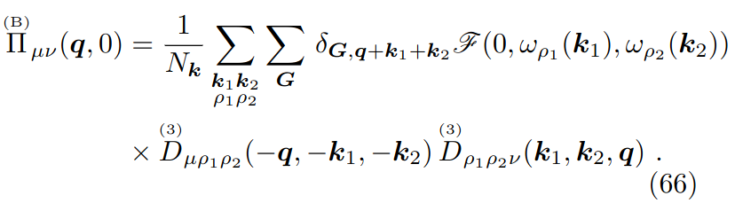{width="400px"}

In order to do that, exit from the current directory *hessian*, create a
directory *spectral_static*, enter into it, and use this input file
*spectral_static.py* to compute the spectral function in the static
approximation, for the special point $X$

``` python
import cellconstructor as CC
import cellconstructor.ForceTensor

dyn = CC.Phonons.Phonons("../minim/SSCHA.T300.dyn",3)
FC3 = CC.ForceTensor.Tensor3(dyn=dyn)
FC3.SetupFromFile(fname="../hessian/FC3",file_format='D3Q')


# integration grid
k_grid=[2,2,2]

# X in 2pi/Angstrom
points=[0.0,-0.1547054, 0.0]

CC.Spectral.get_full_dynamic_correction_along_path(dyn=dyn,
                                                tensor3=FC3,
                                                k_grid=k_grid,
                                                e1=100, de=0.1, e0=0,     # energy grid
                                                T=300,
                                                q_path=points,
                                                static_limit = True,
                                                filename_sp='full_spectral_func_X')
```

We used as integration $\boldsymbol{k}$-grid (i.e. the
$\boldsymbol{k}$-grid of the summation in Eqs.(66), (75)) the grid
commensurate with the supercell, i.e. a 2x2x2 grid. In that case, using
the centering is irrelevant, as there is no Fourier interpolation. With

``` bash
$ mpirun -np 4 python spectral_static.py > spectral_static.out
```

we run the code with MPI with 4 parallel processes. In output we have
the file *full_spectral_func_X\_static.dat* that contains the spectral
function

``` 
# -------------------------------------------------------------
# len (2pi/Angstrom), energy (cm-1), spectral function (1/cm-1)
# -------------------------------------------------------------
 0.000000    0.0000000   0.0000000
 0.000000    0.1000000   0.0000000
 0.000000    0.2000000   0.0000000
 0.000000    0.3000000   0.0000001
 0.000000    0.4000000   0.0000002
 0.000000    0.5000000   0.0000003

                   ...
```

where the first line indicates the lenght of the path. This would be
relevant in case we had not just a single $\boldsymbol{q}$ point, but a
path of $\boldsymbol{q}$-points. In that case, we would have several
blocks, one for each $\boldsymbol{q}$ point, and the first column of
each block would indicate the lenght of the $\boldsymbol{q}$-path. In
this case, since we have just one point, we have just one block with the
first column equal to zero. Plotting the 3rd vs 2nd column we obtain
this result:

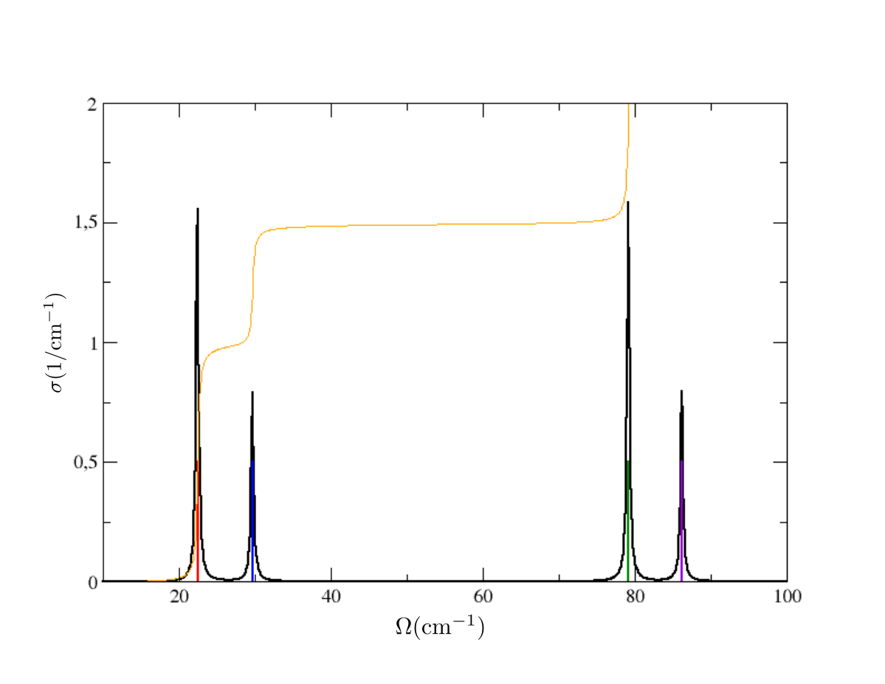{width="600px"}

We have Dirac deltas ( to be precise, extremely narrow Lorentzians whose
width is given only by the choice of the finite size of the used energy
grid) around values that coincides with the Hessian frequency values
(plotted here with vertical lines), that you can find in the
`Hessian.dyn3` file obtained in the previous run. Indeed, the Hessian
calculation corresponds exactly to a calculation done with the static
self-energy. Two observations. The height of the spikes is proportional
to the degeneracy of the modes. The yellow line indicates the integral
function $\int_0^{\Omega}\sigma(\Omega',\boldsymbol{q})\,d\Omega'$,
which at the end returns the value: \[number of modes\]/2 (therefore 3
in this case). This is a general sum rule fulfilled by the spectral
function (not only in the static approximation).

Now we do a full calculation (no static approximation anymore). In this
case, we need to specify the smearing parameter
$\delta_{\scriptscriptstyle{\text{se}}}$ to compute the dynamic
selfenergy from Eq.(75). In order to be tidy, let us do this calculation
in another directory *spectral* (and let us do the same for all the
subsequent calculations, new calculations in new directories). Using
this *spectral.py* input file

``` python
import cellconstructor as CC
import cellconstructor.ForceTensor

dyn = CC.Phonons.Phonons("../minim/SSCHA.T300.dyn",3)
FC3 = CC.ForceTensor.Tensor3(dyn=dyn)
FC3.SetupFromFile(fname="../hessian/FC3",file_format='D3Q')


# integration grid
k_grid=[20,20,20]

# X in 2pi/Angstrom
points=[0.0,-0.1547054, 0.0]

CC.Spectral.get_full_dynamic_correction_along_path(dyn=dyn,
                                           tensor3=FC3,
                                           k_grid=k_grid,
                                           e1=100, de=0.1, e0=0,     # energy grid
                                           sm1=10.0,sm0=1.0,nsm=3,    # smearing values
                                           T=300,
                                           q_path=points,
                                           static_limit = True,
                                           filename_sp='full_spectral_func_X')
```

where now we have specified that we want to do the calculation with 3
smearing values (equally spaced) between 1.0 and 10.0 cm-1 (thus we will
have 1.0, 5.5, and 10.0 cm-1) With

``` bash
$ mpirun -np 4 python spectral.py > spectral.out
```

in output we have three files with the spectral functions, one for each
smearing value. In general, convergence must be studied with respect to
the integration $\boldsymbol{k}$-grid and smearing used. Plotting the
static result and the dynamic result for sm=1.0 cm-1, both computed with
20x20x20 $\boldsymbol{k}$-grid, we see this result

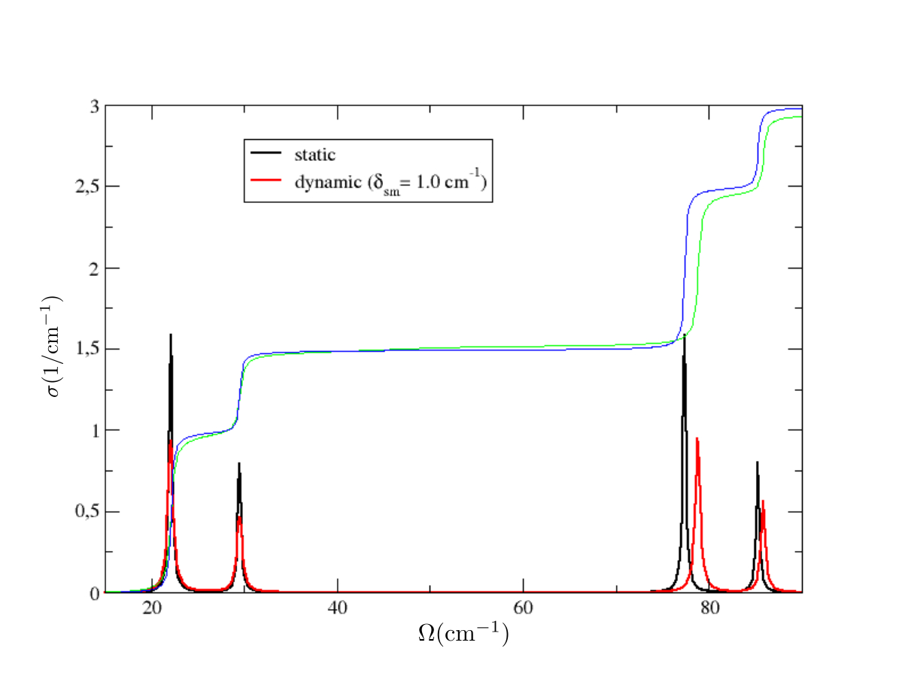{width="600px"}

Therefore, we can conclude that in $X$ the SSCHA phonons are barely
affected by the interaction. However, the situation is different if
analogous calculation is done in $\Gamma$.

::: topic
**Exercise**

In $\Gamma$, do the same calculations previously done in $X$, and plot
the results
:::

This is the result you should obtain

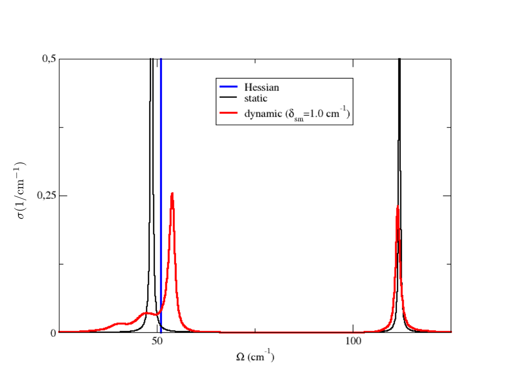{width="600px"}

Notice that here the triple-degenerate optical mode of the Hessian
dynamical matrix is splitted into due different peaks of the static
spectral function (LO and double degenerate TO). This is due to the
LO-TO splitting occurring in PbTe. The frequencies in the Hessian
dynamical matrix in $\Gamma$ refer only to the short-range part of the
FCs. However, the long-range dipole-dipole contribution coming from the
Effective Charges (nonanalytic contribution), which is at the origin of
the LO-TO splitting, is taken into account when the spectral function is
computed. Moreover, notice that when dynamic spectral function is
considered, the double-degenerate TO mode gets smeared, showing a strong
non-Lorentzian character. When 4x4x4 supercell calculations are
performed, it clearly appears a satellite peak.

Before continuing the spectral analysis, let us spend some time to
investigate the static correction. As said, the static spectral function
is nothing but a collection of Dirac-deltas centered around the Hessian
eigenvalues. Therefore, in the static case the only information are the
eigenvalues, there is not a complex spectrum to be analyzed. Indeed,
there is a routine that we can use to compute the static correction for
any q point, and for any integration grid. With this input file
*static.py*

``` python
import cellconstructor.ForceTensor
import cellconstructor as CC
import numpy as np # will be used just to create a path

dyn = CC.Phonons.Phonons("../minim/SSCHA.T300.dyn",3) # SSCHA matrices
FC3 = CC.ForceTensor.Tensor3(dyn=dyn)
FC3.SetupFromFile(fname="../hessian/FC3",file_format='D3Q')


# integration grid
k_grid=[4,4,4]

Xcoord=0.1547054
points=[[0.0,z,0.0] for z in np.linspace(-Xcoord,Xcoord,100)] # create the path
                                   # you can also download the path from a file

CC.Spectral.get_static_correction_along_path(dyn=dyn,
                                            tensor3=FC3,
                                            k_grid=k_grid,
                                            T=300,
                                            q_path=points)
```

with

``` bash
$ mpirun -np 4 python static.py > static.out
```

we obtain the file *v2+d3static_freq.dat*, done like this

``` 
# ------------------------------------------------------------------------
# len (2pi/Angstrom), sscha freq (cm-1), sscha + static bubble freq (cm-1)
# ------------------------------------------------------------------------
 0.000000    22.6699858  22.6699858 ...    22.1602770  22.1717260 ...
 0.003125    22.7847829  22.7847829 ...    29.9763683  80.8414572 ...

                              ...
```

where the first column is the lenght of the path in 2$\pi$/Angstrom, the
next (6, in this case) columns are the SSCHA frequencies, and the next
(6, in this case) columns are the SSCHA+static bubble
self-energy-corrected frequencies. This is the plot obtained with this
result

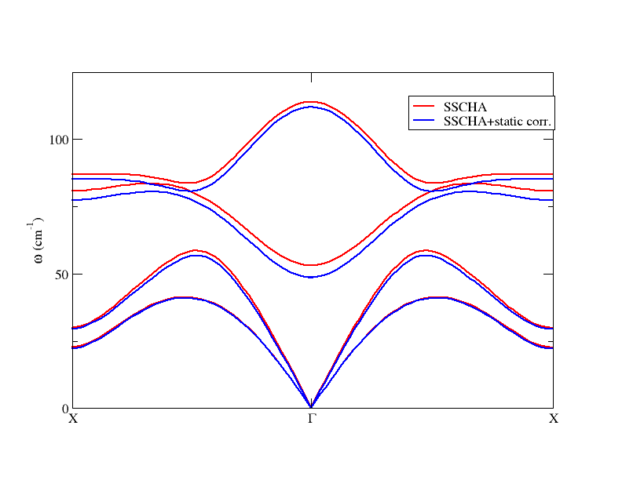{width="600px"}

Therefore, as long as one is interested only in the static correction,
e.g. because one wants to study the structural instability, the routine
`get_static_correction_along_path` is the one that has to be employed.
Indeed, notice that this is the proper way to detect instabilities
(imaginary frequencies) in points of the Brillouin zone that do not
belong to the grid used to compute the Hessian. One should not Fourier
interpolate the Hessian matrices computed on a grid, in order to obtain
the frequency dispersion along a path, but rather should interpolate the
correction and add it to the SSCHA frequency, point by point (which is
what we are doing here). Moreover, in this way we can increase the
integration $k$-grid to reach the convergence. Notice that the LO-TO
splitting has been properly taken into account.

We can now go back to the spectral calculations. In general,
calculations done with Eq.(70) can be heavy, but often the off-diagonal
terms of the phonon self-energy in the mode basis set can be neglected
and use Eqs. (78), (79), (80). This is the case of PbTe. With this input
file *nomm_spectral.py*

``` python
import cellconstructor as CC
import cellconstructor.ForceTensor

dyn = CC.Phonons.Phonons("../minim/SSCHA.T300.dyn",3)
FC3 = CC.ForceTensor.Tensor3(dyn=dyn)
FC3.SetupFromFile(fname="../hessian/FC3",file_format='D3Q')


# integration grid
k_grid=[20,20,20]

G=[0.0,0.0,0.0]
points=G

CC.Spectral.get_diag_dynamic_correction_along_path(dyn,
                                           tensor3=FC3,
                                           k_grid=k_grid,
                                           e1=150, de=0.1, e0=0.0,
                                           sm1=1.0, sm0=1.0,
                                           nsm=1,
                                           q_path=points,
                                           T=300.0)
```

and

``` bash
$ mpirun -np 4 python nomm_spectral.py > nomm_spectral.out
```

we obtain several files:

-   *spectral_func_1.00.dat*

    > with the structure
    >
    > ``` 
    > # ---------------------------------------------------------------------------------
    > # len (2pi/Ang), ene. (cm-1), spec. func. (1/cm-1), spec. fun. mode comp. (1/cm-1)
    > # ---------------------------------------------------------------------------------
    >   0.000         0.000     0.000           -0.000      0.000   ...
    >   0.000         0.100     1.527            0.509      0.509   ...
    >   0.000         0.200     2.387            0.795      0.795   ...
    >                            ...
    > ```
    >
    > The file is made by several blocks, one for each $\boldsymbol{q}$
    > point of the path considered (now we have just one point, thus one
    > block). The first column of the block gives the length of the path
    > (at that point). The second and third column give the energy and
    > total spectrum, respectively. The subsequent columns give the
    > contribution to the spectrum given by each mode (Cfr.
    > Eqs.(78),(79)). Plotting the 3rd vs 2nd column you can verify that
    > in this case the spectrum is essentially identical to the one
    > already obtained with the full formula (i.e. to the spectrum
    > obtained considering the off-diagonal terms of the self-energy
    > too). Notice that in this file we have the spectrum given by the
    > three acoustic modes in $\Gamma$. We did not consider the
    > translational modes (because trivial) in the calculation done with
    > *get_full_dynamic_correction_along_path*, where the flag
    > `notransl` by default was set equal to `True`.

-   *spectral_func_lorentz_one_shot_1.00.dat*,
    *spectral_func_lorentz_perturb_1.00.dat*

    > These files have the same structure of *spectral_func_1.00.dat*.
    > However, now the spectral functions are computed in the Lorenztian
    > approximation, Eq.(81), using the one-shot, Eqs.(84),(85) and the
    > perturbative, Eqs.(86),(87), values of the energy and HWHM. The
    > codes offers also the possibility to use a still very tentative
    > approach to solve the self-consistent relation Eqs.(82),(83), and
    > produce the relative Lorentzian spectral functions. Plotting the
    > spectral functions of the TO mode from *spectral_func_1.00.dat*
    > and *spectral_func_lorentz_one_shot_1.00.dat* we obtain this
    >
    > {width="600px"}
    >
    > This confirms the strong non-Lorentzian character of this mode

-   *v2_freq_shift_hwhm_one_shot_1.00.dat,
    v2_freq_shift_hwhm_perturb_1.00.dat*

    > They have the structure
    >
    > ``` 
    > # -----------------------------------------------------------------
    > # len (2pi/Angstrom), SSCHA freq (cm-1), shift (cm-1) , HWHM (cm-1)
    > # -----------------------------------------------------------------
    >
    >                       ....
    > ```
    >
    > For each $\boldsymbol{q}$ point there is a line, with the lenght
    > along the path, the SSCHA frequencies for that point,
    > $\omega_{\mu}(\boldsymbol{q})$, the energy shift
    > $\Delta_\mu(\boldsymbol{q})=\Omega_\mu(\boldsymbol{q})-\omega_\mu(\boldsymbol{q})$
    > and the HWHM $\Gamma_\mu(\boldsymbol{q})$.

-   *freq_dynamic_one_shot_1.00.dat, freq_dynamic_perturb_1.00.dat*

    > They have the structure
    >
    > ``` 
    > # ------------------------------------------------------------
    > # len (2pi/Angstrom), SSCHA+shift (sorted) (cm-1), HWHM (cm-1)
    > # ------------------------------------------------------------
    >
    >                       ....
    > ```
    >
    > For each $\boldsymbol{q}$ point there is a line, with the lenght
    > along the path, the shifted frequencies
    > $\Omega_\mu(\boldsymbol{q})=\omega_\mu(\boldsymbol{q})+\Delta_\mu(\boldsymbol{q})$
    > (sorted in incresing value, in principle different from the
    > SSCHA-frequency increasing order) and the corresponding HWHMs
    > $\Gamma_\mu(\boldsymbol{q})$. This is the file that has to be used
    > to plot the correct phonon dispersion, together with the
    > linewidth.

There is a dedicated routine to compute, with less computational time
and more accuracy, only the energy shift (i.e. the corrected frequency)
and the linewidth of the modes in the one-shot and perturbative
no-mode-mixing Lorentzian approach. It is the
`get_os_perturb_dynamic_correction_along_path` routine, using the
*os_perturb_correction.py* input file

``` python
import cellconstructor as CC
import cellconstructor.ForceTensor

dyn = CC.Phonons.Phonons("../minim/SSCHA.T300.dyn",3)
FC3 = CC.ForceTensor.Tensor3(dyn=dyn)
FC3.SetupFromFile(fname="../hessian/FC3",file_format='D3Q')


# integration grid
k_grid=[10,10,10]

points=[0.0,0.0,0.0]

CC.Spectral.get_os_perturb_dynamic_correction_along_path(dyn,
                                           tensor3=FC3,
                                           k_grid=k_grid,
                                           sm1=1.0, sm0=1.0,
                                           nsm=1,
                                           q_path=points,
                                           T=300.0)
```

::: topic
**Exercise**

Do this calculation to obtain the dispersion along the path
$X-\Gamma-X$.
:::

After that, using this script to extract the results

``` bash
for i in `seq 1 6`
do
 awk -v i="${i}" '{ if ( NR  > 3 ) printf"%22.11f%22.11f%22.11f%22.11f\n", \
 $1,$(i+1),$(i+1)+$(i+7),$(i+1)-$(i+7)}' freq_dynamic_1.0.os.dat > freq_${i}
done
```

and then using this gnuplot script *plot.gp*

``` gnuplot
set terminal pngcairo size 2048,1536 enhanced
set output 'freq.png'

xmin=0
xmax=0.30941100000
set xrange[xmin:xmax]

set multiplot
set object rectangle from graph 0,0 to graph 1,1 \
behind fillcolor rgb 'black' fillstyle transparent solid 0.100 noborder

plot for [i=1:6] 'freq_'.i using 1:3:4 with filledcurves \
    fs transparent solid 0.125 noborder lc rgb "blue" notitle
plot for [i=1:6] 'freq_'.i using 1:2   with lines \
    lc rgb "black" lw 3.5 notitle
```

``` bash
$ gnuplot plot.gp
```

you obtain this figure

> 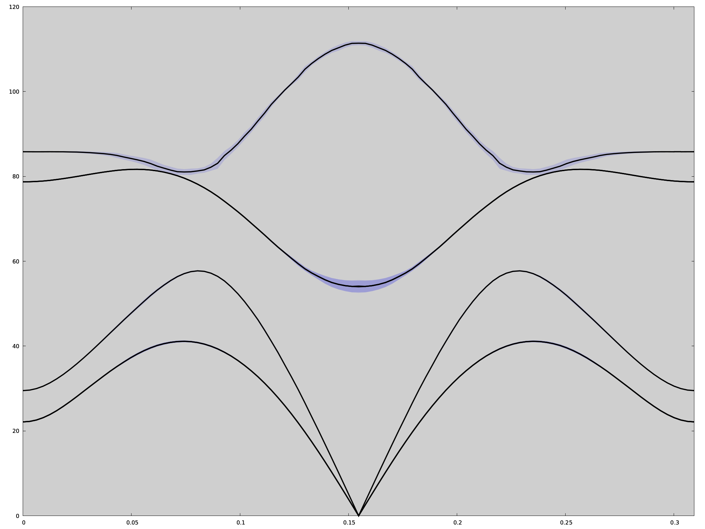{width="600px"}

Here you have the plot of the shifted SSCHA phonon frequencies with the
linewidth. However, it must be remembered that this picture is
appropriate as long as the Lorentzian picture is valid. We already know
that at least in $\Gamma$ this is not really the case (as said, this is
even more evident if the calculation is done with a 4x4x4 supercell). In
that case, the best thing to do is a spectral calculation (full, or in
the no-mode-mixing approximation), and use the three columns (lenght of
the path & energy & spectral value) to do a colorplot. For example, this
is the kind of result that you obtain for PbTe with the 4x4x4 supercell

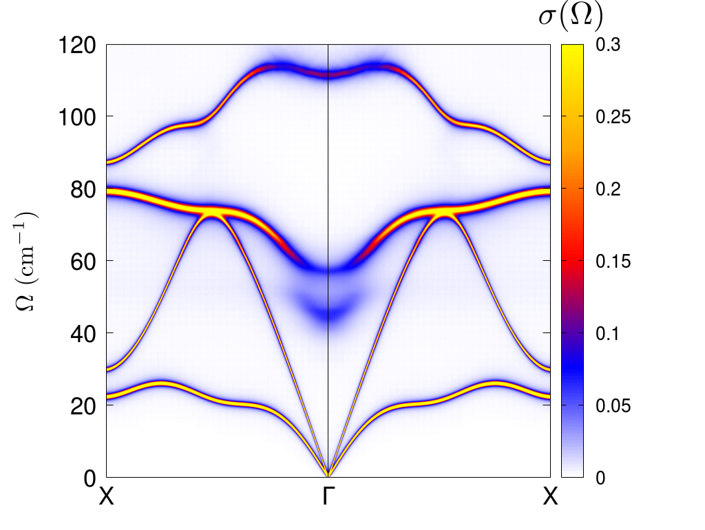{width="400px"}

::: topic
**Exercise**

Do the no-mode-mixing calculation along the path $X-\Gamma-X$ with
smearing $10.0\,\text{cm}^{-1}$
:::

We conclde this tutorial stressing that a convergence analysis in terms
of integration grid and smearing has to be done in order to obtain
reliable results. The `get_os_perturb_dynamic_correction_along_path`
routine is the best tool to do that. With this *input.py* input file you
can do the calculation for several integration grids

``` python
import cellconstructor as CC
import cellconstructor.ForceTensor


dyn = CC.Phonons.Phonons("../minim/SSCHA.T300.dyn",3)
FC3 = CC.ForceTensor.Tensor3(dyn=dyn)
FC3.SetupFromFile(fname="../hessian/FC3",file_format='D3Q')


for kval in [4,8,16,32]:

   print("COMPUTING {}".format(kval))

   CC.Spectral.get_os_perturb_dynamic_correction_along_path(dyn,
                                  tensor3=FC3,
                                  k_grid=[kval,kval,kval],
                                  sm1=20.0, sm0=0.1,
                                  nsm=80,
                                  q_path=[0.0,0.0,0.0],
                                  T=300.0,
                                  filename_shift_lw  = 'shift_hwhm_{}'.format(kval),
                                  filename_freq_dyn = 'freq_{}'.format(kval))
```

giving

``` bash
$ mpirun -np 4 python input.py > output
```

From *output* you can take the list of smearing values and write them in
a file *sm.dat*. After that, you can collect the results with this
*extract.sh* script

``` bash
for grid in 4 8 16 32
do
 > ${grid}x${grid}x${grid}.dat
 while read sm
 do
  tail -1  shift_hwhm_${grid}_${sm}.os.dat \
  | awk -v sm="${sm}" '{printf"%11.7f\t%22.11f\n",sm,$(NF-1)}' \
  >> ${grid}x${grid}x${grid}.dat
 done < sm.dat
done
```

giving

``` bash
$ bash extract.sh
```

so as to obtain the files *4x4x4.dat*, *8x8x8.dat*, *16x16x16.dat*, and
*32x32x32.dat*. Plotting them you obtain

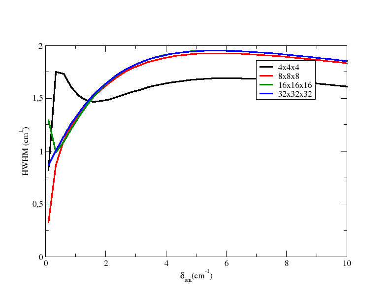{width="400px"}

From the plot, you can see that you need at least a 8x8x8 grid to obtain
a converged value, using smearing equal to 1.0 cm-1.
