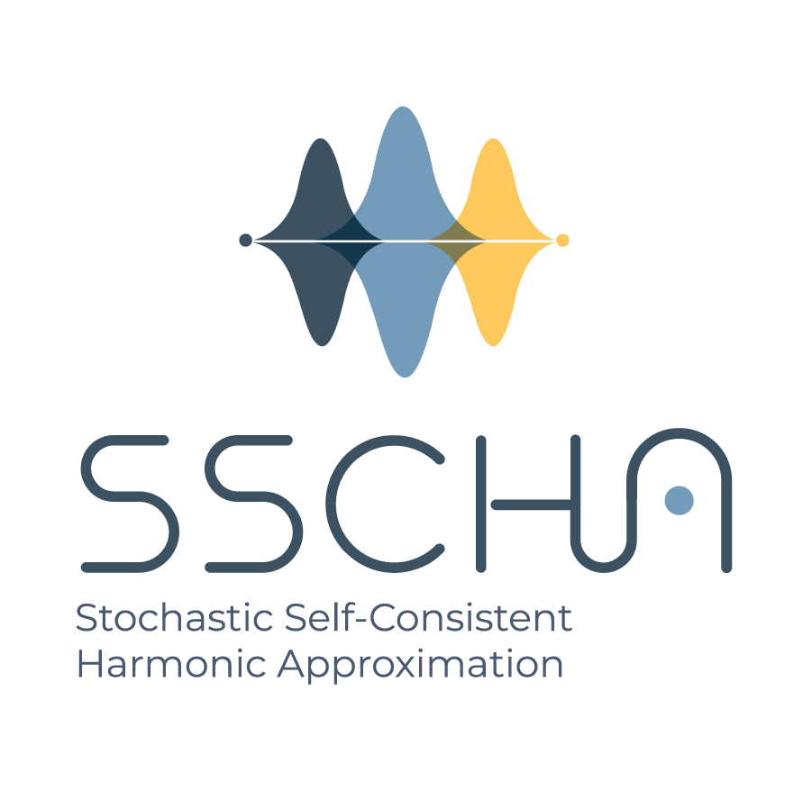

The stochastic self-consistent harmonic approximation (SSCHA) is a full computational python package that simulates thermodynamic and phononic properties of materials accounting for anharmonicity at a nonperturbative level, fully including quantum and thermal fluctuations.

If you are simulating transport or thermal properties of materials, phase diagrams, or phonon-related properties, then you need the SSCHA code. The method is based on a full-quantum variational method that optimizes the nuclear wave-functions (or density matrix at finite temperature) to minimize the free energy. In this way it can be used to calculate thermodynamic properties of strongly anharmonic systems and the conditions at which first- and second-order phase transitions occur, estimate the phonon frequencies expected experimentally, obtain spectral functions, phonon lifetimes, determine the structural changes imposed by quantum effects, the electron-phonon interaction in strongly anharmonic systems, and so on.  

[Get Started with SSCHA](http://sscha.eu/download/){: .btn .btn-primary .btn-lg}
[Watch the video-lectures](http://sscha.eu/lectures/){: .btn .btn-primary .btn-lg}

Do not miss our [YouTube channel](https://www.youtube.com/@SSCHAcode) to see videos with lectures about the SSCHA and hands-on tutorials:

<iframe style="width:100%" width="560" height="315" src="https://www.youtube.com/embed/videoseries?list=PLUGVzxx49_SspeWpADPb3ckYOSUrUCKJg" title="YouTube video player" frameborder="0" allow="accelerometer; autoplay; clipboard-write; encrypted-media; gyroscope; picture-in-picture; web-share" allowfullscreen></iframe>
